# Knowledge Package — SDF-Manifold Active Gaussian Memory

This file is the navigation and implementation package for the project. Detailed derivations are split across:

- [`MASTER_KNOWLEDGE.md`](MASTER_KNOWLEDGE.md): research synthesis, claims, mathematics, convergence, task, losses, evaluation, and ablations;
- [`architecture.md`](architecture.md): block-level architecture and software interfaces;
- [`pipeline.md`](pipeline.md): training/inference flow and implementation order.

## 1. Research thesis

The project should not be framed as merely applying 3D Gaussian Splatting to multi-sequence MRI. The unified hypothesis is:

> The quality and observability of a patient-specific Gaussian space are determined by the trajectory through which the space is observed. A structural SDF can reduce the free Gaussian geometry, making observability estimation and active sequence–slice routing more tractable.

The two major novelties are linked:

```text
3D-SLNR-inspired structural SDF
        ↓
SDF-constrained low-DoF Gaussian prior
        ↓
compact uncertainty / observability state
        ↓
balanced multi-wave sequence–slice trajectory
        ↓
patient-adaptive convergence and stopping
```

---

## 2. Novelty package A — SDF-constrained Gaussian prior

### Anchor insight from 3D-SLNR

3D-SLNR obtains expressiveness from local SDF primitives, shared basis functions, adaptive geometry, efficient local lookup, and controlled prune/expand rather than large per-point latent features.

### Proposed adaptation

The SDF is not only an initialization tool. It defines the manifold on which Gaussian geometry is optimized.

For anchor \(\mathbf a_i\):

\[
\mathbf n_i=
\frac{\nabla F_\psi(\mathbf a_i)}
{\|\nabla F_\psi(\mathbf a_i)\|+\epsilon}.
\]

The Gaussian orientation is derived from the tangent-normal frame, rather than learned as a free quaternion.

A low-dimensional covariance is

\[
\Sigma_i=
\sigma_{t,i}^2(\mathbf I-\mathbf n_i\mathbf n_i^\top)
+
\sigma_{n,i}^2\mathbf n_i\mathbf n_i^\top.
\]

The center is optimized in local manifold coordinates:

\[
\mu_i=\mathbf a_i+
\delta u_i\mathbf t_{1,i}+
\delta v_i\mathbf t_{2,i}+
\delta n_i\mathbf n_i.
\]

### Key implementation decisions

- SDF is a slow structural memory;
- Gaussian state is a fast evidence/appearance memory;
- structural and modality-specific residuals use separate update gates;
- boundary SDF plus interior volumetric Gaussians is the recommended MVP;
- birth, split, and prune are accepted only when they improve the common energy;
- topology is frozen near convergence.

### Core claim

> SDF does not merely initialize Gaussians; it converts unconstrained 3D Gaussian fitting into low-dimensional manifold optimization.

---

## 3. Novelty package B — Balanced multi-wave trajectory

### Observation action

\[
a_t=(m_t,z_t)
\]

or, at region resolution,

\[
a_t=(m_t,z_t,r_t).
\]

A candidate image remains hidden until selected.

### Search domain

The waves move on an evolving joint feature–geometry graph whose nodes represent sequence–slice regions. Edges capture:

- within-sequence spatial adjacency;
- cross-sequence anatomical correspondence;
- SDF-geodesic neighborhood;
- learned feature similarity.

### Dynamic edge cost

\[
c_t(i,j)=
\frac{
\lambda_gd_{geo}+
\lambda_fd_{feat}+
\lambda_md_{mod}+
\lambda_jd_{jump}
}{\epsilon+Q_t(j)}
+
\lambda_rR_t(j).
\]

Utility \(Q_t\) combines expected uncertainty reduction, uncovered mass, novelty, pathology risk, and expected topology correction. Redundancy \(R_t\) penalizes overlap and repeated observations.

### Multi-wave execution

1. cluster SDF/Gaussian support anchors;
2. initialize one information wave per cluster;
3. expand local frontiers in parallel;
4. let each wave propose top candidates;
5. use a shared scheduler to select complementary, non-overlapping queries;
6. assimilate observations;
7. repair only locally changed graph costs and wavefronts;
8. repeat until observability converges.

### Why multi-wave is not merely acceleration

It provides:

- coverage of multiple anatomical modes;
- resistance to a single trajectory becoming trapped locally;
- balanced exploration and refinement;
- diversity between selected queries;
- batchable query/encoding;
- an uncertainty-weighted geodesic partition of the patient space.

### Optimization claim

For a fixed graph with nonnegative costs, each multi-source shortest-path subproblem is solved exactly. The full nonlinear adaptive trajectory is not globally optimal. The defensible claim is observation-stable fixed-point convergence under monotone energy descent and stabilized topology.

---

## 4. End-to-end flow

```mermaid
flowchart LR
    A[Registered MRI slice pool on CPU/disk] --> B[Anchor Scout]
    B --> C[Structural SDF Scaffold]
    C --> D[SDF-guided Low-DoF Gaussian Prior]
    D --> E[Feature-Geometry Observation Graph]
    E --> F[Parallel Multi-Wave Propagation]
    F --> G[Balanced Global Scheduler]
    G --> H[Query selected sequence-slice]
    H --> I[Structural + Appearance Encoders]
    I --> J[Render-Before-Update]
    J --> K[Local Evidence Assimilation]
    K --> L[Uncertainty + Topology Update]
    L --> M[Incremental Graph Repair]
    M --> N{Observability converged?}
    N -- No --> F
    N -- Yes --> O[3D Segmentation + Uncertainty]
    K --> P[Auxiliary Held-out Reconstruction]
```



---

## 5. Recommended first-paper task

### Primary task

**Budgeted active multi-sequence 3D tumor segmentation from sparse slice queries.**

### Auxiliary task

Held-out slice reconstruction to verify that the patient representation preserves anatomy and intensity evidence rather than only memorizing a segmentation mask.

### Why segmentation first

- SDF naturally represents boundaries;
- task-aware observability has a clear clinical objective;
- fewer appearance dimensions are required than full reconstruction;
- lesion preservation can be evaluated directly;
- scope is more realistic for an ISBI paper.

---

## 6. Convergence package

The algorithm should not stop only because a fixed number of updates has been reached.

Primary convergence conditions:

\[
\max_a\Delta I(a)<\epsilon_I,
\]

\[
\frac{\|\theta_{t+1}-\theta_t\|}
{\|\theta_t\|+\epsilon}<\epsilon_\theta,
\]

\[
\mathcal L_{observed}<\tau_D,
\qquad
U_{worst}<\tau_U,
\]

with stable topology for \(P\) consecutive rounds.

The maximum query budget is a safety fallback. If it is reached without convergence, output `insufficiently_observed` together with an uncertainty map.

---

## 7. Training package

### Phase A — Representation pretraining

Train the structural encoder, SDF scaffold, Gaussian initializer, renderer, and local updater using random/uniform sparse trajectories.

### Phase B — Utility learning

For sampled states, estimate actual candidate improvement:

\[
\Delta Q(a)=Q(\mathcal G_{t+1}^{a})-Q(\mathcal G_t),
\]

then train a utility/ranking predictor.

### Phase C — Routing

Train/calibrate edge costs, wave balance, redundancy penalties, and the global scheduler. Start with imitation/ranking rather than reinforcement learning.

### Phase D — Joint fine-tuning

Unroll 3–6 steps with truncated BPTT and periodic state detachment.

### Phase E — Stopping calibration

Calibrate thresholds against premature stopping, lesion miss rate, query count, and uncertainty calibration.

---

## 8. Evaluation package

### Segmentation

- Dice for WT/TC/ET;
- HD95;
- lesion-wise Dice and HD95;
- lesion recall and false-negative lesion count;
- surface Dice and ASSD.

### Trajectory

- quality–budget curves;
- area under the quality–budget curve;
- queries required to reach 90% and 95% of full-input performance;
- predicted versus actual information-gain correlation;
- redundancy rate;
- sequence allocation;
- convergence steps and failure rate.

### Efficiency

- peak training and inference VRAM separately;
- representation memory;
- number of Gaussians and bytes per primitive;
- runtime per query/update;
- total queried slices.

### Auxiliary reconstruction

- PSNR;
- SSIM;
- NMSE;
- edge/gradient error;
- downstream segmentation fidelity.

---

## 9. Mandatory ablations

1. free Gaussian vs SDF-guided initialization;
2. SDF initialization only vs persistent SDF constraint;
3. free quaternion vs SDF-derived orientation;
4. full covariance vs tangent/normal low-DoF covariance;
5. single-wave vs multi-wave;
6. multi-wave without balancing;
7. no redundancy penalty;
8. fixed-step vs convergence-based stopping;
9. no topology adaptation;
10. full graph recomputation vs local repair;
11. segmentation only vs segmentation plus reconstruction;
12. explicit full-volume fusion vs asynchronous state assimilation.

---

## 10. Claims and reviewer safeguards

### Preserve

- trajectory determines Gaussian-space observability;
- the SDF defines the optimization manifold, not only initialization;
- multi-wave routing provides complementary balanced exploration;
- stopping is based on observability and safety.

### Avoid

- claiming a globally optimal nonlinear trajectory;
- calling the method completely fusion-free;
- calling slices time points without a temporal dimension;
- calling the method vanilla 3DGS without a differentiable Gaussian slice renderer;
- claiming clinical fidelity using PSNR/SSIM alone;
- hard-coding an equal number of queries per sequence.

---

## 11. Initial implementation order

1. registered slice provider and physical plane metadata;
2. plane-aware Gaussian slice renderer;
3. SDF-constrained Gaussian data structure;
4. fixed-anchor SDF/Gaussian initialization;
5. render-before-update local assimilation;
6. segmentation and held-out reconstruction heads;
7. uncertainty state;
8. static candidate graph;
9. single-wave greedy baseline;
10. balanced multi-wave scheduler;
11. convergence controller;
12. adaptive topology and incremental graph repair.
