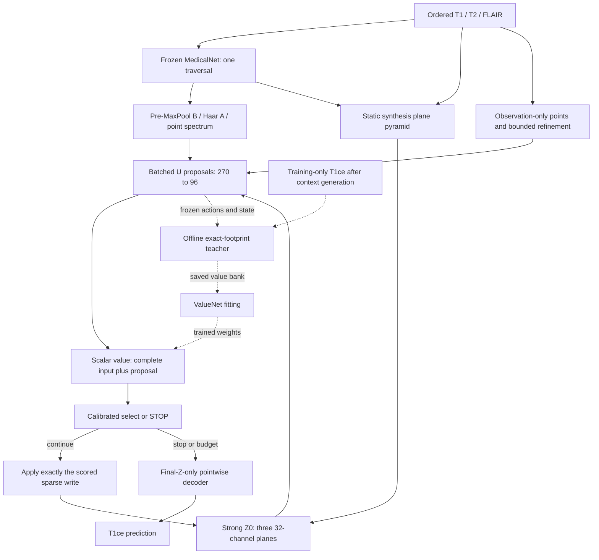

# Astra: core learning optimization, current SOTA, and block expectations

Date and literature cutoff: **2026-09-06**. Repository: `QuocKhanhLuong/3DGS`, branch `main`. Reviewed production source: `1c792b6dd3abba1d1afbbb4987f3d1c76c62a429`; the preceding report-only commit is `11da135`. This document is a research recommendation, not implementation authority or an experiment result.

**Scope:** report only; no production edits, training, checkpoint changes, or server execution. This pass revisits downstream architecture across C/D/E/F/G conceptually. MedicalNet ResNet10 stays frozen, including BatchNorm statistics; spectral evidence keeps the pre-MaxPool tap; inference consumes T1/T2/FLAIR only. New downstream designs explicitly require future implementation and validation. No Gate H claim is made.

Labels used throughout: **FACT** = inspected code/artifact or executed mathematical/synthetic check; **LITERATURE EVIDENCE** = authors' reported mechanism/result, not independently reproduced here; **INFERENCE** = conclusion from those sources; **HYPOTHESIS** = unmeasured expected effect; **PROPOSAL** = a design or acceptance target. Proposal tables inherit PROPOSAL status. All numeric expectations specify assumptions; none is a measured MRI improvement from this project.

## 1. Executive recommendation

**Recommend PFGR-Lite with a strong modality-aware Z0, an unchanged initial correction family, an action-conditioned scalar gain model, and an offline effect teacher.** Expensive counterfactual measurement should create reusable supervision, not execute inside each ValueNet optimizer step. Keep the exact footprint logic in the teacher; initially omit dense footprint features, benefit/harm heads, learned uncertainty, lookahead, and a separate stop network from deployment.

The largest new architectural concern precedes RewardNet: **when a native one-channel MedicalNet checkpoint is adapted by this repository's repeated-and-divided stem weights, the frozen backbone sees the mean of the three contrasts.** It cannot distinguish their ordering. Larger downstream networks operating only on those features cannot recover the lost distinction. A new CPU probe confirms this conditional invariance. The raw-observation point-refinement branch is an exception, so the entire current method is not claimed permutation-invariant. §6 derives the limitation and specifies a small observation-only identity-preserving conditioning path without unfreezing or rerunning MedicalNet.

The decision hierarchy should be:

1. Establish an honestly strong static synthesis baseline, including preservation of modality identity.
2. Measure available correction headroom and learn useful updates independently of a cold router.
3. Fit signed action gain from reliable post-context labels with a frozen updater/decoder.
4. Test whether selection beats random and whether a second state reassessment beats a parallel set.
5. Keep adaptive stopping only if it improves reconstruction or the quality–compute frontier over K=0/1/2/4.

**Expected ordering of opportunity, not measured attribution:** base representation and updater learning have the highest possible direct accuracy impact; teacher correctness and explicit gain learning have high decision-quality potential; proposal conditioning has medium indirect potential; complex calibration and full inference footprint context have uncertain incremental value. More expressive writes are conditional on an oracle demonstrating a capacity limit.

The 36-hour smoke run is evidence of unacceptable repeated supervision work. It is not a hardware budget. This report imposes no eight-hour cap, no device-specific architecture ceiling, and no promise of a fixed speedup. It derives relative work and break-even conditions. The previous report's hardware-linked planning caps are not constraints for this recommendation.

## 2. Scientific objective

**Recovered intent:** available T1/T2/FLAIR → fixed pretrained anatomical representation plus semantic/spectral spatial evidence → sparse candidate latent corrections → reconstruction state reassessed after useful processing → synthesized T1ce. The system allocates internal computation; it acquires no new MRI measurements during inference.

The documentary recovery in [deep synthesis v2, §2](astra-trajectory-deep-synthesis-v2.md#2-recovered-original-idea--source-of-truth) inspected the pre-refactor acquisition router, the August point-guided transition, and later C/D/E plans. Relevant history includes [`4ccffce`](https://github.com/QuocKhanhLuong/3DGS/commit/4ccffce), [`d623d17:PLAN.md`](https://github.com/QuocKhanhLuong/3DGS/blob/d623d17/PLAN.md), and [`7b4df61:PLAN_GATE_C_D_E.md`](https://github.com/QuocKhanhLuong/3DGS/blob/7b4df61/PLAN_GATE_C_D_E.md). The representation was specified before selector, stopping, history, and losses were fixed. The earlier physical-acquisition objective is historical ancestry, not a valid reason to retain travel costs for latent writes.

**Scientific contract:** improve conditional reconstruction quality with measurable incremental value from point-guided correction beyond **D(Z0)**, at reasonable processing cost. Final decoding reads final Z. T1ce or segmentation may supervise/evaluate only after the observation-only context and candidate actions exist. No target-derived route, STOP decision, mask, geometry, initialization, or inference feature is allowed. A training-only oracle is allowed and must be marked as privileged supervision.

**Optional hypotheses:** sequentiality, varying K, exact no-revisit, scalar versus decomposed value, local context dimensions, fixed radial write, shared projector widths, and all downstream loss decompositions. Retain each only for a causal contribution. A static result with K=0 can be the scientifically correct outcome.

## 3. Current bottleneck hierarchy

### Evidence and what remains unknown

The [first review](astra-trajectory-formulation-review.md), [deep synthesis](astra-trajectory-deep-synthesis-v2.md), and [September remediation](trajectory-reward-logic-remediation-2026-09-01.md) were read before this synthesis. The remediation correctly documents its code changes, but its acquisition analogy and requirement to escape ~99% K0 do not define success in the present formulation. An update must improve the reconstruction or an explicit quality–cost tradeoff.

**FACT.** The latest local exports are [config.yaml](../03-09-2026-reports/config.yaml), [metadata](../03-09-2026-reports/wandb-metadata.json), and [summary](../03-09-2026-reports/wandb-summary.json). Their SHA-256 values, respectively, are `bb4854bbf7ebc7fd186c57f8c1cd0bcf351d1495ab7602613a53d61d5051d37c`, `6fe7df81220db74d0e500fa91c889bf7ad5fbae14f0255d4eb2c754e08e38c1c`, and `09cbe609c787b18f7c519c13cc897efee9115237a661dad4e51854e95fb65983`.

| Measured/exported item | Value | Interpretation limit |
|---|---:|---|
| Last-epoch training time | 40,278.3214 s = 11.1884 h | One epoch aggregate, not per-subject timing |
| Last-epoch training Gate-E | 34,116.9986 s = 9.477 h | 84.7031% of training time; not a 100× measured ratio |
| Other training time by subtraction | 6,161.3228 s | Gate-E / remainder ≈5.537×; nested timers need profiling |
| Validation Gate-E | 149.3912 s | Cannot infer equal train/validation work |
| Run runtime | 129,644.2296 s ≈36.01 h | Three-epoch run; not a required future budget |
| Final validation MAE / PSNR / SSIM | 0.144253 / 14.943713 dB / 0.329820 | No matched Z0 or oracle; cannot infer contribution or SOTA gap |
| Counterfactual candidates per supervised state | 32; 16 high-score, 15 random, selected anchor | The old teacher does **not** label all 2,048 candidates |
| Runtime source SHA | `d02e50b57d5d82165641f1f39a16b83a9d6e431b` | Not available in inspected local history; exact server parity unresolved |

Hardware fields describe the historical run only. Host GPU count is not proof of distributed execution. Exact epoch subject visits, supervised-state counts, valid local queries, counterfactual invocations, and per-candidate durations are unavailable in these exports. Therefore `34,116.9986 / subject_visits` and `34,116.9986 / counterfactual_invocations` are the correct estimands, **not numbers that can be filled using guessed denominators**.

| Priority | Bottleneck | Evidence | Required resolution |
|---|---|---|---|
| P0 | Input/representation information and fair base | Conditional stem averaging; tiny B→Z0 head; no paired baseline | Modality identity probe, strong-base study, source reconstruction diagnostic |
| P0 | Useful action availability | U capacity/headroom not reported; cold policy can restrict gradients | Frozen-selector/random updater training and independent oracle |
| P0 | Label meaning and support | Harm clipping, candidate-local denominator, centre fibres | One signed global objective and complete-support teacher |
| P0 | Repeated work and moving labels | Per-state/candidate target validation, sampling, clones and decode inside training objective | Separate producer training, teacher snapshots and cheap value fitting |
| P1 | Value information and training distribution | 126-d scorer lacks parts of U's 270-d input | Compare 270/366 and effect features on identical labels |
| P1 | Policy consistency | Rank/stop mismatch and train/Gate-G policy differences | One versioned select-or-stop implementation |
| P2 | Depth, risk heads, spatial bases | Plausible mechanisms but no causal internal evidence | Add only after component-specific tests |

The code evidence remains [reward_supervision.py](../src/smagm/features/point_guided/reward_supervision.py), [training_objective.py](../src/smagm/features/point_guided/training_objective.py), [trajectory.py](../src/smagm/features/point_guided/trajectory.py), [updater.py](../src/smagm/features/point_guided/updater.py), and [baseline_inference.py](../src/smagm/features/point_guided/baseline_inference.py). “Orders of magnitude slower” is a concern about algorithmic structure and some repeated operations, not a measured aggregate ratio supported by this summary.

## 4. Current SOTA landscape

### Search method and evidence strength

**LITERATURE EVIDENCE.** Fresh searches covered MRI synthesis through September 6, 2026; diffusion/flow, transformers, Mamba, deterministic regression, conditional neural fields, recurrent reconstruction, adaptive restoration, proposal critics, distillation, best-arm identification, latent influence, and selective calibration. Primary papers, conference/journal pages, and author code were preferred. Recent sources absent from the earlier architecture argument include CoPeDiT, WFM, YODA, MU-Diff, FgC2F-UDiff, SLaM-DiMM, CFM, CoNeS, APE, JOMI, and a September 2026 residual-refinement preprint.

This is a targeted architecture survey, not a systematic review or an independently verified leaderboard. “Closest SOTA principle” below means a strong relevant mechanism, not that every cited foundational paper remains the 2026 task winner. Search hits about missing-modality **segmentation**, local healthy-tissue **inpainting**, or 3T→7T conversion are not silently reclassified as T1ce synthesis. New preprints are distinguished from peer-reviewed publications. Reported public code means an author repository was located; it was not installed or reproduced.

Search families included `T1 T2 FLAIR T1ce synthesis 2025 2026`, `BraTS missing modality diffusion transformer Mamba`, `MRI synthesis wavelet flow matching`, `adaptive restoration incremental capacity early exit`, `action conditioned value proposal verifier`, `latent editing Jacobian local influence`, `offline teacher distillation hard negatives multi fidelity best arm`, and `selected regression conformal risk winner calibration`. Named-paper follow-ups checked original tables, metric formulas, versions and author repositories. The most recent inspected conceptual paper is dated September3,2026; recency does not make its different inpainting task directly comparable.

### Table C — SOTA MRI SYNTHESIS

**DIRECTLY COMPARABLE to this run: none verified.** Exact input/target matching is necessary but insufficient; split, normalization, masks, resolution and metric reduction must also match. Rows marked **P-exact** have the exact contrast task but remain only partially comparable. **P-other** uses another contrast/task aggregate. **C** is conceptual only. NR = not reported/reliably extracted in the inspected source; never zero.

| Paper / year / status | Dataset | Inputs → target | Architecture | PSNR | SSIM | MAE | Comparability and preprocessing caveat | Code / closest relevance |
|---|---|---|---|---:|---:|---:|---|---|
| [MU-Diff, 2025 journal](https://www.nature.com/articles/s44387-025-00016-8), [Table 1](https://www.nature.com/articles/s44387-025-00016-8/tables/1) | BraTS2019; 214/61/30 subjects | T1/T2/FLAIR → T1ce | Two adversarial diffusion generators, contrast adaptation | 22.697±1.777 | .749±.064 | .062±.033 | **P-exact**; 80 middle axial slices, resize256², per-volume min-max, brain/background removal | [Official code](https://github.com/sanuwanihewa/MU-Diff); multicontrast conditioning and lesion evaluation |
| [cWDM, 2024 preprint/challenge method](https://arxiv.org/html/2411.17203v1), Table1 | BraTS2024 validation | T1/T2/FLAIR → T1ce | Conditional 3D wavelet diffusion | 27.31 | .936 | NR; MSE=.00285 | **P-exact**; complete normalized volumes, includes a different support convention than brain-only scores | [Code](https://github.com/pfriedri/cwdm); full-volume wavelet baseline |
| [WFM, April2026 preprint; authors state MIDL2026 acceptance](https://arxiv.org/html/2604.21146v1), Table1, Euler1 | BraTS2024; 1,032/219 stated | T1/T2/FLAIR → T1c | Class-conditioned 3D wavelet flow | 26.40 | .930 | NR | **P-exact**; within-brain z-score and masked metrics claimed; range implementation needs audit | [Code](https://github.com/yalcintur/WFM); single-step structural simplification |
| [FgC2F-UDiff, 2025 preprint version](https://arxiv.org/html/2501.03526v1), TableI row11 | BraTS2021 | T1/T2/FLAIR → T1ce | Frequency-guided coarse-to-fine diffusion | 28.52±1.38 | .942±.011 | NR | **P-exact**; stated240×240×150, [-1,1], five-fold7:1:2; printed PSNR formula is nonstandard, requiring code audit | [Code](https://github.com/xiaojiao929/FgC2F-UDiff); frequency and curriculum comparator |
| [SLaM-DiMM, Sept2025 preprint](https://arxiv.org/html/2509.16019v1), Table1 | BraSyn2025 glioma validation219 | T1/T2/FLAIR → T1ce | Shared 2D latent diffusion; optional 3D coherence net | NR | .9244 baseline; .9226 with CEn | NR | **P-exact**; percentile clipping, removes top/bottom15 slices, whole3D SSIM reported | [Code](https://github.com/BheeshmSharma/SLaM-DiMM-MICCAI-BraTS-Challenge-2025); extra refinement can lose quality |
| [CoNeS, MELBA2024](https://www.melba-journal.org/pdf/2024:004.pdf), Tables1–2 | BraTS2018 | T1/T2/FLAIR → T1ce | Conditional neural field with shift modulation | 31.2±3.11 whole; 20.9±3.66 tumor crop | .951±.017 whole; .667±.099 crop | NR | **P-exact**; 2D, normalized[0,1] for evaluation; crop changes outcome drastically | [Code](https://github.com/cyjdswx/CoNeS); closest conditional implicit synthesis comparator |
| [CFM, MICCAI2025](https://papers.miccai.org/miccai-2025/paper/1113_paper.pdf), Table1 | BraTS2023 | T1w → T1ce | Single-step controllable flow; staged segmentation constraints | 29.5674 | .8765 (87.65%) | .0271 | **P-other**; one input,160×192×96; no direct comparison with three-input whole-brain results | [Code](https://github.com/ladderlab-xjtu/CFM); direct generation and staged supervision |
| [CoPeDiT, Aug2026 v3 preprint](https://arxiv.org/html/2602.18400v3), Table1 | BraTS2021 | Three available → one missing, aggregated across contrasts | Completeness tokenizer + 3D DiT | 28.26±1.24 | .842±.019 | .055±.023 | **P-other**; one-missing average, not T1ce-specific; protocol must be reproduced | [Code](https://github.com/JK-Liu7/CoPeDiT); strong 3D latent/transformer comparator |
| [YODA, 2025 preprint; TMI2026 release](https://arxiv.org/html/2505.02048v2), TableII | BraTS; test200 | T1w/T2w → FLAIR | 2.5D diffusion training, regression sampling | 27.23±3.19 | .9087±.0545 | NR | **P-other**; different missing contrast and two inputs; values from inspected v2 | [Code/publication](https://github.com/Deep-MI/YODA); deterministic fidelity baseline |
| [I2I-Mamba, 2024 v2](https://arxiv.org/html/2405.14022v2), TableI | IXI | T1/PD → T2 | Conv backbone + channel-mixed selective SSM | 35.71±.82 | .970±.005 | NR | **P-other**; healthy subjects,2D normalized slices; no enhancing-tumor claim | [Code](https://github.com/icon-lab/I2I-Mamba); long/short-range fusion |
| [APT, CVPR2025](https://openaccess.thecvf.com/content/CVPR2025/papers/Shin_Anatomical_Consistency_and_Adaptive_Prior-informed_Transformation_for_Multi-contrast_MR_Image_CVPR_2025_paper.pdf) | BraTS2021 and ADNI | Multiple available → missing contrast | Prior selection + anatomical consistency + iterative unrolling | NR here | NR here | NR | **P-other**; main PDF search excerpt obtained, full fetch failed; no borrowed comparator-row metrics presented as original | [Code](https://github.com/yejees/APT); sequential synthesis mechanism |
| [M2DN, TMI2024](https://ieeexplore.ieee.org/document/10444695/) | Two public brain datasets | Arbitrarily missing contrasts | Joint modality-masked diffusion/inpainting | NR here | NR here | NR | **P-other**; exact per-target numerical protocol not recovered from inspected primary abstract | Unified conditioning and explicit missingness |
| [Sharpening the Ensemble, Sept3 2026 preprint](https://arxiv.org/html/2609.03981v1) | BraTS local inpainting | Masked image/ensemble → healthy tissue region | Frozen ensemble + residual refiner | NR here | .8767→.8780 held-out; .8555→.8572 official-validation | NR; MSE essentially unchanged reported | **C**; healthy-tissue inpainting, not missing T1ce | Evidence that a small residual gain can be meaningful without dramatic dB claims |

**Reported model size/inference accounting:** WFM reports81.5M (rounded82M) parameters and0.16s for its Euler1 volume; CFM reports0.1421s per instance in its own setup; neither timing transfers here. cWDM reports172s for a cropped T1 ablation, not a measured T1ce deployment latency. CoPeDiT reports137.63M for the **tokenizer**, not the whole system, and1.73s per volume under its stated200-step mixed-precision protocol; full pipeline timing/memory should be reproduced before treating that as a reference. MU-Diff uses two generators and four denoising steps; a reliable total parameter/time count was not recovered. I2I-Mamba, CoNeS and SLaM-DiMM counts are NR in this extraction. Missing counts should be measured from official code in the comparison phase, not guessed from architecture names.

**Two numerical audit cautions:** WFM's Heun row labels and prose use step/NFE inconsistently; use its clear Euler1 row above, and count actual model calls during replication. FgC2F-UDiff's displayed Eq11 places `sqrt(MSE)` in the PSNR denominator. That may be a manuscript error, but until the metric code is checked its table is author-reported evidence, not a standard-PSNR calibration anchor. Published precision does not establish comparability.

### Mechanisms outside synthesis

| Family / closest primary source | Mechanism and relevance | Difference / what not to claim |
|---|---|---|
| [RIM](https://arxiv.org/abs/1706.04008), [MoDL](https://arxiv.org/abs/1712.02862), [MambaRoll, 2026 journal-era version](https://arxiv.org/html/2412.09331v2), [official code](https://github.com/icon-lab/MambaRoll) | Recurrent or unrolled corrections with shared learned priors and observation-consistency signals | Our missing target has no measured T1ce k-space residual. Borrow stage supervision/reuse, not a fictitious data-consistency gradient |
| [Learning to learn by gradient descent](https://arxiv.org/abs/1606.04474) | Learned update rule trained through optimization trajectories | U has no target-loss gradient at inference; teacher gradients can supervise but cannot become runtime inputs |
| [APE, ECCV2022](https://arxiv.org/abs/2203.11589), [code](https://github.com/littlepure2333/APE); [AdaRevD, CVPR2024](https://arxiv.org/abs/2406.09135) | Predict incremental restoration capacity or patch difficulty; exit at appropriate stage | Closer than acquisition routing; patch difficulty is not automatically signed benefit of our write |
| [ACT](https://arxiv.org/abs/1603.08983), [PonderNet](https://arxiv.org/abs/2107.05407), [Mixture-of-Depths](https://arxiv.org/abs/2404.02258) | Learn halting distributions or route a sparse token subset through depth | Borrow budget/frontier evaluation; their routing losses do not calibrate reconstruction gain |
| [Selecting Computations](https://arxiv.org/abs/1207.5879) | Value of additional computation relative to its cost | Our greedy marginal gain is a myopic surrogate, not exact metareasoning value |
| [QT-Opt](https://arxiv.org/abs/1806.10293), [Q2-Opt](https://arxiv.org/abs/1910.02787), [TD-MPC2](https://arxiv.org/abs/2310.16828) | Evaluate concrete actions; distributional value or short latent planning | Physical environments have new outcomes; our transition is already known. No learned world model needed |
| [LEVER](https://arxiv.org/abs/2302.08468) | Generate programs, then score proposals with execution evidence | Supports action-first verification. Executable program outcomes differ from unknowable target residuals |
| [Generalized distillation](https://arxiv.org/abs/1511.03643), [knowledge distillation](https://arxiv.org/abs/1503.02531), [batch fitted value learning](https://jmlr.org/papers/v6/ernst05a.html) | Expensive/richer teacher separated from student optimization; reuse recorded transitions | Cannot transfer target-only information perfectly. Our labels are immediate measured gains, not Bellman bootstraps |
| [DAgger](https://proceedings.mlr.press/v15/ross11a.html) | Query teacher on learner-visited states and aggregate data | Borrow state-distribution repair; one refresh has no theorem guaranteeing adequacy here |
| [ANCE](https://houwx.net/files/papers/qa/2021_iclr_ance.pdf), [multi-fidelity best-arm identification](https://papers.nips.cc/paper/2022/file/71c31ebf577ffdad5f4a74156daad518-Paper-Conference.pdf) | Hard negatives and selective allocation of expensive evaluations | No universal optimal negative ratio; biased low-fidelity proxies cannot eliminate arms with formal confidence without valid bounds |
| [PointRend](https://openaccess.thecvf.com/content_CVPR_2020/papers/Kirillov_PointRend_Image_Segmentation_As_Rendering_CVPR_2020_paper.pdf) | Coarse plus fine point features; concentrate prediction near difficult boundaries | Pixel-label uncertainty differs from gain of a nonlocal latent write |
| [EG3D](https://arxiv.org/abs/2112.07945), [LowRankGAN](https://proceedings.neurips.cc/paper_files/paper/2021/file/8b4066554730ddfaa0266346bdc1b202-Paper.pdf), [Jacobian semantic directions](https://arxiv.org/html/2303.11073v2) | Hybrid planes/implicit decoder; local response and constrained latent directions | Geometric support is not semantic effect. Our MRI decoder has no volumetric rendering or super-resolution stage |
| [Influence functions](https://proceedings.mlr.press/v70/koh17a.html) | Trace training-example perturbations through fitted model parameters | Not the mathematical object here: we perturb a frozen model's latent input, not retrain on reweighted data |
| [JOMI](https://arxiv.org/html/2403.03868v3), [code](https://github.com/ying531/JOMI-paper); [Learn then Test](https://arxiv.org/abs/2110.01052); [Conformal Risk Control](https://arxiv.org/html/2208.02814v4) | Account for selection or calibrate a decision policy for a specified risk | Pointwise coverage is insufficient after argmax; sequential state dependence needs its own argument |
| [Online selective inference, Sale–Ramdas2025](https://arxiv.org/abs/2503.16809); [CAP2025](https://jmlr.org/papers/v26/24-0452.html) | Selection can disrupt exchangeability; calibration rules require careful conditions | Versions and disputed generality matter. Do not import an abstract-level guarantee into correlated within-subject routes |

These are mechanism comparisons. Modern all-in-one restoration, including [MambaIR/MambaIRv2](https://github.com/csguoh/MambaIR) and [AdaIR frequency mining](https://arxiv.org/abs/2403.14614), strengthens the case for contextual feature processing; “adaptive” in those names does not establish adaptive inference depth. None supplies a transferable numeric PSNR gain for our blocks.

## 5. SOTA by architectural block

### Table A — SOTA MAP

| Block | Closest SOTA method / primary source | Mechanism | Current block / gap | Borrowable idea and possible improvement |
|---|---|---|---|---|
| 1. Frozen semantic observation encoder | [MedicalNet](https://github.com/Tencent/MedicalNet); [VISTA3D](https://arxiv.org/abs/2406.05285) as a broader segmentation reference | Pretrained 3D features; richer semantic conditioning in modern segmentation | Frozen ResNet10 plus minimal3-class head; segmentation prior is not synthesis sufficiency; repeated stem can discard modality identity | Preserve frozen prior, audit what information reaches trainable heads; no model replacement in this pass |
| 2. Shallow spectral evidence | cWDM/FgC2F-UDiff; AdaIR | Separate frequency/scale structure from spatial content | Fixed2-level undecimated Haar of prepool-derived planes,56 channels/plane | Keep fixed transform; test whether high bands help over LL/ordinary shallow channels; do not introduce local FFT merely by analogy |
| 3. Semantic point generation | PointRend | Allocate predictions to spatially informative points | Initial points are actually deterministic geometry/mask dependent, not semantic sampling | Preserve value-independent initialization as control; evaluate semantic-stratified training actions rather than assert tumor coverage |
| 4. Point refinement | PointRend's fine/coarse feature principle | Improve useful sampling locations | Existing ≤2-mm observation-conditioned offsets | Demonstrate gain over fixed points at identical action count/support; keep bounded coordinates |
| 5. B/static tri-planes | EG3D; multiscale restoration | Strong plane generator plus efficient query | Prepool axis collapse discards depth detail; lacks direct ordered modality path under adapted stem | Keep B/A provenance; add separate synthesis conditioning and contextual static head |
| 6. Z0 initialization | YODA; [NAFNet](https://arxiv.org/abs/2204.04676); CoNeS | Spend sufficient capacity on a good initial prediction | Shared1×1 initializer, weak contextual synthesis processing | Train a multiscale residual plane head and matched static baseline before route learning |
| 7. UpdateNet | RIM/MoDL; adaptive restoration | Shared residual corrections supervised at intermediate/final states |270→128→96, potential cold-policy starvation | Isolated/random-route training; no target-gradient inference input |
| 8. Proposed action | QT-Opt; LEVER | Score an explicit operation after proposal | Point score precedes δ | Batched bounded δ; retain state/version/proposal identity |
| 9. Footprint/effect model | EG3D dependency; LowRankGAN/Jacobian response | Separate structural support from amplitude | Local sphere plus3centre fibres | Exact bilinear sparse response and complete-support labels; optional cheap response statistics |
| 10. Gain/value head | Action-value regression; APE | Estimate incremental utility | Sigmoid clipped relative target | One unbounded signed scalar trained only from explicit effect labels |
| 11. Routing | Spatial conditional computation; mixture-of-depths | Select a subset worth processing | Greedy cost-based sequential route | Gain-ranked one/two-round correction; compare parallel sparse set |
| 12. Halting | APE/PonderNet/VOC | Predict benefit of additional depth | Halt and selected action can disagree | Same calibrated candidate value for selection and STOP; fixed K remains competitor |
| 13. Calibration | JOMI/Learn then Test | Evaluate the selected decision, not random-point predictions | No winner-aware gain calibration demonstrated | Simple held-out affine/threshold first; risk control only when its frontier benefit is measured |
| 14. Final decoder | CoNeS; EG3D | Conditional implicit field with sufficient latent processing |96→64→32→1 | Test modest wider pointwise D with strong Z0; keep pointwise locality needed by exact teacher |
| 15. Training curriculum | Distillation; DAgger; staged CFM | Learn generator, then evaluate/fit on its states | Joint producer/scorer and unstable targets | Producer freeze → reusable teacher bank → cheap V fit → optional distribution refresh |
| 16. Counterfactual supervision engine | Best-arm/multi-fidelity evaluation | Spend accuracy where decisions are ambiguous | Repeated validation/clones/decodes inside optimizer loop | Cache invariant work, batch exact sparse queries, label once, preserve random coverage |

## 6. Base/Z0 capacity analysis

### A previously underemphasized information bottleneck

**FACT.** [medicalnet_resnet10.py](../src/smagm/features/point_guided/medicalnet_resnet10.py), `adapt_medicalnet_input_conv_weight` around312–335, constructs `W3 = repeat(W1,3)/3`. Therefore for already normalized input channels,

\[
\operatorname{Conv}_{W_3}(X)=\operatorname{Conv}_{W_1}((X_{T1}+X_{T2}+X_F)/3).
\]

All subsequent frozen feature maps are functions of that mean. Permuting channels, or adding e to one and subtracting e from another, leaves them identical in exact arithmetic. This concerns **the adapted native checkpoint**, not an arbitrary three-channel checkpoint with independently learned kernels. The export names a native-style checkpoint but does not supply its tensors/provenance record, so its actual loaded adaptation remains to be verified.

A CPU float64 probe used actual `MedicalNetResNet10` and the adaptation function, seed23, random one-channel weights, evaluation mode and input `[1,3,17,19,21]`. Maximum feature differences under channel permutation were `1.2212e-15` prepool, `1.6376e-15` Layer1 and `1.0200e-15` deep; balanced perturbation differences were all below`1.6e-15`. The ordered input changed by a maximum`6.6541`. No checkpoint or MRI data was used and no parameters were optimized.

**INFERENCE.** For the base-only path, richer processing of the same features cannot invert this many-to-one mapping. The refiner reads ordered observations through [refinement.py](../src/smagm/features/point_guided/refinement.py), so the route can acquire modality dependence through point positions; using tiny bounded position changes as the primary carrier of missing contrast identity is an unnecessarily indirect hypothesis. Spatially conditioned point/query paths must be audited separately before claiming whole-model invariance.

### Recommended fair strong base: Z0-S

**PROPOSAL.** Keep MedicalNet and the locked B→A spectral path unchanged. Introduce a **separate static synthesis head**, not a second pretrained encoder:

* Reuse the already available prepool64, Layer1-64 and deep512 maps from the same traversal. Their strides/affines are known by actual operations, not assumed isotropic spacing.
* Preserve ordered source intensity information with fixed geometry-aligned sampling of X onto those grids. A small trainable projection/collapse of `[feature, X_T1, X_T2, X_FLAIR]` supplies a static plane pyramid. This is an explicit observation-conditioning addition; it does not modify frozen MedicalNet weights or move the spectral tap.
* Use shared-per-scale plane processing, geometry-aware top-down fusion, and two residual3×3 blocks per scale. Start hidden width64 and output32 per plane to preserve U's action dimensionality. Zero-initialize final residual layers where appropriate. No batch statistics may mix subjects/targets.
* Compare the current decoder with a pointwise `96→128→64→1` SiLU head. Select width and static-head depth by a validation capacity/convergence curve, not an artificial latency cap. The final decoder still reads only final Z; source conditioning reaches it through Z0.

For plane φ and scale l, one concrete formulation is

\[
C_{l\phi}=\mathrm{Collapse}_{l\phi}([F_l,\mathrm{Sample}_{G_l}(X)]),\qquad
H_{l\phi}=\mathrm{ResBlock}_{l}^2(P_l C_{l\phi}+\mathrm{Align}_{l+1\to l}H_{l+1,\phi}),
\quad Z^S_{0\phi}=P_{out}H_{0\phi}.
\]

`Collapse` is an observation-only normalized axis weighting with shared feature channel projection; φ identifies XY/XZ/YZ, not a new coordinate convention. Each scale's affine is recorded explicitly. MAIN calibration/teacher banks begin only after this head, decoder, spectral projector and U are frozen.

This is the strongest **recommended compatible family**, not a claim that its exact width is the empirically strongest network. Required controls are (i) current Z0 trained to convergence, (ii) larger static head on old features, (iii) the same head with ordered observation conditioning, and (iv) an independently tuned dense residual synthesis head using the same frozen prior/observations. If the dense static head wins decisively, do not weaken it to make sparse routing look useful. A fully trainable published synthesis model is also an external competitiveness comparator, explicitly outside the frozen-prior method family.

The simplest contrast-identity control is frozen features plus a source-conditioned synthesis head, not three new MedicalNet traversals. A learnable pre-backbone channel mixer would change the prior's input distribution and is not the recommendation. Reconstruction of each **observed** contrast from the frozen representation is a diagnostic of information loss, not proof of T1ce capability.

[WFM](https://arxiv.org/html/2604.21146v1) also averages its initial state, but separately concatenates source modalities as conditioning. Averaging a prior need not discard ordered evidence.

**Expected contribution:** potentially HIGH direct effect if the old base is information/capacity limited, confidence MEDIUM for the diagnosis and LOW for any reconstruction magnitude. A strong base may leave less point-correction gain. That is a fairer scientific result, not a reason to retain the weaker base.

## 7. UpdateNet capacity analysis

The current U has47,072 parameters and maps270→128→96 with `δ=0.1 tanh(a)`. Per plane its write is `ΔZ_c(j)=δ_c K_i(j)`: channel variation is learned, spatial variation is one fixed radial basis. This is rank one as a channel-by-support matrix. The4-mm radius and component bound constrain latent values, not image harm; D can amplify them.

| Correction family | Capacity / cost | Stability and overfit risk | Output footprint | Decision |
|---|---|---|---|---|
| A. Current one-vector radial write |96 coefficients; cheapest | Familiar, bounded; could underfit asymmetric residuals | Three extruded interpolated supports | **MAIN initially**; establish useful actions before changing it |
| B. Learned spatial basis |Learn basis bank plus per-action coefficients | Learned support/normalization can drift and confound locality | Depends on basis support; must stay explicitly compact | Defer; weaker interpretability than fixed bases |
| C. Multiple fixed compact bases |For r bases,96r outputs; additional sparse accumulation | Deterministic support; coefficient cancellation/norm inflation requires joint bound | Same envelope if every basis is supported inside current patches | First expansion if direct-vector/patch oracle establishes capacity need |
| D. Tiny local convolutional residual |Reads small Z/observation patches; writes channel-varying patch | More point specificity; patch extraction/boundary handling matters | Fixed patch envelope; still nonlocal in3D | Test only after input versus output capacity is separated |
| E. Low-rank patch update |Channel and spatial factors; rank r | Factor scaling non-identifiability; normalize spatial factors | Fixed declared envelope | Sensible intermediate capacity; compare with fixed-basis alternative |
| F. Hypernetwork-generated patch |Most expressive; many output values | High overfit and unstable amplitudes | Full generated patch extrusion | Highest migration risk; no current justification |
| G. Current vector with footprint context |Same96 outputs; larger U inputs | Could fix inadequate state description without increasing write rank | Unchanged | Test before broadening action geometry if vector oracle has headroom |

**PROPOSAL: diagnostic ladder.** Measure current-U Oracle1; then train U on observation-selected isolated/random actions with the base/decoder frozen; then optimize a bounded96-vector per pre-generated point **for training/development diagnosis only**; then compare a bounded multi-basis/patch oracle. A vector oracle beating U implicates learning/input sufficiency. A patch oracle substantially beating the best bounded vector implicates the action family. Neither finite nonconvex oracle is a proof of the maximum possible gain.

For a fixed-basis expansion, use `K, K·u, K·v` or another explicitly normalized compact physical basis; impose a bound on the **resulting write**, e.g. `sum_r |a_{cr}| max_j |ψ_r(j)| ≤s`, rather than granting r times more amplitude. Compare at equal total write norm, candidate set and decoder. These are proposed signed spatial bases, not a change to the frozen Haar branch.

The [CoNeS conditional-field mechanism](https://www.melba-journal.org/pdf/2024:004.pdf) motivates contextual modulation, while recurrent reconstruction motivates learning actual corrections. Neither establishes that a larger U will improve this model. Expected U-training impact is HIGH if oracle headroom exists; expected spatial expansion impact is **unknown until that ladder is run**.

## 8. Action representation analysis

**FACT.** Proposal conditioning was implemented in `9a33058` and reverted in `39a39d3` after a commit described as a failed paired gate. No attributable retained paired metrics were recovered in the preceding history audit. It must be a control, not advertised as a previously untried invention.

Define current updater input `o_i=[q_Z(p_i), f_spec,i, π_i, α_i]∈R270`, and proposed vector `δ_i∈R96`. Every action is `(subject_context_id,state_version,point_id,δ_i,writer_version)`. Recomputed proposals after a state change are different actions even when the point index is unchanged.

| V input | Dimension | What it can resolve | Remaining limitation / expected use |
|---|---:|---|---|
| Current point descriptor |126 | Current contracted semantics/spectrum/state | Omits some U inputs and actual δ; historical control |
| Historical proposal descriptor |222=126+96 | Which correction the old U proposes | Still lacks full U evidence; explicit history replication |
| Full U input |270 | Makes proposal inferable for a fixed deterministic U | V must internally approximate U; may already suffice |
| Full input + δ |366 | Exposes action norm/direction without relearning U | MAIN Lite; no remote effect state, no target residual |
|366 + cheap geometry/update statistics |Config-defined small addition | Footprint size, support fraction, vector norms | Deterministic statistics often redundant but easy to learn; include only if beneficial |
| Full PFGR moments/position |562 in v2 | Integrated current footprint feature moments plus location | Many additional state queries; moments are not full effect context |
|366 + decoder-response proxy |Small declared summary | Predicted image change magnitude/sign/sensitivity | Image change is not loss gain; requires extra decoder/JVP work |

**Mathematical distinction:** δ is deterministic from o for frozen U, so `I(g;δ|o)=0` in that idealized complete-input setting. Adding δ to270 does not create information; it changes the inductive bias and reduces the work V must learn. Adding δ to126 can genuinely resolve omitted-input aliasing. Thus proposal conditioning is expected to improve **sample efficiency/ranking**, not directly enlarge reconstruction capacity. An ablation against270 is indispensable.

A simple decoder-response feature can sample fixed target-free probe points in the structural footprint and summarize `D(q+W_iδ)−D(q)` using mean, mean absolute value, variance and maxima. This exposes sensitivity without supplying Y. It can still fail to tell whether that change points toward the unknown target. Computing accurate training labels over the footprint does **not** imply these expensive features belong in inference.

For N=2,048, dense U proposals require95,944,704 weight MACs and0.75MiB of FP32 correction vectors, excluding activations. A `366→128→64→1` V has55,297 parameters and112,852,992 weight MACs over N candidates. These are algebraic counts, not latency measurements. Inference cost may be dominated by memory reads, base synthesis or final decoding; profile all of them.

## 9. Effect-teacher design

### One objective with an honest meaning

**PROPOSAL.** Define the primary decision objective on a declared, observation-derived evaluation mask m and normalized target Y:

\[
R(Z;Y)=\frac1M\sum_{v\in\Omega}m_v\rho_\epsilon(D(S_vZ)-Y_v),\qquad
M=\sum_v m_v,\quad \rho_\epsilon(r)=\sqrt{r^2+\epsilon^2}-\epsilon.
\]

The same preprocessing, epsilon, mask and denominator apply to every candidate and depth. For an already generated action `a_i=(p_i,δ_i)`, define

\[
g_i=R(Z;Y)-R(Z+W_i\delta_i;Y).
\]

This is **signed reduction in mean masked Charbonnier loss**, not generic “reconstruction improvement” across every metric. MAE, PSNR, SSIM and lesion-region effects are separately evaluated; a positive Charbonnier label need not improve every metric. Do not put SSIM into the exact pointwise teacher without also expanding support by its image-window dependence and changing the estimator.

Let `S_v` be the concatenated bilinear plane query and `W_i` the actual discrete radial write. The structural output footprint is

\[
F_i=\{v:m_v>0,\ S_vW_i\ne0\}.
\]

It is the union of three extruded **interpolated discrete plane supports**, not the intersection and not merely a4-mm3D sphere. Geometry maps RAS coordinates through the actual feature affine, including shear/rotation. Some values in F may cancel or encounter a locally insensitive decoder; F is a support superset of actual nonzero image effects. Since D is pointwise, gain outside F is exactly zero. A future convolutional or global decoder requires a new footprint derivation.

Exact teacher decoding can therefore use `q_v=S_vZ` and `q'_v=q_v+(S_vW_i)δ_i` directly. It need not clone three planes or decode unaffected voxels. This is the same nonlinear decoder evaluation as a full write, up to floating-point order. The prior v2 synthetic experiment found a positive local gain with a negative full-volume gain; that is a mathematical counterexample to local supervision, not evidence about prevalence in MRI.

For a sample distribution `q_i(v)>0` everywhere in F, an unbiased fixed-sample estimator is

\[
\hat g_i=\frac1Q\sum_{j=1}^Q\frac{m_{v_j}}{M q_i(v_j)}
\left[\rho(D(S_{v_j}Z)-Y_{v_j})-\rho(D(S_{v_j}Z+(S_{v_j}W_i)\delta_i)-Y_{v_j})\right].
\]

Use a mixture of the three projected support extrusions, or a cached union sampler. In a mixture, compute the **sum** of component probabilities at overlaps; counting a voxel three times without this correction biases gain. Valid masks, boundaries and physical-to-grid mappings determine the actual probabilities. Before/after evaluations use the same voxels. A sphere/centre-fibre mixture with uncovered footprint regions has zero inclusion probability there and cannot estimate global gain unbiasedly.

Store separate diagnostic benefit and harm as the positive and negative parts of per-voxel loss change, with `g=benefit−harm`. These are useful audits even when V predicts only g. No extra inference heads are required to obtain teacher diagnostics.

### Reliable teacher, inexpensive student

The teacher may inspect all of F and Y **after** action generation. The student need not consume F. It learns `E[g|o,δ]` from the366-d descriptor. The difference between richer teacher knowledge and deployment information creates irreducible conditional variation; it cannot be removed merely by increasing V width. [Generalized distillation](https://arxiv.org/abs/1511.03643) supplies the learning analogy, not a guarantee that a privileged label is identifiable from observations.

MAIN labels use fixed Q and record uncertainty. Select Q from a development-only comparison with exact footprint references: sign reliability near the chosen gain margin and top-action regret matter more than global label correlation. A provisional grid `Q∈{256,1024,4096}` is a **measurement plan**, not a quality or runtime recommendation. Full F enumeration is the reference where feasible; full-volume decode is the independent equivalence check.

### Multi-fidelity teacher, with a bias boundary

| Level | Computation | Permitted role | Limitation |
|---|---|---|---|
| L0 | Linearized/Jacobian response or cheap observation-based score | Shortlisting and allocating teacher effort | Unbounded approximation bias unless separately certified |
| L1 | Low-Q complete-footprint Monte Carlo | Broad fixed-Q labels; triage | Noisy sign/rank near zero |
| L2 | High-Q exact nonlinear decoder on sampled footprint | Top/ambiguous candidate confirmation | More expensive; use fresh confirmation samples after selection |
| L3 | Enumerated footprint / full-volume comparison | Reference oracle, calibration audit, estimator validation | Expensive; limited representative subjects/states |

A proposed `2048→64→8` cascade is a diagnostic option, not MAIN and not an asserted speedup over the current32-label teacher. Maintain an independent uniform/spatial sample outside the cascade. Report L3-best recall of shortlisted candidates, regret lost at each stage and teacher queries saved. Best-arm racing is meaningful only if uncertainty bounds cover both sampling error and fidelity bias. A heuristic Taylor score supplies no such bound. [Multi-fidelity best-arm identification](https://papers.nips.cc/paper/2022/file/71c31ebf577ffdad5f4a74156daad518-Paper-Conference.pdf) motivates resource allocation; its assumptions must be checked before borrowing a guarantee.

Adaptive sampling until an estimate crosses a threshold can bias retained labels. For MAIN regression use the fixed-Q sample, or generate an independent fixed-Q confirmation label after a racing decision. Confidence sequences can guide computation under valid boundedness assumptions; they do not automatically make a stopped sample mean unbiased.

## 10. Gate-E redesign

### Turn expensive supervision into an immutable data product

**PROPOSAL.** Separate Gate-E responsibilities into (i) selected-action updater losses and (ii) offline counterfactual value-label creation. The former remains in U training; the latter leaves the optimizer's inner loop completely.

1. Train and freeze a transition snapshot: observation head, point pipeline, spectral projector, Z0, U, writer and D.
2. Generate observation-only states/actions using random routes, fixed budgets and an available learned policy. Save descriptors/proposals before opening target context.
3. Join a validated training target, evaluate effects, and write a versioned value bank.
4. Fit V for many epochs using stored descriptors and labels. These steps perform **no MRI decode, target-volume validation or counterfactual write**.
5. Collect new learner-visited states when coverage diagnostics show a shift; append labels under the same producer snapshot.

Changing V alone changes visited-state distribution but does not invalidate the measured effect of an old `(Z,a)` pair. Changing U, D, Z0, spectral features, refiner, normalization, writer or geometry semantics invalidates affected records: a new bank version is required. A hash match is necessary but not sufficient; verify descriptors and source identities too.

**Minimum bank record:** subject/split ID; source/context digest; producer/decoder/writer hashes; state version and route prefix; point ID/RAS position;270-d input and96-d proposal; candidate-selection mechanism; signed label, benefit/harm diagnostics, estimator variance/Q/fidelity; mask/normalization/target provenance; random seeds; label schema version. Save tensors in chunked arrays with an indexed manifest. Targets remain in the training-only teacher store, not in deployed checkpoints. Storing descriptors is exact reuse for a frozen feature producer; it is invalid for training that producer through V.

This resembles batch fitted value learning and [DAgger](https://proceedings.mlr.press/v15/ross11a.html) state aggregation, but no Bellman backup or online target access is needed. **One refresh may suffice; there is no evidence that it will.** Start with a broad bank and allow one learner-state refresh. Continue only if new-state label residuals, harmful selections or oracle regret remain materially worse than bank-covered states. The stopping criterion concerns coverage/quality, not an arbitrary refresh count.

### Which candidates receive expensive labels?

**PROPOSAL starting composition per state:**32 actions consisting of16 uniform eligible candidates,8 high-score candidates from a frozen preceding V, and8 spatially/semantically stratified candidates; deduplicate with declared replacement rules. Before a V exists, use observation-only diverse sampling for its slot. Ratios are low-confidence design settings, **not a literature-established optimum**. Compare50% versus25% uniform coverage at equal teacher queries.

Add up to8 teacher-discovered hard/ambiguous candidates in a separate supplemental partition only if needed. [ANCE](https://houwx.net/files/papers/qa/2021_iclr_ance.pdf) supports mining informative negatives; it supplies no optimal ratio for scalar MRI gain regression. Retrieval ranking and calibrated conditional-mean prediction have different sampling requirements.

Selection for the main regression bank must be determined before Y by observations, old scores and randomization. Target-aware hard-negative mining can alter the conditional label distribution even without deployment leakage. Use supplemental labels for explicitly marked ranking/diagnostic work, or use valid known inclusion weights when fitting the intended mean. Do not blindly mix “all harmful winners” with uniform labels and call the resulting regressor calibrated. Save every inclusion mechanism; never create zero-gain labels for unmeasured candidates.

For a frozen state/action distribution, expensive teacher work scales with distinct bank records, **not number of V optimizer epochs**. This is the principal structural improvement. Label reuse cannot eliminate selected-action reconstruction work needed to learn U, and a frozen bank cannot track a changing transition model.

## 11. Value model design

**MAIN:** `Vφ:R366→R`, using128/64 hidden units and SiLU, predicts a signed gain. A fixed positive training-split scale `s_g` makes tiny global gains numerically manageable: fit `g/s_g` and invert on output. It is one global scale, not candidate-local division or clipped per-state normalization. Store it in the checkpoint. Choose MSE on fixed-Q unbiased labels for a conditional-mean interpretation; robust Huber is an ablation because its population target is generally a robust location, not exactly the mean.

| Output formulation | Benefit | Additional burden | Recommendation |
|---|---|---|---|
| Signed scalar mean | Direct ranking/threshold units; minimal model | Cannot express conditional dispersion | **MAIN Lite** |
| Local benefit / collateral harm | Interpretable diagnostics; separate failure modes | No guarantee separate regressions beat direct net gain; definition must cover F | Teacher diagnostics first; deployment heads only if regret/harm improves |
| Mean + variance | Supports risk heuristics | Variance conflates observation ambiguity, model error and MC noise | Defer; subtracting κσ is not automatically calibrated |
| Quantile | Direct lower-tail decision target | Pinball target differs from mean; candidate-wise quantiles fail after argmax | Optional risk study on actual selected decisions |
| Positive-gain probability + magnitude | Separates frequency from magnitude | `P(g>0)E[g|g>0]` ignores negative magnitude; needs negative branch for net mean | Avoid unnecessary heads; classifier alone insufficient |
| Ranking only | Can learn relative order | No absolute STOP meaning or gain magnitude | Secondary objective only if it adds held-out decision quality |

A direct scalar effect model is already a model of expected **loss change**. Predicting image change first may help generalize across losses, but requires a higher-dimensional conditional output and unknown target residual information still remains. Do not add an effect simulator when the exact latent transition and small decoder are available to the teacher.

Use unweighted MSE on the specified deployment-relevant bank distribution for the simplest statistical interpretation. If oversampling by observation-side strata, log the intended distribution and evaluate deployment winners separately; if fitting a different marginal objective use declared inverse inclusion weights. Do not assume inverse estimated MC variance weights are innocuous when variance correlates with the latent label. Common-probe correlation and subject clustering must be accounted for in uncertainty estimates.

Train V on detached descriptors/proposals and detached labels. Reconstruction gradients, straight-through selection and U losses must not update V. A useful ranking head with biased gain magnitude can select well and stop badly; that is why candidate regret and threshold risk are separate tests.

## 12. Routing design

For the current observation-only state, compute all proposals in batches, score them, and apply exactly the proposal that was scored:

\[
\delta_{ti}=U_\theta(o_{ti}),\quad \hat g_{ti}=s_g V_\phi([o_{ti},\delta_{ti}]),\quad
i_t=\arg\max_i\tilde g_{ti},\qquad Z_{t+1}=Z_t+W_{i_t}\delta_{ti_t}.
\]

Use a stable point-ID tie break. The calibrated `\tilde g` is the same value used for selection and stopping. Hard selection is detached; no reconstruction-to-V straight-through gradient. A state/version assertion prevents scoring an old proposal and applying a recomputed different one. N remains a point coverage parameter, not a supervision count.

| Policy | What it tests | Added work / scientific condition |
|---|---|---|
| Greedy signed gain | Whether immediate marginal correction can be predicted | MAIN first policy |
| Greedy gain + locality/diversity | Whether descriptors miss interference/redundancy | Not default; a penalty can double-count harm already in measured net gain |
| Fixed top-K | Whether selection helps without adaptive stopping | Essential low-complexity comparator |
| Parallel adaptive set | Whether one score pass captures enough useful actions | Needs joint-effect audit, not sum-of-gains assumption |
| Two-step lookahead | Whether a slightly worse first action unlocks larger second gain | Branch cost and sequence-valued labels; test only after greedy myopia is measured |
| State stop head + candidate V | Whether global useful-action availability is easier to predict | Extra supervision/disagreement risk; no present justification |

Travel cost is zero: there is no physical travel. Exact no-revisit is removed in the proposal because a repeated point can implement another residual correction. Candidate eligibility follows geometry/validity, and every state is rescored. Log repeated-action frequency and diminishing gains; add cooldown or coverage only if repeat cycles demonstrably waste work. A safety route budget guarantees finite execution. Negative-gain cycles should be addressed through gain calibration/updater learning before imposing acquisition semantics.

No history input is mandatory for a myopic Markov model if Z and observation context completely determine the transition and loss. The366-d descriptor is only a partial observation of that state, however. If remote-state aliasing causes regret, cheap pooled Z statistics are a justified next ablation. Step/budget embeddings become necessary for a finite-horizon value objective; they are not automatically necessary for immediate gain.

## 13. Stopping/calibration design

**PROPOSAL.** Let the gain margin be in the same normalized loss units as g. Select the highest calibrated candidate and stop if

\[
\max_i\tilde g_{ti}\le \eta + c_{next},\quad\text{or }t=K_{max}.
\]

`η` is an explicitly selected quality/risk margin; `c_next=κ·estimated_incremental_latency` is optional compute valuation. Set κ=0 in the quality-first comparison. There is no arbitrary step/travel penalty masquerading as reconstruction gain. The score pass already paid for cannot be recovered by stopping; account for it when measuring K0 latency. If continuation requires another full candidate pass, include that future work in the compute model consistently.

**Lowest-complexity calibration:** fit a positive affine transform `\tilde g=a\hat g+b`, a>0, on winners from held-out calibration subjects under the frozen policy. Tune η on a separate development partition or use nested/cross-fitted selection. Positive a preserves ranking; calibration cannot fix top-1 regret. Record reliability by depth and selected-score bins. If winner errors depend strongly on depth, compare a small depth-conditioned offset with a single shared transform; accept only an improved frontier.

Argmax among2,048 candidates creates selection optimism; random-point RMSE is inadequate. Correlated candidates mean neither “2,048 independent tests” nor a pointwise conformal interval is automatically correct. [JOMI](https://arxiv.org/html/2403.03868v3) specifically studies selection-aware inference, but its exchangeability machinery is not implemented by fitting an affine map. [Learn then Test](https://arxiv.org/abs/2110.01052) offers a route to selecting a policy under a defined risk with a held-out testing construction. This report claims **empirical calibration only** for Lite.

Measure selected-action harmful rate and per-subject negative cumulative gain, not just interval coverage. False stop means STOP despite a measured best action exceeding the quality/compute margin; false continuation means CONTINUE when the best available true action does not clear it. A harmful chosen action despite another useful candidate is primarily a selection failure, separately logged. Budget exhaustion is not a false-stop label for the learned rule.

If affine calibration cannot control harmful continuation without losing too much useful gain, evaluate isotonic mean calibration, a selected-policy lower bound, or a direct risk-control threshold. Isotonic ties need deterministic handling. Conformal/quantile methods require subject-level calibration separation and a selection/sequential-validity argument; ensemble variance alone supplies neither. Full statistical risk machinery is retained only if it improves the measured frontier over a simple threshold.

## 14. Sequential vs parallel analysis

**HYPOTHESIS.** One or two correction rounds may capture most useful sparse gain. This is a testable expectation, not a K≤2 scientific constraint. Compare K=0,1,2,4 first; extend if the quality curve is still improving. A second round pays for new state queries/proposals/value scores. It must improve correction quality enough to justify that work.

For a parallel set A proposed from Z, evaluate

\[
G(A)=R(Z)-R\left(Z+\sum_{i\in A}W_i\delta_i(Z)\right),\qquad
I(A)=G(A)-\sum_{i\in A}g_i(Z).
\]

Even if plane writes commute as additions, the decoder is nonlinear and proposals made from Z differ from those made after a previous write. Plane-patch non-overlap does not ensure disjoint3D output influence: an XY extrusion can intersect an XZ extrusion. Exact disjoint output footprints imply additive pointwise loss gains for frozen proposals; mere distant centres do not.

Compare (a) parallel top2/top4, (b) sequential with stale initial scores/proposals, (c) sequential with scores refreshed but proposals held fixed where meaningful, and (d) full state-dependent U/V refresh. This separates order, rescoring and changed correction content. Main headline comparison is fully refreshed sequential versus parallel at equal measured total latency and separately equal number of writes.

[APE](https://arxiv.org/abs/2203.11589) and [AdaRevD](https://arxiv.org/abs/2406.09135) make incremental restoration capacity a relevant precedent. SLaM-DiMM's target-dependent coherence-refinement outcomes in Table C caution that another stage is not uniformly beneficial. Neither establishes useful sequential state reassessment for this tri-plane system.

If reassessment gives no reproducible gain, choose a parallel sparse set, or fixed one-step correction if sets interfere. If routing does not beat a matched static residual head, remove adaptive routing entirely. No route-shape aesthetic justifies keeping it.

## 15. Training curriculum

**PROPOSAL:** separate direct reconstruction learning from decision learning, with a small number of producer snapshots.

| Stage | Trainable | Frozen | Supervision and purpose |
|---|---|---|---|
| S0: base | Synthesis plane head, D; authorized semantic head if its objective is retained | MedicalNet and its statistics; route absent | Paired reconstruction with training-only targets; establish converged Z0 |
| S1: correction | U; spectral band projector; optionally existing bounded refiner in a separately measured variant | MedicalNet, strong base and D weights | Isolated one-step plus observation-selected random/stratified fixed-K paths; intermediate and final reconstruction |
| S2: teacher | None | All feature/state/transition producers | Generate actions first, then measure signed effects and save bank |
| S3: value | V only | Everything producing bank descriptors/labels | Explicit normalized-gain MSE; optional ranking ablation |
| S4: policy coverage | V only after new labels | Same producer snapshot | Add learner-visited states if coverage tests trigger; keep old valid labels |
| S5: calibration | Affine/threshold parameters only | Network and candidate policy | Subject-disjoint development/calibration; freeze final operating point |
| S6: locked evaluation | None | Everything | Held-out comparison, oracle diagnostics reported separately |

The spectral projector deserves explicit ownership: it may receive no useful Z0 reconstruction gradient if the static base bypasses A. Train it with U in S1; do not accidentally freeze a randomly initialized spectral compression and then conclude spectral evidence is useless. Semantic labels may supervise the existing semantic objective in a separate post-context training path; they may never define inference point masks or route choices.

For S1, use an observation-generated mixture of isolated1-step and short random1/2/4-step paths with probabilities predeclared. Start with equal sampling across these four path modes as a tunable curriculum setting, not a literature optimum. Train all selected steps regardless of a cold V's STOP output. Use intermediate loss `Σ_t w_t R(Z_t)` and terminal loss with normalized weights, retaining base performance through frozen Z0. Optional U magnitude regularization must not dominate small useful corrections. No monotonic hinge is needed by default; signed teacher labels and diagnostics already reveal harm. A hinge can suppress useful non-myopic intermediate actions if added indiscriminately.

Training-only oracle imitation is allowed after proposals are generated. It can bootstrap a scorer or focus U training on attainable useful actions. Mix oracle-selected and random actions and validate on observation-selected routes: exclusively optimizing oracle winners can exploit privileged residual directions unavailable to the deployed U. A failed oracle action still supplies a measured negative value label. Never reinterpret teacher choices as inference performance.

### Gradient ownership

| Loss / operation | Base/D | U / spectral / optional refiner | V | Calibration |
|---|---|---|---|---|
| Base reconstruction: Charbonnier, optional gradient/SSIM | S0 only | None | None | None |
| Existing semantic loss | Authorized semantic head only; backbone frozen | None unless explicitly studied | None | None |
| Intermediate/final correction reconstruction | Frozen weights; D retains derivative w.r.t. Z | S1 | None | None |
| Delta regularizer | None | U only | None | None |
| Local/monotonic auxiliaries | Omitted MAIN; if ablated declare module ownership | U and explicitly enabled producer only | None | None |
| Teacher measured effects | No parameter gradients | No parameter gradients | Labels detached | None |
| Value MSE / optional ranking | None | None, even through δ | S3/S4 only | None |
| Route argmax and STOP | No straight-through path | Selected U action receives its own loss in S1 | No reconstruction gradient | None |
| Held-out calibration objective | None | None | Frozen | S5 only |

Freezing D weights is not `no_grad()` around its S1 forward: U still needs the input Jacobian. Teacher phases may use `no_grad()` for exact nonlinear labels; a separate target-after-context autograd branch is permitted only for the optional Jacobian teacher. No joint fine-tuning is MAIN. If later joint producer training helps, freeze a new snapshot, rebuild affected bank labels and recalibrate; old critic targets are not preserved by wishful continuity.

## 16. Accuracy optimization opportunities

### A causal decomposition, not an additive dB budget

Let R_base be current Z0 risk, R_strong the fair stronger static baseline, R_Uπ the frozen-updater policy result, and R_oracle a clearly specified privileged comparator. An exact telescoping decomposition can be written for a **single risk**:

\[
R_{base}-R_{final}=(R_{base}-R_{strong})+(R_{strong}-R_{U,random})
+(R_{U,random}-R_{U,learned,fixedK})+(R_{U,learned,fixedK}-R_{final}).
\]

The terms depend on the chosen controls and may be negative. They are not independent causal effects; use factorial experiments to expose interactions. PSNR and SSIM changes do not add in the same way. Teacher approximation error is measured by replaying the **same actions** with exact versus approximate labels/selection; harmful corrections are measured directly, not subtracted again if already included in final risk.

| Potential source | Measurable contrast | What can legitimately be bounded |
|---|---|---|
| A. Better Z0 | Converged old base vs Z0-S vs matched dense head | Observed paired benefit of tested capacity; no theoretical missing-contrast ceiling |
| B. Better U learning | Same base/D/write family, old U vs isolated/random-trained U | Available current-action Oracle1; bounded-vector optimization diagnostic is only attained gain |
| C. Better action representation | Same context/training, vector vs multi-basis/patch | Best observed oracle action gain; nonconvex patch oracle is not a certified global optimum |
| D. Better V |126/270/366/562 on identical banks/U; top1 regret | Exact best-of-N one-step including STOP upper-bounds any selector on that fixed set/state |
| E. Better routing | Learned vs random vs privileged greedy, same U/budget | Greedy OracleK is a diagnostic, **not** an upper bound on every K-step policy |
| F. Stopping | Fixed K frontier vs calibrated STOP, same scores | Actual harmful suffix loss avoided and positive gain forgone |
| G. Sequential reassessment | Fully refreshed vs parallel/stale proposals at equal work | Measured interaction and state-refresh gain; no generic monotonicity guarantee |

True optimal finite-horizon action selection including STOP provides a theoretical upper bound within the declared action family, but exhaustive branching is usually infeasible. Report greedy oracle, beam-search oracle and direct-vector oracle by their actual algorithms, not collectively as “the upper bound.” Measurement noise can inflate the best-of-N label; select with one teacher draw and evaluate with an independent exact/high-Q reference.

The strongest immediate accuracy opportunities are preventing information loss, learning a competent static prediction, ensuring U receives usable gradients and changing the label to the effect actually desired. Changing route depth before these tests has weak evidential support.

## 17. Compute optimization opportunities

### Which computations should exist?

**PROPOSAL:** delete target validation per candidate, full-plane clones for hypothetical writes, unaffected-voxel decoding, repeated frozen-feature extraction, and counterfactual evaluation per ValueNet epoch. Keep exact selected-action updates, reliable label creation and honest evaluation. Batch small neural operations; do not reduce label quality merely to make the old loop tolerable.

| Component | Reuse / computation | Equivalence classification |
|---|---|---|
| ValidatedTargetContext | Once per subject/normalization/mask version; cache transformed Y and M | EXACT invariant reuse |
| CandidateGeometryCache | RAS→grid maps, support indices, bilinear coefficients | EXACT while points/geometry/writer unchanged |
| CandidateSupportCache | Footprint sampler components/counts/probabilities | EXACT support bookkeeping; sampling afterward is APPROXIMATE estimation |
| BatchedUpdateProposal | One batched network call over descriptors | NUMERICALLY EQUIVALENT, subject to evaluation mode/rounding |
| SparseCounterfactualQuery | Add queried write effect to cached q; never clone full Z | EXACT algebra; NUMERICALLY EQUIVALENT implementation |
| BatchedCounterfactualDecoder | Candidate/query chunks using the same D | NUMERICALLY EQUIVALENT; validate mixed precision separately |
| StateProbeBank | Reuse baseline q/D(q)/Y for identical state/voxel queries | EXACT reuse; changing state invalidates q/D cache |
| Offline ValueBank | Fit many V epochs on immutable descriptors/labels | EXACT reuse of those records; finite bank distribution is an approximation to deployment |
| Low-Q / Taylor / shortlist | Spend less teacher work | APPROXIMATE; acceptance by sign/regret and missed-best-action audits |

### Jacobian teacher: useful mathematics, conditional economics

For local query displacement `d_iv=S_vW_iδ_i`, define `r_v=D(q_v)−Y_v`, `J_v=∂D/∂q_v`. Then

\[
g_i^{(1)}=-\sum_v\frac{m_v}{M}\rho'_\epsilon(r_v)J_vd_{iv}
=-\langle\nabla_Z R,W_i\delta_i\rangle.
\]

One VJP of the loss gives a plane gradient; gather its kernel-weighted patch vectors and dot with every δ. Once the plane gradient exists, scoring many actions is cheap. This is a **latent-input response calculation**, unlike [training-data influence functions](https://proceedings.mlr.press/v70/koh17a.html).

A Gauss–Newton-style approximation adds

\[
g_i^{GN}=-\sum_v\frac{m_v}{M}\left[\rho'(r_v)J_vd_{iv}
+\tfrac12\rho''(r_v)(J_vd_{iv})^2\right],\quad
\rho'(r)=\frac r{\sqrt{r^2+\epsilon^2}},\quad
\rho''(r)=\frac{\epsilon^2}{(r^2+\epsilon^2)^{3/2}}.
\]

It omits the decoder curvature term `ρ'(r)dᵀH_Dd/2`. A JVP exposes `Jd` without a full Jacobian, but one JVP per candidate can cost as much as evaluating this small MLP's exact changed output. Computing a full-volume VJP can also cost more than32 sparse counterfactuals. The break-even is approximately `V·c_Dbackward < m·Q·c_Dforward`, adjusted for query reuse and before-prediction caches. Benchmark it; “first order” is not synonymous with cheaper.

**Executed scalar counterexample:** with residual r=.01, proposed image displacement d=−.04 and epsilon=.001, the linear prediction is`+0.0398014876084` while exact Charbonnier gain is`−0.0199667864185`. The action overshoots. This no-training arithmetic probe shows why a bounded latent vector does not establish sign-correct Taylor labels. Use response approximations for shortlisting unless exact audits demonstrate acceptable decision error; retain exact nonlinear confirmation near the stop margin.

### Table F — RUNTIME REDESIGN

All relative costs below are algebraic scenarios or measurements explicitly identified, **not promised wall-clock speedups**.

| Stage | Old computation | New computation | Relative expected cost / assumptions |
|---|---|---|---|
| Base learning | Shared frontend plus coupled route/objective | Train strong Z0 independently | May increase static-head cost; justified by quality, not speed |
| U learning | Coupled reconstruction and32 counterfactual labels/state | Selected-action/intermediate reconstruction only | Removes unrelated teacher term; still requires backprop through D |
| Teacher creation | Revalidate target, clone planes, repeat local/spill decoding | Cached targets/geometry; sparse exact query; batched footprint labels | Less redundant work; full-support Q can exceed old query count, so net factor needs profiling |
| V fitting | Re-enter expensive teacher while optimizing scorer | Matrix batches of stored366-d descriptors | Zero new counterfactual calls; neural fitting cost only |
| Label refresh | Labels change implicitly with every U update | Explicit frozen snapshot and conditional state-bank append |1–2 initial banks proposed, not guaranteed sufficient |
| Inference | Dense scores then selected U; repeated route loop | Dense batched U+V; typically few evaluated rounds if quality allows | More proposal MACs per round; fewer rounds only if validated, no assumed fixed factor |
| Validation | Often training-like objective work | Prediction metrics; teacher only on designated oracle/calibration subset | Remove counterfactual training labels from routine full validation |

Let E be the number of V training epochs over equivalent recorded states, b the number of necessary label-generation passes, S the subject/state records, m labeled actions/state, Q footprint queries/action. Online recomputation costs approximately `E·S·m·C_teacher`; reuse costs `b·S·m·C_teacher + E·S·m·C_Vfit`. If `C_teacher≫C_Vfit`, repeat elimination tends to E/b. For **illustrative** E=20–100 and b=1–2, that is10–100× fewer repeated counterfactual evaluations than reevaluating the same frozen labels every epoch. Confidence HIGH in the count identity, LOW in those unmeasured E/b settings. This is **not** a10–100× prediction against the actual three-epoch moving-producer run.

Teacher-to-student cost can be large even without volume operations: a current decoder forward uses8,224 weight MACs/query; Q=1,024 after-prediction queries use8,421,376 MACs versus55,104 for one Lite V forward, a152.8× ratio. Before-prediction work, backprop, batching and cache costs change the ratio substantially. This arithmetic explains why repeated value fitting can be much cheaper after a bank exists; it is not a measured100× wall-clock result. A wider decoder increases both quality capacity and teacher cost and must be included in accounting.

For the recorded epoch, Gate-E fraction p=.8470313 gives an Amdahl bound if all other work stays fixed:10× Gate-E acceleration implies4.207× total training acceleration;50× implies5.885×; deleting its entire cost would cap the total at6.537×. The proposed training stages change what work exists, so these are reference bounds for that old epoch, not forecasts for the new system.

Required profiling units: seconds/subject, states/subject, actions/state, queries/action, useful labels/second, updater step time, bank read throughput, peak VRAM, final decode time, and total accelerator-hours. Preserve the original run's hardware only as provenance. No architecture is selected around that device.

## 18. PFGR-Full vs PFGR-Lite

### Table D — DESIGN PARETO

| Design | Accuracy potential | Runtime expectation | Complexity | Scientific clarity | Decision |
|---|---|---|---|---|---|
| Strong static Z0 / dense static residual head | High base ceiling; no routing claim | Single pass; no teacher/value inference | Lowest | Clear synthesis baseline | Mandatory; final choice if correction adds nothing |
| Strong Z0 + random/fixed one-step U | Tests direct correction capacity | One selected U/write; minimal selection cost | Low | Clear residual contribution | Mandatory control |
| Strong Z0 + fixed top-K scalar scorer | Recovers ranking gain without halt complexity | One or repeated scoring depending on parallel/sequential | Low–medium | Selection contribution isolated | Serious final alternative |
| **PFGR-Lite**:366-d scalar V, offline footprint teacher | Expected to capture much attainable ranking gain if local inputs suffice | Batched proposals/scoring; initial1/2-round study | Medium | Explicit action gain with simple deployment | **Recommended first implementation** |
| Parallel adaptive sparse set | Similar if interactions/state refresh are weak | One candidate pass; joint-effect training/audit may add work | Medium | Sparse allocation without trajectory rhetoric | Prefer if equal-quality frontier beats sequential |
| PFGR-Full:562-d context, benefit/harm/risk heads | Potential improvement if remote effect uncertainty is limiting | Extra footprint queries/features, fitting and calibration | High | Harder causal attribution | Escalate only after Lite failure diagnostics |
| Two-step sequence value / lookahead | Can recover beneficial non-myopic sequences | Branching proposals and sequence labels | Highest | Control problem is explicit but evidence-heavy | Defer until greedy-myopia oracle gap is material |

**HYPOTHESIS:** Lite will preserve most *learnable* gain when U is fixed and well trained, because it sees complete U evidence and the action itself. Confidence LOW–MEDIUM; remote decoder context could falsify it. Full is favored only if paired 366-versus562 tests show lower selected regret and harm at the same teacher labels and a favorable end-to-end frontier. Full's interpretable heads alone do not count as accuracy improvement.

The offline exact-footprint teacher is shared across Lite and Full. Its cost cannot be charged only to Full when comparing them, nor hidden from Lite's total training budget. No inference footprint features, benefit/harm outputs, learned variance, attention, second encoder or separate stop head are included merely to make the method look more novel.

## 19. Expected contribution of every block

### Table B — BLOCK EXPECTATION / EXPECTED IMPACT BY BLOCK

Ratings are **conditional hypotheses**, not additive effect sizes: `+++` HIGH potential direct contribution or correction of a fundamental signal error; `++` MEDIUM contribution; `+` LOW incremental contribution; `0` no direct accuracy effect expected from an exact systems change; `?` direction/magnitude unresolved. They are not dB bins. “Confidence” concerns the mechanism/direction, not an unknown quantitative MRI gain. Compute changes are relative to the corresponding current block; some quality improvements deliberately increase work.

| Block / current implementation | Closest SOTA principle | Proposed change | Accuracy expectation | Compute expectation | Primary metric | Confidence / evidence |
|---|---|---|---|---|---|---|
| Frozen MedicalNet / adapted mean stem | Pretrained3D features, MedicalNet | Keep frozen; preserve ordered modalities in downstream head |+++ conditional on information bottleneck; encoder alone unchanged | Neutral backbone; increase head | Z0 MAE↓/PSNR↑; modality sensitivity | HIGH algebra, MEDIUM practical relevance; §6 probe, checkpoint condition unresolved |
| Pre-MaxPool spectral / fixed Haar | Frequency-separated synthesis/restoration | Retain tap and train shared projection through U; ablate bands |+ expected fine-detail help, magnitude unknown | Neutral versus existing; compare remove branch | ΔSSIM, edge error, U oracle gain | LOW–MEDIUM; frequency mechanism, no internal paired evidence |
| Initial points / quasi-uniform geometry | PointRend spatial allocation | Preserve deterministic coverage; stratify training actions separately |0 from unchanged generator; ? from changed coverage | Neutral | Coverage, best-of-N gain | MEDIUM for reproducibility; LOW for accuracy allocation |
| Point refinement / bounded raw-input offsets | Coarse/fine point features | Retain as measured optional U-stage trainable |+ or? beyond fixed points | Neutral existing; moderate reduction if removed | Paired gain fixed vs refined | LOW; direct source inputs and bounds, no contribution result |
| Static B / shallow axis collapse | Strong contextual plane generation | Keep B/A diagnostic path; contextual synthesis pyramid alongside it |++ potential spatial/context benefit | Increase | Z0 capacity curve, source reconstruction | MEDIUM mechanism; LOW magnitude |
| Z0 initializer /1×1 | Strong deterministic synthesis baseline | Z0-S residual multiscale plane head |+++ if base underfit; may reduce route headroom | Increase | Absolute base MAE/PSNR/SSIM | MEDIUM; architecture bottleneck plus modern regression comparisons |
| U learning / coupled cold routing | Recurrent/intermediate residual supervision | Isolated/random-route curriculum; freeze base/D |+++ conditional on attainable actions | Moderate reduction by removing teacher from U step | Random1 gain, Oracle1 gain, no-op rate | MEDIUM causal mechanism; no internal trained oracle |
| U spatial write / rank-one radial | Low-rank local editing | Keep initially; fixed bases only after oracle |? expansion; no guaranteed benefit | Neutral MAIN; increase expansion | Vector vs patch oracle gap | LOW until capacity diagnostic |
| Action proposal / score before update | Proposal critics/verifiers | Batch actual U outputs before V |++ indirect ranking effect; zero new U capacity | Increase proposal work per score pass | Top1 regret, oracle gap | MEDIUM versus126; LOW–MEDIUM versus270 because δ is deterministic |
| Effect teacher / local clipped label | Exact latent response, expensive teacher | Signed masked global gain over true F |+++ decision-signal correction, not guaranteed image gain | Per-label ambiguous; major reduction with reuse | Global harm, label sign/regret vs exact | HIGH mathematical correctness; MEDIUM downstream benefit |
| ValueNet / sigmoid126 | Action-conditioned value regression | Scalar366, fixed global scale, explicit MSE |++ selection/stop improvement if predictable | Modest increase head; major training reduction via bank | Selected gain↑, regret↓, RMSE by winners | MEDIUM; proper target and inputs, no measured efficacy |
| Footprint inference context / none | Jacobian/context-aware latent editing | Keep absent MAIN;562/response ablations |? additional benefit beyond366 | Neutral MAIN; increase if added | Matched-bank top1 regret, latency | LOW; missing remote context plausible, moments may be insufficient |
| Router / cost-ranked trajectory | Sparse conditional computation | Same signed value selects actual scored action; no travel |++ if rank/stop mismatch harmful | Moderate reduction if rounds decrease; unknown until tested | Learned-random gap, global selected gain | HIGH consistency logic, MEDIUM accuracy effect |
| Halting / separate raw-reward test | Incremental capacity / VOC | One margin; compete with fixedK |+ or? quality/compute benefit, not direct capacity | Moderate reduction only if useful early stops | Quality–latency frontier, false stops | LOW–MEDIUM; depends on useful-action curve |
| Calibration / no verified winner calibration | Selected decision calibration | Held-out positive affine + threshold first |+ lower harmful continuation; cannot improve rank | Neutral inference | Harmful continuation↓ at fixed useful gain | MEDIUM empirical rationale; no formal risk guarantee |
| Decoder / small pointwise MLP | Conditional implicit synthesis | Modest width ablation, still final-Z-only |++ if decoder-limited; ? until convergence curve | Increase decode/teacher | Base capacity and correction sensitivity | LOW–MEDIUM; size alone not evidence of underfit |
| Curriculum / moving U and V targets | Distillation, fitted value learning, DAgger | Freeze producer, bank, fit, conditional refresh |++ stable learning and coverage | Major reduction in repeated label work | New-state regret, training stability | HIGH stale-label logic; MEDIUM accuracy expectation |
| Counterfactual engine / nested loops | Cached/batched exact evaluation | Sparse queries, validation/cache reuse |0 for exact transformations | Major reduction in redundant work; factor unprofiled | Exact parity, labels/s, total work | HIGH equivalence math; MEDIUM wall-clock direction |

### Why each rating is bounded

1. **Encoder identity:** the strongest claim is the exact adapted-stem information loss. The benefit of the proposed remedy depends on the actual checkpoint and data distribution. It may be small if the mean already contains nearly all predictable T1ce information. No dB estimate is justified.
2. **Spectrum:** prepool detail and fixed bands offer an inductive bias, but they are transformed versions of existing observations. Compare LL-only, raw shallow and full spectral evidence; frequency papers use different networks and do not establish a transferable range.
3. **Points:** unchanged geometry contributes coverage and determinism, not a new accuracy gain. Point density improves attainable action choices only until redundancy or poor U dominates.
4. **Refinement:** bounded offsets can reposition evidence, but can also encode incidental contrast dependence through coordinates. An offset norm alone is not a contribution metric; fixed-point accuracy is the control.
5. **B:** preserving the locked spectral provenance avoids confounding a new synthesis head with a changed transform. Better contextual static processing may improve reconstruction, but plane collapse still loses3D distinctions.
6. **Z0:** it owns direct synthesis quality. Stronger bases must be optimized to convergence, not compared after equal epochs with different learning speeds. Route gain surviving this improvement is more credible.
7. **U learning:** useful random/oracle actions establish whether there is anything to select. Training without cold-policy starvation is a high-priority intervention even if adaptive routing is later removed.
8. **Write form:** greater patch rank can produce different spatial effects, but also more harm. Require a patch-versus-vector oracle and equal write bounds before spending this capacity.
9. **Proposal:** the measured action must match the scored action. Exposing δ may reduce sample complexity; a complete270-d input can theoretically infer it, so a win over126 alone does not prove proposal-specific benefit.
10. **Teacher:** complete support changes the scientific meaning of the label. Even a perfect label cannot make an under-informed V or incapable U succeed; teacher correctness is necessary support, not an accuracy promise.
11. **V:** its success is conditional on observable predictability and oracle headroom. MAE of values alone is insufficient because most near-zero actions can dominate it.
12. **Inference footprint:** richer features can address remote-state aliasing, but querying thousands of remote voxels merely to construct a “cheap” score undermines the student rationale. Promote only from paired regret/latency evidence.
13. **Routing:** one value definition removes contradictory actions. Random and oracle controls determine how much of the gain is selection rather than merely executing U.
14. **Stopping:** expected benefit is fewer harmful/unnecessary updates. A fixed K can win if value calibration is poor or gains are uniform; the report does not require a varied K histogram.
15. **Calibration:** a positive affine map shifts operating points while preserving order. It is support for a decision rule, not extra correction capacity.
16. **Decoder:** a wider pointwise MLP preserves exact teacher support and tests capacity cheaply relative to replacing the whole decoder. It may add nothing if plane features are the actual limit.
17. **Curriculum:** freezing targets makes optimization coherent; aggregation addresses state shift. Fewer labels may reduce coverage, so reuse must be paired with new-state diagnostics.
18. **Engine:** exact caching/batching should change no mathematical prediction or label. Any observed accuracy change from an allegedly exact optimization is a parity bug or numerical effect to investigate.

## 20. Whole-method expected performance

**No credible absolute PSNR/SSIM/MAE forecast is available.** The run lacks converged matched Z0, strong-base controls and oracle actions. Literature scores have incompatible protocols. The following are acceptance targets and conditional scenarios, not empirical predictions.

Let `G_1=mean[R(Z0)−R(Z_Oracle1)]` with STOP included and independent high-quality evaluation; define `G_L` for learned one-step/STOP under the same candidates. Report the ratio `G_L/G_1` only when G1 is positive and distinguishable from measurement noise, together with both absolute gains and subject-level uncertainty. Report learned-minus-random gain separately; a large fraction of a negligible oracle gain is not a useful contribution.

| Scenario | Expected outcome / evidence requirement | Quantitative target status |
|---|---|---|
| Best case | Strong base remains correctable, U creates useful actions,366 captures their ordering; second round adds value | **Stretch target:** recover≥80% of exact Oracle1 mean gain with learned1/STOP; LOW confidence, no internal precedent |
| Working expectation | Base/U improvements dominate total quality; V captures a useful part of remaining gain; Full adds little | **Initial engineering acceptance target:**≥50% Oracle1 gain and positive learned–random gap; LOW confidence, chosen to demand meaningful selection |
| Stopping succeeds | Same quality as best validated fixed budget with less processing, or fewer harmful actions at similar compute | **Target:**≥20% route-computation reduction with noninferiority margin preregistered from development repeatability; LOW confidence, not a wall-clock whole-model forecast |
| Teacher/student separation succeeds | Repeated counterfactual calls disappear from V epochs without new-state regret increasing | EXACT call-count expectation; actual time reduction follows §17 assumptions, magnitude unmeasured |
| Failure case | Strong Z0 leaves little headroom, U is a near-no-op, or gain is not identifiable from source inputs | Keep strong static/one-step model; remove routing and adaptive-depth claims |

The50%/80%/20% numbers are deliberately **decision targets**, not literature-supported expected effects. They may be revised before experiments from actual development headroom and operational requirements, with the revision logged; never tune them after held-out results. A target with a vanishing denominator is disabled, not declared passed. Any accuracy noninferiority margin must be specified in absolute metric units before the confirmatory comparison.

Potential total improvement cannot be forecast by adding Table B ratings. Better Z0 can shrink correction headroom; better U can make ranking easier or harder; greater write capacity can raise both oracle gain and harm; a conservative threshold can improve safety while reducing mean gain. Factorial controls and paired subjects reveal these interactions.

## 21. Current-SOTA competitiveness target

**External competitiveness and internal contribution are separate questions.** To be competitive on the exact missing-T1ce task, this system must be evaluated alongside reproduced strong deterministic and generative baselines on the same split, ordered source preprocessing, whole-volume geometry, intensity range and metric support. Table C cannot supply a universal dB threshold. Reported exact-task values span very different supports, including CoNeS's whole-image versus tumor-crop gap; raw rank ordering is not defensible.

Minimum external comparison family: a strong deterministic conditional synthesis model, a modern3D flow/diffusion model with available code such as cWDM/WFM, and the closest conditional implicit baseline. Include a recent transformer/latent missing-modality model when its official protocol can be reproduced. A full benchmark implementation is future work, not accomplished by citing numbers. Count parameters, actual inference model calls, preprocessing and postprocessing, latency, memory and training accelerator-hours in a common harness.

For this paper's **point-guided contribution**, a smaller but reproducible gain over a well-tuned strong Z0 can be enough if it survives matched-budget dense/static refinement, improves clinically relevant spatial regions without hidden target masks, and is explained by oracle/routing evidence. Predeclare a smallest practically relevant improvement with the research team before final evaluation; statistical significance alone or an arbitrary universal +dB bar is insufficient. Report paired confidence intervals for MAE, PSNR, SSIM, masked Charbonnier and target-region analyses. Lesion/segmentation masks may define post-prediction evaluation subsets, never inference choices.

If the frozen-prior architecture remains far behind reproduced whole-model synthesis baselines, the contribution may still be a general sparse-correction decision mechanism, but a claim of competitive MRI synthesis must be narrowed. Test transfer of the correction principle to another strong **frozen** base in a later investigation before claiming broad applicability; the current pass keeps MedicalNet fixed.

## 22. Minimal Pareto-optimal architecture

**PROPOSAL, policy version `pfgr_lite_v1`.** This is the recommended Pareto candidate, not an empirically established optimum.



The diagram's Z node denotes Z0 initially and Zt subsequently. The teacher branch is a separate training job; it is absent from inference. Candidate generation, proposal creation and route replay through an observation-only policy precede target measurement. During teacher aggregation, each new state is generated by a declared policy; privileged oracle routes are separately tagged training/diagnostic records.

**Minimal interfaces:**

```python
encode_observations(x: Float[B,3,D,H,W], geometry, source_mask) -> ObservationContext
initialize_state(context) -> TriPlanes[B,32,Hf,Wf; B,32,Df,Wf; B,32,Df,Hf]
build_inputs(context, state, candidate_ids) -> Float[B,N,270]
propose(inputs, write_scale) -> Float[B,N,96]
predict_gain(detach(inputs), detach(proposals)) -> Float[B,N]
select_or_stop(gains, calibration, margin, step, route_budget) -> Decision
apply_scored_action(state, action_with_state_version) -> TriPlanes
decode_final(state, geometry, query_chunks) -> prediction
# Separate training package, absent from deployed inference dependencies:
measure_effects(frozen_context, state, generated_actions, validated_target) -> ValueRecords
```

Batch axes need ragged candidate masks when subjects differ; do not flatten subjects into one normalization or selection set. Shared writer uses RAS-mm geometry and existing compact support. No target tensor, loss residual, teacher score or segmentation-derived mask appears in an inference signature.

```yaml
policy_version: pfgr_lite_v1
observation_backbone:
  architecture: medicalnet_resnet10
  frozen: true
  eval_statistics: true
  traversals_per_subject: 1
spectral_tap: pre_maxpool
base_state:
  version: modality_conditioned_plane_pyramid_v1
  plane_channels: 32
  hidden_channels: 64
  residual_blocks_per_scale: 2
  preserve_ordered_source_channels: true
correction:
  representation: bounded_radial_vector_v1
  input_channels: 270
  output_channels: 96
  write_scale: 0.1
  support_radius_mm: 4.0
value:
  input_type: full_updater_input_and_proposal
  input_channels: 366
  hidden_channels: [128, 64]
  output_type: signed_scalar
  gain_target_type: masked_mean_charbonnier_footprint
  normalization: fixed_training_split_scale
  reconstruction_gradient: false
route:
  route_budget: 2  # initial hypothesis; compare 0,1,2,4 and extend if warranted
  execution: sequential_reassessed
  candidate_revisit_policy: allowed
  selection_gradient: none
  gain_margin: null  # required calibrated value before deployment
  compute_cost_per_second: 0.0  # quality-first comparison
  locality_weight: 0.0
  redundancy_weight: 0.0
value_calibration:
  type: positive_affine_winner_conditioned
  artifact_required: true
teacher:
  execution: offline_frozen_snapshot
  candidates_per_state: 32
  selection_counts: {uniform: 16, high_score: 8, stratified: 8}
  sampling: complete_footprint_fixed_q
  query_count: null  # selected by label-fidelity study before bank creation
  use_taylor_for_main_labels: false
  producer_hash_required: true
```

Nulls deliberately fail closed until the corresponding development result exists; they are not automatic defaults. All shown widths/counts are initial implementation settings, not validated best parameters. Distinguish `route_budget` from executed K and `teacher.candidates_per_state` from dense N.

Checkpoint `pfgr_lite_checkpoint_v1` must include production/teacher schema versions, complete preprocessing and geometry contract, frozen-backbone source hash/adaptation flag, producer component hashes, U/write definition, value input ordering/scale, calibrated affine/margin, candidate/revisit/budget policy, split manifests and training-bank IDs. Bank-only target provenance is referenced by digest, not embedded as deployment data. Loading a legacy126-d sigmoid checkpoint into366-d signed V must fail. Partial warm starts require named compatible modules and a new uncalibrated policy artifact; never silently reinterpret old reward units.

## 23. Exact experiments needed

### Common protocol

**PROPOSAL.** Split subjects before making any state/action records. Use training for producer/value fitting; separate development capacity selection, calibration/threshold selection and final untouched test. If sample size forces reuse, use nested cross-fitting with subject-level separation and document it. No volume, slice, state or action from one subject may straddle training/calibration/test. No test-set tuning, including candidate count, Q, gain margin or route budget.

Freeze paired seeds, subjects, preprocessing, candidates and U/D snapshots for decision comparisons. Use subject-level paired bootstrap intervals; multiple states/actions are clustered observations, not independent sample size. Three independent producer seeds are a **minimum proposed robustness check**, not a power guarantee. A small pilot estimates subject variability and a priori sample size for the declared effect margin. Log all exclusions and failed/no-op runs.

For every run report Z0/final MAE, PSNR, SSIM and Charbonnier; their paired changes; local and global signed action gains; cumulative gain; harmful/useful rates; selected top1 regret; false stop/continuation; oracle/random gaps; best-of-N1 and greedy-oracleK; no-op gain; K histogram conditional on useful-action availability; latency/update and whole inference; teacher queries/time; peak VRAM; total accelerator-hours. Compute PSNR from the same intensity range/reduction and SSIM with the same3D/slice/window protocol for all systems.

### Causal experiment matrix

| Experiment | Question / hypothesis | Independent variable and controls | Metrics / pass criterion | Failure interpretation / next action |
|---|---|---|---|---|
| E0a: provenance and static headroom | Is the source encoding/base a limiting factor? | Loaded stem provenance; old head, wider old-feature head, ordered-source Z0-S, matched dense head; same frozen prior | Modality probe plus converged paired base MAE/PSNR/SSIM; gain exceeds preregistered relevance margin | If source conditioning adds nothing, simplify it; if dense head wins, retain it as true baseline |
| E0b: correction headroom | Can current actions improve strong Z0? | Z0, Random1, RandomK, Oracle1 incl STOP, greedy OracleK, learned policy; same frozen U | Positive best-of-N gain and oracle–random gap beyond MC error; independent reference labels | No headroom→stop router work and investigate U/base, or keep static model |
| E1: U capability | Is learning or spatial write capacity limiting? | Coupled-old vs isolated/random U; bounded-vector vs equal-norm fixed-basis/patch diagnostic oracle | Random1/Oracle1 gain↑; vector oracle closes U gap; patch gap isolates write form | Vector gap→inputs/training; patch-only gap→basis study; neither→little attainable correction |
| E2: teacher target/fidelity | Does complete support correct misleading labels? | Local old target, signed sphere, exact/MC footprint; same generated actions | Sign error, global top1 regret, harmful selections vs L3; Q chosen by threshold reliability | No decision difference→cheaper valid estimator may suffice; never claim global meaning for incomplete support |
| E3: representation and value | Does proposal/context help? |126,270,366,366+stats,562,response proxy; same bank and comparable training | Paired regret and learned global gain;366 beats270 or reduces data needed for same regret | No366 benefit→use270; Full only if incremental frontier win |
| E4: learned selection | Does V recover useful action allocation? | Learned1/fixedK vs random with equal writes; same U | Positive learned–random gap and meaningful oracle fraction (§20 target); selected harm↓ | If U useful but ranking poor, fix V/labels; if similar, use cheap fixed/random correction |
| E5: stopping | Does STOP improve quality/compute? | K0/1/2/4 vs adaptive; same candidate scorer | Pareto improvement or preregistered quality noninferiority with route compute saved; harmful suffixes avoided | Fixed K dominates→remove adaptive STOP; K0 acceptable if optimal |
| E6: sequentiality | Does reassessment earn its cost? | Parallel, stale sequential, refreshed V, full refreshed U/V; equal writes and matched time | Positive refreshed gain beyond margin and useful interaction evidence | No benefit→parallel/top1; harmful interactions→one-step or compatible-set policy |
| E7a: systems parity | Does exact reuse preserve computation? | Full write/full decode vs sparse query; serial vs batched; cache cold/warm | Numerical tolerances by dtype; labels/policy decisions stable away from ties; memory/time measured | Any mismatch→fix geometry/version/cache before training claims |
| E7b: bank and multi-fidelity | Does reuse/shortlisting reduce work without losing decisions? | Online frozen-label repeat vs bank; broad fixed-Q vs cascade; equal action coverage audit | Teacher-call elimination; labels/s; high-fidelity best recall/regret; new-state coverage | Stale bank→new producer snapshot; shortlist misses→increase broad coverage or remove cascade |
| E8: final contribution | Does sparse correction survive a strong fair baseline? | Best static/dense, fixedU, fixedK, Lite, optional Full; matched validation tuning effort | Held-out paired accuracy and latency frontier with subject CI and practical margin; external protocols separately reproduced | No contribution→publish/narrow static result; no adaptive or SOTA claim |

### Resource estimates without a device budget

No training or profiling is executed in this report. Estimate resources from a development microprofile, not the old GPU name. Define `Cbase`=accelerator-hours per converged base run; `CU`=hours per U run; `CT(S,T,m,Q)`=teacher hours for S subjects,T states,m actions,Q queries; `CV(M,E)`=V fit hours; `CI(S,K)`=inference/evaluation hours. Include data preprocessing and optimizer convergence in measured run costs.

* E0a is approximately4 base variants×number of seeds×Cbase; E0b adds CT for a representative subset. Begin with a pilot subset to estimate variance, then size the confirmatory study.
* E1 is updater variants×seeds×CU plus bounded oracle-optimization diagnostic time, explicitly reported separately. A diagnostic optimizer is future work, not training performed here.
* E2 reuses the same generated actions: cost is their sum of tested Q levels plus a limited L3 reference; do not regenerate U or source features for every Q.
* E3 costs one shared teacher bank plus representation variants×CV, with feature-extraction additions for562/response descriptors; V-only seed replication is cheap but is not producer replication.
* E4–E6 primarily replay frozen producers: policy variants×CI plus reference teacher actions on evaluated states; state unions are cached under exact hashes.
* E7 uses bounded representative batches/subjects and reports speed ratios with warm/cold cache conditions; E8 costs all locked model runs×CI plus the fully disclosed historical training cost.

This supplies a realistic scaling model while leaving hours explicitly unknown until profiling. The old export lacks denominators needed to turn its epoch timer into a trustworthy subject/candidate rate. Report both amortized teacher cost per V experiment and total one-time creation cost; never hide the latter when claiming efficiency.

## 24. Falsification/removal rules

### Table E — BLOCK FALSIFICATION

Every rule is a **PROPOSAL**. Minimum evidence is paired held-out development subjects with fixed producer controls and uncertainty narrower than the preregistered practical margin; final claims require untouched-test confirmation. “No significance” with an underpowered study is unresolved, not proof of equivalence.

| Block / hypothesis | Expected observation | Metric / minimum specific evidence | Failure action |
|---|---|---|---|
| Ordered-source static conditioning resolves lost information | More faithful strong Z0 than same head on averaged features | Loaded checkpoint adaptation proof plus paired capacity/convergence curve | Remove conditioning if equivalent; retain scientific limit statement only where stem condition holds |
| Multiscale static head provides needed base capacity | Stronger Z0 beyond tiny head | Base accuracy vs tuned simpler/dense controls | Use simpler head if noninferior; never weaken baseline to inflate route gain |
| Spectral bands help U | Full spectrum beats LL/raw shallow controls | Oracle/random gain and edge/SSIM effects | Remove unnecessary bands/branch in future redesign; preserve tap for retained spectral path |
| Semantic/point refinement helps | Refined or semantic-conditioned actions outperform fixed/uniform controls | Same N/support/budget; subject-level gain | Freeze/remove unsupported trainable refinement or semantic conditioning |
| Current U can correct | Useful independent actions exist and trained U improves them | Oracle1 plus Random1 improvement over Z0 | Fix learning/input or abandon correction before router expansion |
| Richer spatial write is needed | Equal-bound patch oracle beats vector and learned basis realizes part of gap | Held-out patch/vector diagnostics, harm audit | Keep rank-one write |
| Complete-footprint teacher matters | Fewer globally harmful choices than local labels | L3 labels on representative top/random states; paired decisions | Keep mathematically valid cheaper estimator if equivalent; drop expensive extras, not coverage correctness |
| Proposal-aware V helps |366 beats270 in regret or data efficiency | Same bank, comparable parameter/search effort, selected-action metrics | Use270; do not claim proposal-specific novelty |
| Inference footprint context helps |562/response improves residual Lite failures | Equal-label study and end-to-end latency frontier | Omit inference footprint features |
| Scalar V supports selection | Learned policy beats random and recovers material oracle gain | Independent oracle evaluation; meaningful denominator | Remove V if simple fixed correction matches; otherwise diagnose identifiability/calibration |
| Dual benefit/harm or uncertainty outputs help | Lower harm at fixed useful gain than scalar | Same input/bank/head-capacity controls | Omit extra heads |
| Reassessment is useful | Refreshed sequential beats parallel/stale at matched work | E6 interaction and accuracy CI | Prefer parallel or one-step |
| Adaptive stopping is useful | Improves fixed-budget frontier | E5 with K0/1/2/4 and stated noninferiority margin | Use best fixed budget, including zero |
| Calibration helps decisions | Harmful continuation falls without excessive missed useful actions | Winner/depth diagnostics on separate calibration/development roles | Keep simpler fixed margin or fixed K; add complexity only with risk benefit |
| Bank coverage is adequate | Learner-state regret matches covered-state regret | New-state teacher audit after freeze | Append learner states; refresh all labels only if producer changed |
| Taylor/cascade saves useful work | Best-action recall remains high and regret unchanged within margin | Independent L3 confirmation and broad random negatives | Remove proxy or relax pruning; exact teacher is fallback |
| Exact runtime redesign is correct | Same predictions/labels, fewer redundant operations | Geometry/dtype/cache parity tests and call counters | Reject optimization until parity restored |

No-revisit, travel, overlap, reconstruction-to-V ST gradients, per-candidate normalization, sigmoid gain, mandatory benefit/harm heads and adaptive-K success criteria have no retained MAIN role. Reintroduction requires a new explicit hypothesis and comparison. If no sparse method beats a strong static baseline, the method selection must change rather than the success definition.

## 25. Recommended implementation changes

All rows below are **future work**, not edits made in this report. The one-shot implementation specification in v2 remains a detailed reference for footprint geometry/bank boundaries, but this report supersedes its default inference feature/head complexity and hardware-linked experiment caps.

| Priority | File/module responsibility | Proposed change | Why / required check |
|---|---|---|---|
| P0 | `medicalnet_resnet10.py`, checkpoint provenance tests | Preserve model; expose/audit adaptation metadata and ordered-channel invariant | Prove frozen source contract, one traversal, prepool tap |
| P0 | New `synthesis_state_head.py`; integration in frontend/state init | Z0-S source-conditioned plane pyramid behind explicit version | Strong fair baseline; no target/decoder bypass; geometry and source-permutation tests |
| P0 | `decoder.py` / decoder config | Optional wider pointwise MLP, same final-Z-only API | Capacity ablation without changing structural footprint; chunk/dtype parity |
| P0 | `updater.py`, correction training owner | Batched functional proposal API, selected-action curriculum | Useful actions and exact score/apply identity; compare loop/batch gradients |
| P0 | New training-only `effect_teacher.py` and `value_bank.py` | Signed complete-footprint labels, immutable snapshot bank | Remove teacher from V optimization; target-access assertions; unbiasedness and stale-hash failure |
| P0 | `reward_supervision.py`, `training_objective.py` | Deprecate old clipped/local value path in new policy; keep explicit legacy loading | Target meaning and gradient ownership; no silent reward-unit migration |
| P1 | New `action_value.py` | Scalar270/366 input variants with fixed gain scale | Proper representation ablation; reconstruction gradient to V exactly absent |
| P1 | `trajectory.py`, solver, `baseline_inference.py` | One select-or-stop policy with scored-action versioning, allowed revisit, route budget | Train/validation/inference policy parity; STOP/empty/tie/nonfinite tests |
| P1 | New `value_calibration.py` | Positive affine/margin artifact with subject-split provenance | Winner calibration and fail-closed missing artifact |
| P1 | Training/config/checkpoint owners | Explicit S0–S6 stages, producer/bank/policy schema versions | Frozen-module and optimizer membership tests; reject incompatible checkpoints |
| P1 | Runtime diagnostics | Count encoder/U/V/D calls, candidates/queries/cache hits, teacher-bank work | No misleading “steps” metric; aggregate/denominator reconciliation |
| P2 | Experimental `multifidelity_teacher.py` | Optional Taylor/racing and independent confirmation | Best-action recall/regret before any promotion |
| P2 | Optional footprint features/spatial bases | Add only on E1/E3 evidence | Equal-bound/capacity controls, no mandatory Full architecture |

### Tests before a future implementation is accepted

**Unit:** adapted-stem conditional invariance; ordered-source head channel distinction; one frozen backbone traversal/eval statistics; source-only mask provenance; exact affine-aligned plane queries; compact write bounds; full-write versus sparse-query equality under identity/anisotropic/rotated/sheared geometry; union probability normalization/overlap handling; Monte Carlo expectation and uncertainty across independent draws; exact no-op g=0; score/apply proposal identity; global signed-gain units; deterministic ties; target-inaccessible select/stop; V/U gradient ownership; frozen D weight/input-gradient distinction; bank invalidation; checkpoint input-order/version rejection.

**Integration:** same observation/context under different unavailable target placeholders produces identical deployed points/proposals/routes/STOP/predictions; teacher receives target only after sealed action/context generation; train/validation/Gate-G use one policy artifact; K0 equals D(Z0) but includes honest scoring latency; random/learned/oracle runs are labeled distinctly; batched and serial teacher agree; held-out split records cannot join training bank; no teacher calls in V fitting or ordinary inference; all1/2/4-step intermediate state versions and cumulative gains reconcile.

**Oracle diagnostics:** exact small-volume enumerated Oracle1, greedy OracleK including STOP, independent confirmation against MC winner optimism, no-op update, random repetition distribution, bounded-vector and equal-norm patch diagnostic oracles. A failed oracle is retained, not dropped from the analysis. Production trained-MRI results must remain separate from CPU synthetic invariants.

### Evidence actually executed for this report series

The previous deep-synthesis work in this same session ran35 focused trajectory/supervision tests with2 CUDA-related skips, then48 frontend/objective/decoder tests: **83 passed,2 skipped**, plus `compileall` and `git diff --check`. Its geometry, sparse-query and misleading-local-gain synthetic probes are recorded in v2. No production source changed afterward. This follow-up added the frozen-stem invariance and scalar Taylor-overshoot probes described above.

**Final focused verification:** `rtk proxy python -m pytest -q tests/features/point_guided/test_semantic_prior.py` → **32 passed in6.09s**. Across the report series, the executed suites total **115 passed,2 skipped**; no training was performed. The report audit verified all26 section numbers, all six required tables, balanced code/math delimiters, every local Markdown link, parameter/MAC/runtime arithmetic, and no trailing whitespace. `git diff --check` passed. Source HEAD before this report commit was `11da1353b7bfcd5c2b5087eb557a25276321dcb9`, whose only change over reviewed production was the preceding report. These are software/math/document checks only.

Strong claims in this report are bounded by one of: a code equation and conditional provenance, an explicitly identified local export, a primary paper's author-reported result, an executed synthetic check, or a labeled unmeasured proposal. The missing server source SHA and absent matched Z0/oracle remain unresolved. No report table substitutes for a trained reconstruction result.

## 26. Paper-level scientific story

**Problem:** synthesizing a missing contrast from existing modalities requires a strong conditional predictor. Extra latent processing should improve uncertain or under-resolved regions without introducing larger errors elsewhere. The system cannot observe the missing target during deployment.

**Insight:** a point is not an action, a local loss reduction is not necessarily global improvement, and expensive effect measurement need not be repeated during scorer optimization. Generate a concrete correction, learn its signed effect from a frozen post-context teacher, and retain only the decision machinery that improves a fair reconstruction frontier.

**Proposed method story, conditional on experiments:** a strong modality-aware static tri-plane synthesis state receives a small number of point-guided corrections selected by a learned action-conditioned gain predictor. The gain predictor is distilled from accurate complete-footprint counterfactual measurements, while inference uses only available MRI observations and inexpensive proposal descriptors. Optional stopping is justified by measured quality/compute benefit.

| Component | Scientific status | What would justify a paper claim |
|---|---|---|
| Frozen prior and source identity preservation | NECESSARY SUPPORT / architecture engineering | Fair information-preserving baseline; not novel multicontrast conditioning |
| Strong static plane head / pointwise D | NECESSARY SUPPORT / METHOD COMPONENT | Strong baseline and decoder capacity ablation |
| Fixed spectral evidence and semantic points | METHOD COMPONENTS | Paired incremental contribution; neither “frequency” nor “semantic” labels establish novelty |
| Improved U curriculum | METHOD COMPONENT / training support | Larger attainable useful corrections without target-dependent deployment |
| Cached teacher bank and batching | ENGINEERING / training system | Exact parity and transparent reduction in repeated work |
| Complete-support signed tri-plane effect teacher | POTENTIAL NOVEL CONTRIBUTION | Correct derivation, unbiased estimator, benefit over local supervision, prior-art comparison |
| Proposal-conditioned gain routing | METHOD COMPONENT; combination may be novel |366 versus270 and historical222 controls; measurable ranking improvement |
| Teacher-rich/student-cheap split | Established principle, method-specific realization | Full teacher improves decisions while cheap descriptors preserve most attainable gain |
| Adaptive halt / sequential reassessment | CONDITIONAL METHOD COMPONENTS | Pareto frontier and E6 evidence; remove story if fixed/parallel wins |
| Multi-fidelity response teacher | OPTIONAL POTENTIAL CONTRIBUTION | Reliable shortlist/confirmation, lower work at equal decision quality; not merely a Taylor formula |

Existing literature already contains multicontrast synthesis, wavelet representations, implicit fields, residual refinement, action critics, distillation and adaptive depth. The defensible novelty is at their **specific scientifically tested intersection**, if the experiments support it: reliable global-effect supervision for sparse tri-plane corrections with a cheap observation-only decision policy. A fresh targeted survey cannot prove no prior method has done this; a novelty claim requires a final focused prior-art review at manuscript time.

The paper is strongest if it shows (1) competitive strong-base quality under a matched protocol, (2) genuine correction headroom, (3) learned selection capturing a material portion of that headroom, (4) complete-footprint labels reducing global harm, and (5) a simpler deployment/training structure with transparent total cost. If only the base improves, report that result honestly. If fixed or parallel correction wins, revise the title and method around that outcome. Architecture complexity and an attractive K histogram are not scientific contributions.
