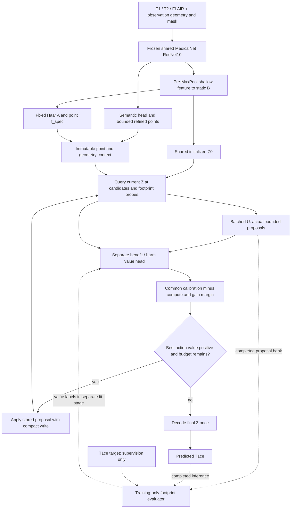

# Astra: second-pass trajectory research and architecture synthesis

Date: 2026-09-06. Repository: `QuocKhanhLuong/3DGS`, branch `main`. Reviewed HEAD: `1c792b6dd3abba1d1afbbb4987f3d1c76c62a429`.

Scope: research synthesis and an implementation specification for reconsidering Gates C/E and the associated D/F/G interfaces. **Only this report is changed. No production implementation, training, checkpoint modification, or new gate execution is claimed.** The current task explicitly permits design proposals beyond the locked implementation; it does not implement them or open Gate H. MedicalNet remains frozen and the spectral tap remains before MaxPool.

Evidence labels: **FACT** means inspected source/artifact, verified literature mechanism, executed synthetic result, or a stated mathematical deduction. **INFERENCE** means an interpretation supported by those facts. **HYPOTHESIS** means an empirical claim requiring a new experiment. **PROPOSAL** means a specification, including every new architecture, threshold, training stage, and GPU budget below. Unmarked entries inside a proposal table inherit PROPOSAL status. GPU budgets are planning caps, never measured forecasts.

## 1. Executive conclusion

**Recommend Proposal-aware Footprint Gain Refinement (PFGR), policy `proposal_footprint_gain_v1`: learn useful bounded corrections first; evaluate each proposed correction using a signed, whole-reconstruction-aligned footprint target; select and stop using the same calibrated net value.** Use a short sequential budget of at most four updates initially, allow revisits, remove physical travel and overlap penalties, and keep a parallel sparse correction set and a no-routing reconstructor as serious competitors. Four is an experimental ceiling, not a scientific constant or required route length.

This recommendation is conditional on action headroom. The decisive first question is whether **any action the updater can actually produce improves reconstruction beyond a properly trained Z0 baseline**. If an independently measured oracle cannot beat random actions, improving routing is premature. If a fixed or parallel correction baseline matches PFGR at equal cost, choose the simpler method. Nothing in the supplied run establishes adaptive refinement's contribution: it reports final reconstruction without paired Z0, random, or oracle reconstruction.

The recovered idea is **spatial allocation of latent reconstruction computation using fixed observation-derived evidence**. It is not active MRI acquisition. The August frontend plan defines fixed spectral evidence A, refined sparse points, and mutable Z while leaving the selector, updater, history, stopping, and losses unresolved. A later implementation plan chooses reward-minus-cost routing. Those later choices are hypotheses about how to realize the idea, not its irreducible scientific content. An older, explicitly replaced system really did acquire new slice observations; transferring its travel and no-revisit intuitions to latent writes needs fresh justification. See §2.

The most consequential new results are:

1. **Proposal-aware scoring was already attempted in this repository.** Commit `9a33058` used a 222-dimensional `[old descriptor, proposed update]` scorer and batched proposals; `39a39d3` reverted it after a “failed paired gate.” The retained material inspected here does not provide an attributable paired reconstruction result. This is prior implementation history, not evidence that proposal conditioning is either successful or scientifically invalid. PFGR must outperform that exact control under repaired supervision, not claim the idea as new.
2. **The output footprint is a union of extruded, interpolation-expanded plane supports.** A 4-mm write is local in plane coordinates, not in reconstructed 3D space. A synthetic 17³ example changed 1,685 output voxels, 1,428 outside the 257-voxel local sphere. Its local Charbonnier gain was positive while global gain was negative. The current centre-fibre sample design has zero inclusion probability for much of that footprint; merely increasing samples on the same fibres cannot remove the bias.
3. **Signed gain on one fixed global objective telescopes.** Summing actual marginal gains equals initial minus final reconstruction loss. Candidate-normalized local means do not have this property. This supplies a principled target, route accounting identity, and a reason not to subtract a second heuristic redundancy penalty by default.
4. **Seeing the proposed update is necessary to remove one particular aliasing problem, but is not sufficient to identify its consequences.** Remote affected decoder features and unknown target residuals remain relevant. PFGR therefore tests compact footprint state summaries alongside full updater inputs and the proposed vector. These summaries are approximations, not a proven Markov state.
5. **Calibration can be made prefix-consistent.** With one frozen scorer, a common strictly increasing calibration map, candidate-independent compute cost, and no history-dependent preference, adaptive inference follows a prefix of the forced-budget greedy route. Calibrating subject-level maximum winner overestimation on those complete routes avoids the circularity of fitting thresholds on states that change when the threshold changes. The guarantee is marginal across exchangeable subjects, not conditional clinical safety or a bound on false stops.
6. **Counterfactual evaluation can avoid copying hypothetical planes altogether.** Bilinear sampling is linear in plane values. Compute the exact discrete write contribution at sampled queries, add it to the old 96-dimensional decoder input, and apply the unchanged nonlinear decoder. Independent CPU probes agree with real writes to below `7e-17` in float64. This makes footprint supervision plausible, but GPU feasibility remains a required experiment.

The scientific claim, if earned, is narrower than “a smart trajectory reconstructs MRI”: **a learned policy can choose useful sparse latent corrections, account for their nonlocal output effects, and improve the quality–compute tradeoff over matched static, random, fixed-budget, and parallel alternatives.** The broad ingredients already have precedents; any novelty lies in the demonstrated combination and footprint treatment, not in inventing adaptive computation or tri-planes.

## 2. Recovered original idea / source of truth

### 2.1 Recovery method and chronological evidence

**FACT.** Repository task navigation was run before code inspection. There is no `.codegraph/` index; the repository's `scripts/codegraph.py` is an ownership navigator. The requested report task name is unregistered, so the existing `trajectory`, `supervision`, and `server_pipeline` scopes were used. Semble located design/history references; direct reads and `git show` then inspected them. No index was created. History was inspected before judging the current code.

| Source / time | What it actually establishes | Authority for this investigation |
|---|---|---|
| [Pre-refactor router, parent of `4ccffce`](https://github.com/QuocKhanhLuong/3DGS/blob/d812751ea080f73023e61418d5245d9a06b6057c/docs/reconstruction/modules/TRAJECTORY_ROUTER.md), §§1–3, 9–14 | Actions were modality/slice pairs; commit preceded revealing new pixels. State included uncertainty, history and remaining budget. Learned gain, oracle diagnostics, batches, and receding horizon were alternatives. Travel had a physical acquisition interpretation. | Historical ancestry, explicitly superseded; **not** permission to reinstate sparse acquisition or Gaussian systems. Reproduce with `git show '4ccffce^:docs/reconstruction/modules/TRAJECTORY_ROUTER.md'`. |
| [`4ccffce`, 2026-08-11](https://github.com/QuocKhanhLuong/3DGS/commit/4ccffcef0d3df0b2734335c34223fc98eda900af), [original frontend note](https://github.com/QuocKhanhLuong/3DGS/blob/4ccffce/docs/architecture/POINT_GUIDED_FRONTEND.md) | Replaces the previous research direction with observation-only multimodal input, semantic points, bounded refinement and compact PoU; trajectory/reconstruction are future interfaces. | Earliest inspected source for the present point-guided direction. |
| [`d623d17` original PLAN](https://github.com/QuocKhanhLuong/3DGS/blob/d623d17/PLAN.md), §§2, 5–7, 11, 14 | One MedicalNet traversal; pre-MaxPool evidence; A fixed across steps; P* sparse carrier; Z mutable reconstruction state. Selector, updater, history, stopping, decoder and losses explicitly open. | Strongest separation of scientific representation from later algorithm choices. |
| [`7b4df61`, original C/D/E plan](https://github.com/QuocKhanhLuong/3DGS/blob/7b4df61/PLAN_GATE_C_D_E.md), §§1, 3, 7, 14, 28 | Expected usefulness of an update at each current state; cumulative gain with travel/redundancy/step penalties; compact updates; final-Z decoding; training-only measured counterfactual supervision. | First detailed formulation of the adaptive-update hypothesis, before implementation. |
| [`bc4f6bf`](https://github.com/QuocKhanhLuong/3DGS/commit/bc4f6bf), [`fe9fc03`](https://github.com/QuocKhanhLuong/3DGS/commit/fe9fc03) | Implemented trajectory/decoder/objective and server infrastructure. | Software evidence, not proof of contribution. |
| [`9a33058`](https://github.com/QuocKhanhLuong/3DGS/commit/9a33058), [`39a39d3`](https://github.com/QuocKhanhLuong/3DGS/commit/39a39d3) | Temporary 222-d proposal-conditioned scorer and batched UpdateNet; subsequent revert. | A prior design attempt requiring acknowledgment and controlled replication. |
| [`b61792f` through `e934339`](https://github.com/QuocKhanhLuong/3DGS/commit/e934339), September 1 | Bounded travel, separate ranking/halting, terminal reward supervision. | Local remediation history, not the source of the original idea. |
| [First Astra report](astra-trajectory-formulation-review.md), September 5 | Mechanistic critique, artifact arithmetic, signed local/spill redesign. | Evidence and a competing proposal, not scientific authority. |

**INFERENCE.** The current direction aims to synthesize missing T1ce from already available T1/T2/FLAIR through a compact observation representation, then deploy semantic/spectral point evidence where it can improve an evolving latent reconstruction. Sequentiality was intended to reassess utility after changing state. “Adaptive” primarily meant **state-dependent spatial allocation**, with variable stopping later made operational; it did not originally require a particular K distribution.

No private conversation or unpublished manuscript was recovered that independently states a stronger theorem, novelty claim, or mandatory route algorithm. This is a documentary reconstruction, not a claim to know the author's unrecorded intentions. The word “audit” is interpreted as predicting/checking the effect of a proposed correction; no independent scientifically validated audit network was found in the inspected current design chain.

### 2.2 ORIGINAL IDEA CONTRACT — Table A

| Scientific component | Original intent | Current implementation | Mismatch | Recommended interpretation |
|---|---|---|---|---|
| **Problem** | Missing-contrast T1ce synthesis from registered observations | Absolute T1ce prediction through final Z | Final quality alone does not establish point contribution | Improve reconstruction at an explicit computation budget |
| **Inputs** | T1/T2/FLAIR; observation geometry and legal mask | `[B,3,D,H,W]`, RAS XYZ mm, observation-derived mask | Server preprocessing provenance not established by exports | Preserve input and provenance boundaries |
| **Outputs** | Reconstructed target contrast | `[B,1,D,H,W]` from final Z | None at conceptual level | Final reconstruction plus honest compute/action diagnostics |
| **Latent state** | Mutable reconstruction tri-planes Z; fixed B/A evidence | Shared `64→32` B-to-Z0, additive writes | Z0 was sometimes discussed without a paired decoded baseline | Z0 is latent; **D(Z0)** is the no-correction image baseline |
| **Point branch** | Sparse semantic/spatial carrier of observation-derived correction evidence | Deterministic points, ≤2-mm refinement, 4-mm support, f_spec | Sparse PoU construction itself is not proof it helps decoding | Attribute points, semantics, spectral evidence and routing separately |
| **Candidate actions** | Potential updates at refined points | Index scored before update is generated | Point alone hides the operation being valued | Action is `(state version, point index, bounded proposed correction)` |
| **Update operation** | Compact correction of Z using fixed evidence | One 32-vector per plane times a radial kernel | Plane-local does not imply output-local | Preserve compact latent writes, account for their output footprint |
| **Decision objective** | Expected reconstruction benefit with economy | Sigmoid clipped relative local/spill proxy minus heuristics | Units, support and harm differ from final reconstruction | Expected signed change of one fixed masked reconstruction objective |
| **Stopping objective** | Avoid unnecessary updates | Separate maximum reward threshold / K cap | May halt or continue independently of the chosen action's value | STOP has zero incremental benefit; compare actual candidate net value with margin |
| **Training supervision** | Post-context reconstruction and measured hypothetical gain | Joint reconstruction/local/monotonic/delta/reward; terminal counterfactuals | Moving labels, updater starvation, gradient conflicts | Useful-updater learning, frozen value-bank fitting, independent calibration |
| **Inference constraints** | No target or new target evidence | Inspected value path observation-only | Runtime source parity remains unknown | Typed target-free context; target only in distinct supervision/evaluation engine |
| **Scientific novelty** | Compact semantic/spectral point-guided evolving reconstruction | Many individually familiar components | Neither existence nor complexity establishes novelty | Prove incremental benefit and effect-aware compute allocation |
| **Non-negotiable constraints** | Shared frozen prior, correct geometry, fixed prepool evidence, target boundary | Largely represented by explicit contracts | No synthetic test certifies data provenance | Retain these plus feasible runtime and measurable correction contribution |
| **Optional choices** | Earlier plan leaves route/stop/loss open; later plan selects one form | RewardNet width/sigmoid, costs, ST, 64 cap, exact no-revisit in G | Implementation locks were mistaken for permanent scientific necessities | Reconsider all; keep an item only for a mechanism and a passed comparison |

## 3. Scientific intent vs current implementation

**SCIENTIFIC INTENT:** use already observed anatomy, semantics and spectral structure to make a better reconstruction through limited spatial corrections. A static reconstructor compresses all conditioning into one initial representation. The point branch is intended to deliver additional conditional processing to Z, not additional MRI measurements.

**CURRENT IMPLEMENTATION:** produce B/A/P*, score a 126-d point descriptor, greedily select under costs, compute one bounded correction, repeat, decode Z, and attach target-based objectives afterward. It is one possible factorization of this intention.

**FACT, mathematical boundary.** For fixed trained parameters, all inference states are deterministic functions of X and permitted inference randomness independent of Y. Consequently the computation cannot add target information beyond X: in the deterministic case `I(Y; X,Z_t)=I(Y; X)`. Extra steps can improve a finite-capacity predictor's use of X, but cannot remove irreducible conditional ambiguity by acquiring absent evidence. High reconstruction uncertainty or anatomical complexity is therefore **not automatically high value of another correction**.

**PROPOSAL.** Retain the shared MedicalNet, prepool spectral construction, refined points and final-Z decoder as the common research platform. Preserve geometry, fixed 4-mm kernels and ≤2-mm point displacement for this coordinated phase. This isolates the update-policy contribution without quietly changing the representation. These retained choices still require contribution ablations; their retention is experimental control, not deference to existing code.

**INFERENCE.** There are three distinct scientific claims: representation quality, availability of useful point corrections, and ability to allocate those corrections. They must have three distinct controls. A better Z0 can shrink route headroom; a better updater can make random routing sufficient. Both outcomes may be progress even if adaptive routing is discarded.

## 4. Current implementation deep reconstruction

### 4.1 Audited computation and source map

**FACT.** The inspected source at this HEAD has the same production trajectory path as the first report's reviewed HEAD; the intervening commit adds that report. Source locations below are current at the reviewed HEAD.

| Contract / operation | Inspected source |
|---|---|
| One shared frontend then context/trajectory/reconstruction | [model.py](../src/smagm/features/point_guided/model.py), `PointGuidedMRIModel`, especially context construction around 353–408 |
| State query and descriptor | [reward.py](../src/smagm/features/point_guided/reward.py), `_sample_plane` 30–52; `DynamicStatePointQuery` 103–146; descriptor 149–173 |
| Rank, halt, ST selection | [trajectory_solver.py](../src/smagm/features/point_guided/trajectory_solver.py), `AdaptiveRouteSolver` 36–94 |
| Costs and configuration | [trajectory_cost.py](../src/smagm/features/point_guided/trajectory_cost.py), `TrajectoryConfig` 23–69; costs 79–154 |
| Update selection and live state write | [trajectory.py](../src/smagm/features/point_guided/trajectory.py), `_run`, particularly 296–478 |
| Correction parameterization | [updater.py](../src/smagm/features/point_guided/updater.py), `UpdateNet` 44–67 |
| Physical discrete support and full-plane clone | [writeback.py](../src/smagm/features/point_guided/writeback.py), `_write_plane` 40–84 |
| Pointwise final-Z MLP | [decoder.py](../src/smagm/features/point_guided/decoder.py), `ImplicitTriPlaneDecoder` 76–202 |
| Counterfactual sampling, fibre support, target and detach | [reward_supervision.py](../src/smagm/features/point_guided/reward_supervision.py), 316–381, 432–573, 603–767 |
| Actual and terminal objectives | [training_objective.py](../src/smagm/features/point_guided/training_objective.py), 345–499 |
| Public inference reconstruction of old policy fields | [baseline_inference.py](../src/smagm/features/point_guided/baseline_inference.py), 43–77, 189–260 |

With `z_i=[z_xy,z_xz,z_yz]∈R^96`, the current networks are:

\[
r_i=\sigma\{\mathrm{MLP}_{126\to64\to1}([z_i,\pi_i,\bar q_i,\alpha_i])\},
\quad \delta_i=s\tanh\{\mathrm{MLP}_{270\to128\to96}([z_i,f_i^{spec},\pi_i,\alpha_i])\}.
\]

The selected vector is applied with a fixed spatial kernel per plane; `s=0.1` in the reviewed corrected profile. The current updater has **47,072 parameters**, the reward head 8,193, and the decoder `96→64→32→1` has 8,321. RewardNet does not consume the signed/raw spectral channels that UpdateNet sees. The route consumes point semantics and spectral evidence; computing sparse PoU elsewhere in the frontend is not evidence that PoU weights directly participate in this write or decoder.

Corrected ranking uses `r−0.05 travel−0.20 overlap`; halt compares another maximum to 0.025. Training can force the first step and use ST weights. Validation through the training wrapper permits revisits. Public Gate G supplies no-revisit while rebuilding a legacy config without the corrected flags. The first report documents this mismatch; the current `route_config` implementation was re-read in this pass.

### 4.2 What the latest artifacts establish

**FACT.** The three files are in `03-09-2026-reports/`; they were read and hashed again. They remain untracked and unmodified.

| Artifact | SHA-256 |
|---|---|
| config.yaml | `bb4854bbf7ebc7fd186c57f8c1cd0bcf351d1495ab7602613a53d61d5051d37c` |
| wandb-metadata.json | `6fe7df81220db74d0e500fa91c889bf7ad5fbae14f0255d4eb2c754e08e38c1c` |
| wandb-summary.json | `09cbe609c787b18f7c519c13cc897efee9115237a661dad4e51854e95fb65983` |

They name `trajectory-logic-fix-smoke-e3-gpu1-20260903-152425`, three epochs, FP32, batch one, RTX A4000 metadata, start `2026-09-03T08:45:45.532293Z`, and source SHA `d02e50b57d5d82165641f1f39a16b83a9d6e431b`. `git cat-file -t` cannot resolve that object locally. Two GPUs in host metadata do not prove distributed training. The exported config lacks the complete effective model/trajectory/data configuration. No server, live W&B history, checkpoint, or original paired-gate experiment was accessed here.

The summary reports final MAE **0.14425335**, PSNR **14.94371264 dB**, SSIM **0.32982035**, elapsed **129,644.23 s ≈36.01 h**, and last-epoch Gate-E/train time **34,116.999/40,278.321 s =84.70%**. `gpu_peak_allocated=14,931,720,192` bytes is about **13.91 GiB**; it is an exported allocation metric, not proof of peak whole-device usage.

Conditional on the inspected aggregation and cap 64, `mean_K/(1−fraction_K0)=64.00000000000021`; nonzero routes reach the cap to export precision. A cohort of 121 would imply 119 K0 and two K64, but the exact cohort count is not established without the split. The first report's arithmetic remains useful; it does **not** supply missing action gains. No per-case Z0 reconstruction, signed global action effects, oracle headroom, or route trace is available. The final quality metrics therefore cannot show that routing improved or harmed reconstruction.

## 5. Lessons from first Astra report

| First-pass observation | Deeper implication / nearby unexplored failure | Formulation or local defect? | Consequence for this report |
|---|---|---|---|
| Rank and halt can use different candidates | The decision does not optimize a common action-plus-STOP objective; an untouched high-score candidate can act as a persistent continuation witness | Local defect exposes missing decision semantics | One action value used for both choice and continuation |
| K0/Kmax extremes | A histogram can reflect real homogeneous action usefulness, score offset, updater weakness, or policy logic; it cannot distinguish these | Evidence/identifiability issue | Condition K on measured useful-action availability; never target an aesthetically varied histogram |
| Clipped relative local labels | They are not increments of a shared potential; cumulative predicted “reward” cannot be reconciled with final reconstruction | Fundamental target issue | Fixed-ROI signed footprint gain and a telescoping audit |
| Terminal labels fix reward starvation | A controller cannot create actions its transition model never learned; better value fitting may correctly stop weak updates | Control/learning order issue | Establish useful actions before routing |
| Train/validation/G differ | The deployed policy is the model plus preprocessing, action semantics, budget, calibration and availability—not just tensors in a state dict | Architecture/provenance issue | Hash and version the executable policy bundle |
| Gate E dominates | The learning algorithm, including label production, is part of the method's cost; a cheap inference MLP can require an infeasible teacher | System/method issue | Offline immutable banks and exact sparse counterfactual evaluation |
| Reward sees less than updater | Recovering the missing proposed action does not recover remote affected residual context or unknown target anatomy | Representation issue | Test both proposal conditioning and footprint state context |
| Travel is locality | “Distance travelled” can be an inherited acquisition metaphor with no compute counterpart | Scientific interpretation issue | Zero locality cost by default; keep distance as descriptive telemetry only |
| K is not success | Three gates are needed: useful action existence, discrimination, and quality–latency contribution | Experimental design issue | E0/E1 before learned routing; E8 decides the contribution |

**INFERENCE.** The first-pass signed local/spill v2 is a sound diagnostic improvement over clipping, but it leaves the output influence mismatch in the primary target and retains no-revisit without a latent-correction argument. PFGR directly measures the footprint, allows bounded repeated corrections, and adds a prefix-calibrated policy. These are testable differences, not a judgment that the earlier short diagnostic was unreasonable.

## 6. New findings from deeper analysis

### Table B — NEW FINDINGS

| Finding | Severity | Evidence | Scientific implication | Action |
|---|---|---|---|---|
| Proposal-conditioned routing already existed and was reverted | High for novelty/provenance | `9a33058`, `39a39d3`; old `forward_candidates`, 222-d scorer; [historical audit](audit/workers/agy-a-architecture.md) §6 | Cannot advertise it as a newly discovered idea or infer efficacy from the revert's title | Include the historical architecture as a controlled arm; recover the missing paired evidence if available |
| Local sphere does not describe output influence | High | Writer/query composition; §15 proof; 1,428 affected voxels outside sphere in probe | Current gain target can miss most potential damage | Use full footprint or a valid estimator |
| Centre-only spill has a support failure, not just too few samples | High | `build_spill_samples` fixes two coordinates at centre | More samples on three centre fibres remain biased for patch-wide effects | Give every affected output voxel positive sampling probability |
| Shared-objective marginal gain telescopes | High opportunity | §9/§24 identity | Can reconcile routing scores, selected actions and final quality in common units | Signed fixed-mask Charbonnier target; cumulative-gain residual log |
| Rank-one plane writes constrain updater action capacity | High hypothesis | `correction[:,None,None] * weight`; 96 free channel coefficients | Router might be selecting among intrinsically weak actions | Direct-vector oracle before capacity expansion |
| Fixed write scale has no invariant output meaning | Medium | Decoder/state reparameterization; Jacobian expression §8 | 0.1 neither certifies small image changes nor proves undersized updates | Measure latent scale, saturation and output response |
| Full updater descriptor plus proposal is still not a sufficient state | High | Remote-feature counterexample §10 | Better representation can improve conditional prediction, never recover unavailable target residual exactly | Footprint context ablation; distinguish reducible and irreducible error |
| Parallel frozen proposals commute in Z but may interfere in image loss | High | Additive writer; nonlinear decoder; §14 | Point distance/no-revisit is not a correct compatibility test | Measure footprint overlap and pair interaction |
| No-revisit can remove legitimate coordinate-descent actions | Medium | Repeated same-kernel writes sum; updater depends on current Z | Repeating a point is not reacquiring the same data | Allow fresh proposals at revisited points under a hard budget |
| Selection incurs compute before deciding K0 | High operational | Dense candidate scoring; proposal-aware design | More sophisticated stopping can cost more than the updates it saves | Include scorer/context construction and initial/terminal assessment in latency |
| Common monotone calibration yields policy-prefix invariance | High opportunity | §17 proof | Decision calibration can be separated from state collection without threshold-state circularity | Frozen full-budget rollout, subject-level winner residual calibration |
| Sparse exact counterfactuals are practical at query level | High opportunity | Independent affine probes below `7e-17` FP64 | Avoid hypothetical plane clones; denser valid labels may be affordable | Batched private query-delta engine with reference equivalence tests |
| Existing experimental validation has been repeatedly used for development | High evidence limitation | Debug/run/report chronology; missing fresh test evidence | Another validation-selected threshold is not untouched-test evidence | New predeclared partitions; no test-set tuning |

Severity describes impact on the research conclusion, not a claim of clinical hazard. Opportunities remain proposals until implemented and empirically verified.

## 7. Point-guided correction headroom analysis

**FACT.** Real-data headroom cannot be computed from the three summary exports. There is no usable trained checkpoint or per-subject Z0/prediction bank in the provided evidence. No reconstruction effect is inferred from synthetic weights. The following is the required offline diagnostic design.

Hold a common frozen frontend/initializer/decoder/updater snapshot. Generate all candidate proposals without targets at each diagnostic state. Only then attach T1ce to the counterfactual evaluator. Start every arm from the identical Z0; decoder, mask, normalization and metrics must match.

| Arm | Construction | What it diagnoses |
|---|---|---|
| **Z0** | Decode without any update or scoring | Baseline quality and cost |
| **No-op update** | Same infrastructure, δ exactly zero | Numerical/normalization artifacts; true gain must be zero |
| **Random-1** | Uniform point identity fixed before target access | Typical updater action |
| **Random-K** | Seeded target-free actions with replacement, K=1,2,4 | Whether arbitrary recurrent correction already suffices |
| **Oracle-1** | Best measured action among all N, with STOP=0 | Selector-independent one-step headroom |
| **Oracle-K** | At each oracle state, generate all proposals first, then choose best post-hoc gain; stop if none positive | Greedy diagnostic headroom, not globally optimal K-step control |
| **Forced Oracle-K** | Same diagnostic but forced K, even negative steps | Separates useful stopping from action ranking; report negative outcomes |
| **Learned fixed/adaptive** | Entire route completed target-free before scoring outcomes | Value/policy discrimination and stopping quality |
| **Direct-vector oracle** | For fixed candidate p and frozen decoder, optimize its 96-vector inside the same box using target only in the diagnostic sandbox | Capacity of the writer/decoder action family, distinct from current U's learned capability |

The direct-vector oracle is nonconvex and initialization/iteration dependent. Call it an **optimization-based lower bound on attainable action quality**, not a global optimum. A successful direct-vector oracle with a weak current-U oracle implicates updater learning/input quality. Failure of both can implicate the write family, strong Z0, insufficient oracle optimization, or weak decoder sensitivity; it does not mathematically prove zero capacity.

A learned K-step policy can outperform greedy Oracle-K by choosing a better sequence. Preserve a negative learned-to-greedy-oracle gap if observed; only exact one-step all-action regret with STOP has the nonnegative definition used below. Greedy Oracle-K is not an upper bound on every K-step policy.

**PROPOSAL.** Evaluate N=2,048 for Oracle-1 on eight preassigned development subjects initially. Use one noisy probe bank for broad screening and an **independent** bank or exact footprint enumeration for selection confirmation. Best-of-N on the same noisy estimates is optimistically biased. Log a “screened subset oracle” if only finalists are accurately evaluated; it is a lower bound on attainable true gain, not an exact all-N best. Oracle-K on all N at four states is a separate budget item; a small subset cannot establish its absence of headroom.

Report per-subject ΔMAE=`MAE(Z0)−MAE(final)`, ΔPSNR=`PSNR(final)−PSNR(Z0)`, ΔSSIM similarly, and ΔCharbonnier, along with local and global action effects. Use subject-level paired confidence intervals, random-seed variability, oracle–learned gap and learned–random gap. A route trained jointly with its base can make D(Z0) an off-distribution ablation; also train a dedicated static Z0 control to convergence under the same upstream capacity and training budget. Both comparisons are needed.

**Decision tree.** No reliable Oracle-1 headroom → do E1 capacity diagnostics, not threshold tuning. Oracle beats random but learned does not → value/representation/policy problem. Random≈oracle and both beat Z0 → corrections matter, adaptive spatial choice may not. Oracle-K≈Oracle-1 → sequential depth may not matter. All routed arms≈dedicated static baseline → reconsider the entire point-correction contribution.

## 8. UpdateNet analysis

**FACT.** One action supplies only three 32-dimensional channel vectors. For plane φ it writes `K_iφ ⊗ δ_iφ`, a rank-one channel-by-space update with a predetermined nonnegative radial profile. There is no learned within-patch spatial shape. Its 96 coefficients may induce complicated image effects through different decoder inputs, but cannot independently prescribe every affected voxel's residual.

For a differentiable decoder, a small action approximately changes a voxel by

\[
\Delta\hat y(v)\approx J_D(z(v))\,[k_{i,xy}(v)\delta_{i,xy},k_{i,xz}(v)\delta_{i,xz},k_{i,yz}(v)\delta_{i,yz}].
\]

The output response depends on the **direction** of δ and on decoder Jacobians throughout the footprint. Norm alone does not identify benefit. At scale 0.1 the channel box gives `||δ||₂≤0.1√96≈0.9798`; it is not an image-error bound. Rescaling latent coordinates and inversely rescaling the decoder can preserve predictions while changing the meaning of a fixed latent write scale. Measure state RMS and decoder response before increasing the bound.

**PROPOSAL, diagnostics before expansion:** per-plane proposal RMS/norm and cross-candidate cosine diversity; fraction of pre-tanh logits with `abs(logit)>2`; relative correction/state RMS; output sensitivity norms; actual footprint positive/negative effects; action variation with p and f_spec; selected/random updater gradient norms; and `g(U)`, `g(0)`, `g(−U)`, `g(0.5U)`, `g(2U clipped to the same box)`. These are offline diagnostic actions, not automatic inference line search using targets.

The current final reconstruction gradient is spread over the whole mask while a single action affects a small fraction; local loss increases signal but can optimize the wrong region. The current monotonic term repeatedly protects the **first selected sphere**, not the whole reconstruction or even each current footprint. This can favor preserving the start over useful remote correction. Replace it in the primary updater objective with measured signed footprint effects; keep global final metrics as the acceptance criterion.

**PROPOSAL.** Initially retain the existing U architecture to isolate learning and measurement. Train it on isolated and short random routes using a frozen, adequately trained base/decoder. If a direct-vector oracle succeeds and U fails, compare adding the same footprint context to U, then a wider MLP. If even optimized vectors cannot express helpful actions but an unconstrained patch oracle can, test a small fixed spatial basis per plane in a subsequent design revision. A basis expansion needs its own support/equivalence/runtime tests; it is not silently included in PFGR v1. Sequential revisits at one point can add amplitude but, with fixed p and kernels, stay in the same 96-dimensional latent write subspace.

## 9. Reward/value formulation analysis

Let Ω be the fixed output lattice, m an observation-derived binary evaluation mask, `M=Σ_v m(v)>0`, and

\[
R(Z;Y)=\frac1M\sum_{v\in\Omega}m(v)\rho(D_Z(v)-Y(v)),\qquad
\rho(e)=\sqrt{e^2+\epsilon^2},\quad \epsilon=10^{-3}.
\]

**PROPOSAL.** Define action gain `g_i(Z,Y)=R(Z;Y)−R(T_i(Z);Y)`, positive for improvement. It is absolute signed **mean masked Charbonnier reduction in normalized target intensity units**. It is neither PSNR nor a percentage nor a probability. Predictions and targets are not clipped by this metric; target normalization is frozen and predictions are treated consistently across every arm.

**FACT, deduction.** For any executed route with a fixed decoder, target, mask and loss,

\[
\sum_{t=0}^{K-1}g_{a_t}(Z_t,Y)=R(Z_0;Y)-R(Z_K;Y).
\]

Consequently a cumulative sum of exact signed gains measures final improvement. This identity does not require greedy selection, monotonic improvement, or independent actions. It fails for per-action changing denominators/domains. No extra redundancy cost is needed to account for actual diminishing reconstruction gains; an additional penalty changes the scientific objective and must be justified separately.

### 9.1 Target alternatives

All options require GT only during training/evaluation. None makes the individual unseen Y deterministic from X; “identifiable” here means a well-defined conditional expectation given the available descriptor and a fixed updater/decoder.

| Target | Identifiability / noise / scale | Cost and relation to final reconstruction | Ranking / stopping suitability |
|---|---|---|---|
| A. Absolute signed local gain | Defined but local residual omitted; relatively low variance | Cheap sphere; ignores most footprint | Local ranking only; unsafe global interpretation |
| B. Relative signed local gain | Divides by unseen variable pre-error; unstable near low error | Cheap; candidate/subject scales vary | Can prefer tiny absolute gains; threshold lacks common global units |
| C. Affected-footprint signed gain with **global M** | Same estimand as D for pointwise loss; sampling variance controllable | Exact support enumeration or importance sampling | Preferred; directly supports ranking and a quality margin |
| D. Whole-volume signed gain | Clear fixed objective; dense evaluation has no sampling noise | Most expensive reference; unnecessary outside footprint | Gold reference; no guarantee it is learnable from a small descriptor |
| E. Local gain minus collateral damage | Meaningful if disjoint regions, consistent volume weights, full support | Local/spill means are not sufficient; ignores beneficial collateral if only damage counted | Conservative surrogate if explicitly named; not exact global expected gain |
| F. Separate positive improvement / harm integrals | Two conditional means with common units; potential cancellation noise | Same samples as C, no extra decoder calls | Preferred two-head diagnostic form; difference equals C exactly in target space |
| G. Ranking only | Labels only within state; invariant to score shifts | Can use C labels and pairs; no absolute scale | Useful fixed-budget control; cannot determine STOP alone |
| H. P(g>0) plus magnitude | Must model both positive and negative conditional magnitudes | Sign labels noisy near zero; three quantities for exact mean | High probability of small gain can hide rare large harm; positive magnitude alone inadequate |
| I. Quantile / lower-bound gain | Conditional tail, not conditional mean; enough data and shift control needed | Pinball fitting plus separate calibration | Useful risk rule; can sacrifice average gain and increase false stops |

A conditional median from L1 or a generic Huber optimum is not automatically expected gain. Use scaled squared error for the conditional-mean claim. Ranking loss, if later added, must be checked for calibration distortion.

### 9.2 What a decomposed value should mean

At each voxel define `d_i(v)=ρ(before−Y)−ρ(after_i−Y)`. PFGR targets

\[
b_i=\frac1M\sum m(v)[d_i(v)]_+,\qquad
h_i=\frac1M\sum m(v)[-d_i(v)]_+,\qquad g_i=b_i-h_i.
\]

These are **benefit and harm over the whole affected footprint**, not “local benefit” and “remote harm”: local voxels can be harmed and distant voxels can improve. For explanation, also split both integrals into sphere and outside-sphere contributions. The exact difference remains global gain; taking the positive part **after** averaging would be a different target.

Use two nonnegative output heads with common scale and a primary net-gain loss. Predicting update magnitude is unnecessary because δ is known; coverage/redundancy can be computed; semantic reliability α is not statistical uncertainty. Do not multiply a gain estimate by an arbitrary “confidence.” An extra harm coefficient β>1 creates a risk-averse objective `b−βh`; it is a valid optional utility but must not be renamed expected reconstruction improvement. MAIN uses β=1 and a separately calibrated overestimation allowance.

## 10. Candidate representation sufficiency

**FACT, constructive argument.** The old q descriptor contains square-root energies of signed high-frequency channels. Flipping a high-band sign can preserve q and its cross-plane agreement, while changing raw f_spec. Two candidates can therefore share the 126-d reward input while supplying different U inputs and different corrections. A scorer can at best learn their conditional average effect. Appending the actual δ removes that particular action ambiguity.

But even `[full U input, δ]` is insufficient in general: two states can have identical features at p and identical δ but different latent features elsewhere in the footprint, changing the nonlinear decoder response. Even the **full** target-free state cannot reveal subject-specific missing-contrast residuals not determined by X. Proposal conditioning improves information and credit assignment; it does not create target observability.

**PROPOSAL.** Compare nested representations on the **same frozen action/label bank**: 126-d; historical 222-d; 270-d full U input; 366-d full U input plus δ; and PFGR's 562-d descriptor including compact footprint moments and position. Match head capacity in a second control to distinguish extra information from extra parameters. Include sign-alias and remote-state synthetic pairs. Report within-state top-1 regret and winner calibration, not only global RMSE.

The full transition process is Markov when state includes Z, fixed observation context, geometry and any imposed history/budget constraints. The proposed pooled descriptor is only an approximation to that state. For a myopic gain head, step index and remaining budget do not change the mathematical immediate gain; adding them can encode training bias. Budget belongs to the controller. Route depth is logged and used to audit calibration. If empirical residuals remain depth-dependent after state conditioning, test a depth feature; do not assert it is necessary in advance.

Global `Pool(Z)` is inexpensive but may dilute the region affected by one action. A coverage map is needed only if coverage itself is in the decision objective or if legal actions depend on it. MAIN uses neither a coverage penalty nor an LSTM history. Recent point identity, accumulated displacement and travel remain diagnostics. Allowing revisits avoids adding artificial history to the action law.

## 11. Proposed-update-aware scoring analysis

**PROPOSAL.** Reverse the under-informed ordering:

\[
o_i^t=[z_i^t,f_i^{spec},\pi_i,\alpha_i]\in\mathbb R^{270},\quad
\delta_i^t=U_\theta(o_i^t),\quad
(\hat b_i^t,\hat h_i^t)=V_\phi(o_i^t,\operatorname{sg}(\delta_i^t),h_i^{foot},\tilde p_i).
\]

An action includes the **stored proposed vector**, its point identity, and the source state/version. Selecting an action executes that vector, rather than recomputing a potentially different action after selection. Proposals expire whenever state, U weights, point geometry, write scale or kernel semantics change.

**FACT, operation count.** The current U needs `270×128+128×96=46,848` matrix multiply-accumulates per candidate, excluding biases/activations. At N=2,048 this is **95,944,704 MACs** (roughly 192 million multiply/add FLOPs under the two-FLOPs-per-MAC convention). FP32 proposals occupy **786,432 bytes =0.75 MiB per subject**. This is a plausible dense proposal workload, not a measured GPU latency. It is N times the selected-only MLP work, so “U is small” does not justify ignoring it.

Batched `[B,N,270]→[B,N,96]` evaluation is algebraically identical to flattened candidate evaluation. Chunk candidates, hoist validation out of inner loops, and cache static f_spec/semantics. No hypothetical plane images need to be built to produce proposals. The previous implementation already had `forward_candidates`, so the mechanics are neither new nor speculative; only their runtime and efficacy in the redesigned method remain unverified.

A lightweight alternative appends three norms, maxima or hidden U activations. Norm summaries lose direction and sign. Reusing detached U hidden activations can save repeated feature extraction, but sharing **trainable** layers between the calibrated value head and U reintroduces moving labels. MAIN uses separate V parameters and the explicit full δ; E3 tests summary compression only if it preserves top-1 regret and calibration.

The historical 222-d variant was `[z,π,q_bar,α,δ]→64→1→sigmoid`. It still used the old clipped target and compact reward context. PFGR differs in signed whole-footprint targets, staged fitting, full U input, footprint context, no ST value gradient, and versioned calibration. The revert proves that a prior attempt was removed; it does not identify which of those design/training factors caused its failed gate. The historical audit's word “improperly” describes then-locked contract compliance, not a mathematical argument against action conditioning.

## 12. Routing formulation analysis

### 12.1 Which mathematical family fits?

| Interpretation | Fit to this task | Necessary distinction |
|---|---|---|
| Sequential error correction | Strong operational description | True target residual is unavailable at inference; updates are amortized from X/Z |
| Value-of-computation allocation | Strongest decision objective | Computation changes predictions, not observations; account for scorer overhead |
| Sparse iterative refinement | Strongest architecture description | Sparsity is in latent write locations, not necessarily output influence |
| Learned optimization | Useful analogy | U does not receive the true reconstruction gradient at inference; no convergence theorem follows |
| Active computation | Strong | Avoid the phrase active acquisition |
| Contextual decision making / bandit regression | Good one-step value fitting approximation | Actions change future contexts; no online GT reward feedback at deployment |
| Finite-horizon control | Correct full abstraction if delayed effects matter | Requires sufficiently informative state and future-return supervision |
| Sparse mixture-of-updates | Strong parallel competitor | Spatial actions share U; they are not independent parameter experts |
| Residual routing | Strong | Residual corrections need not have positive measured value |
| Learned adaptive depth | Relevant alternative | Depth does not itself answer which spatial action to execute |

**INFERENCE.** The best initial family is **budgeted sparse iterative refinement with supervised myopic value-of-computation decisions**. This avoids learning a long-horizon controller before proving useful one-step actions, while retaining a clear escalation criterion: reliable delayed gains that myopic decisions reject.

### 12.2 Eleven routing options

| Formulation | Mechanism | What would justify it / what defeats it |
|---|---|---|
| 1. Greedy signed gain | Choose max calibrated g, stop at common margin | Best initial adaptive baseline; fails on necessary temporarily harmful actions |
| 2. Gain + locality | `g−w_local d` on profitable actions | Keep only if locality improves held-out quality/latency at matched budgets; physical distance alone supplies no compute rationale |
| 3. Gain + diversity | Penalize affected-footprint similarity or measured redundancy | Useful for stale parallel proposals; with fresh exact marginal gain it may double-count redundancy |
| 4. Fixed-budget ranking | Rank current candidates, execute exactly K | Simple control without calibration; can force harm; adaptive spatial choice without adaptive K is still meaningful |
| 5. STOP explicit action | Compare `max_i value_i` to zero | MAIN's scalar comparison is already an explicit STOP policy; a learned STOP logit is not required |
| 6. State stop head + scorer | State predicts whether any useful action exists | Could avoid an expensive dense scan; must measure missed useful candidates and training-max noise |
| 7. Proposal-conditioned gain | Evaluate the actual δ before choosing | Fixes action ambiguity; does not solve footprint/target ambiguity |
| 8. Value of computation | Gain minus incremental runtime/risk allowance | MAIN; needs quality-unit cost conversion and end-to-end profiling |
| 9. Short horizon Q | `Q_b=g−c+max(0,max Q_{b−1}(Z'))` | Only after two-step rescue effects exceed estimation noise and compute cost |
| 10. Differentiable adaptive computation | Hazard/ponder loss across possible depths | Could learn depth jointly; expensive intermediate supervision and probabilistic-policy parity must be addressed |
| 11. Parallel adaptive sparse set | Propose/score at Z0, choose up to K compatible positives, sum writes | Serious low-latency rival; must learn/evaluate interactions and stale scores |

No greedy optimality, adaptive-submodularity, or informative-path approximation guarantee is assumed. These require properties of the objective and transitions that have not been established here. Positive immediate gains do not ensure the globally best route; negative immediate gain does not prove a useless multi-step plan.

## 13. Stopping / value-of-computation analysis

The ideal objective is

\[
\min_\pi\;\mathbb E[R(Z_{K_\pi};Y)]+\rho_{time}\,\mathbb E[T_\pi],
\qquad K_\pi\le B_{route}.
\]

**PROPOSAL.** PFGR approximates this with a conservative immediate decision:

\[
v_i^t=\mu_i^t-q_{cal}-c_t-\gamma_{quality},\quad
a_t=\arg\max_i v_i^t;\quad
\mathrm{STOP}\iff \max_i v_i^t\le0.
\]

Here μ predicts the signed Charbonnier gain, q is an overestimation allowance, c is a measured incremental compute cost converted into the same loss units, and γ is a separately named practical improvement margin. Equality stops. There is one winning action and one value comparison. `K=0` is legal and can be correct.

**Cost accounting matters.** Once all proposals/scores at a state have been computed, that scan is sunk. Compare execution against stopping from that state. Under a protocol that always reassesses after a nonfinal write,

\[
c_t=\rho_{time}\big(t_{write}+\mathbf1[t+1<B_{route}]\,t_{assess}\big).
\]

This is the cost of one more write plus the required next assessment, not a robot travel cost. Final dense decoding occurs on both branches and cancels in this local comparison, but remains in total latency. The initial assessment is overhead even for K0. If costs vary substantially by candidate support, a candidate-specific model is possible, but it changes calibration/prefix details and is **not** MAIN.

The one-step rule ignores the benefit of future actions that a write may enable; it is a **myopic VOC approximation**, not an exact metareasoning solution. With nearly constant update costs and no measured timing objective, set `compute_cost=0`, use a declared gain margin, and call the experiment a quality-margin policy. Do not fabricate a conversion from seconds into MAE/Charbonnier units. The final operational cost uses a predeclared quality–latency tradeoff, selected only on development data and frozen before calibration/test.

Redundancy is reflected by a genuinely state-dependent marginal gain; harm is already subtracted in b−h. Subtracting βh a second time or adding a blanket overlap penalty changes risk preferences. Uncertainty is not itself gain: use calibrated residual error to avoid false confidence, and report false stops induced by conservatism.

## 14. Sequential vs parallel refinement

**FACT.** For fixed proposals generated from the same state,

\[
Z'=Z+\sum_{i\in S}W_i\delta_i
\]

is order-independent in exact arithmetic. Recomputing U after each write makes later δ state-dependent, so sequential routes generally differ. Even with fixed δ, nonlinear decoding and reconstruction loss mean `g(S)≠Σ_i g({i})`.

For a linear decoder and squared loss, an illustrative exact interaction is

\[
g(\{i,j\})-g(\{i\})-g(\{j\})
=-\frac{2}{M}\sum_v m(v)\Delta\hat y_i(v)\Delta\hat y_j(v).
\]

This interaction can exist even when the written patches do not overlap **within the same plane**, because an XY extrusion can intersect an XZ extrusion in output space. A 3D centre-distance threshold also misses such interactions. Disjoint **output footprints** guarantee independence for this pointwise decoder and additive voxel loss, provided proposals are frozen. SSIM/gradient losses require an expanded loss footprint.

**PROPOSAL, parallel competitor.** Generate all actions at Z0. Sort by calibrated signed gain. Add positive actions greedily until a budget of four, rejecting candidate sets whose estimated footprint-interaction score exceeds a frozen compatibility bound. Sum accepted writes and decode once. Record actual set gain and its difference from summed individual gains. A simple fixed top-K version without compatibility is also necessary to determine whether the interaction mechanism earns its cost.

**Sequential advantage hypothesis:** updated Z changes the direction or location of later useful corrections enough to improve quality at the same total latency. **Parallel advantage hypothesis:** proposals largely commute in practice and the sequential reassessment overhead buys little. Compare frozen shared U/V weights first, then equally budgeted training tailored to each method; otherwise training distribution favors the sequential arm.

MAIN provisionally uses short sequential refinement because the original intended state reassessment has a clear role, and calibration is simplest along a single deterministic path. **If E6 finds no reliable sequential advantage, the final recommendation switches to the parallel or fixed design.** This is a predeclared model-selection rule, not an obligation to retain sequentiality.

### Revisit, diversity and coverage

| Policy | Latent-correction meaning | Decision |
|---|---|---|
| Exact no-revisit | At most one update per point, regardless of new state | Reject as MAIN; no new evidence is being reacquired |
| Cooldown | Temporarily suppress repeated local writes | Diagnostic only; may break legitimate short coordinate descent |
| Diminishing-return feature | Expose number/magnitude of past writes | Try only if current state/context cannot explain diminishing gains |
| Learned redundancy | Predict effect of prior actions | Redundant with calibrated marginal gain unless descriptor insufficient |
| Overlap penalty | Prefer less shared influence | Useful parallel heuristic only after interaction validation |
| Coverage map | Track where computation was applied | Descriptive audit; coverage is not reconstruction improvement |
| Free revisit under budget | Recompute a new δ at any legal p | MAIN; bounded K limits runaway behavior, calibrated gain must justify each repeat |

No state-change threshold is used as a substitute for gain. A deterministic identical-state/action cycle is an implementation diagnostic; tiny updates may still be useful. Record per-point visit counts and cumulative correction norms without treating them as success metrics.

## 15. Spatial influence / affected-footprint analysis

### 15.1 Exact dependency of a discrete write

Let `u(v)` map an output voxel centre through the full RAS affine to feature-grid indices. Let `P_φ` retain the two coordinates for plane φ. At written feature node j,

\[
K_{i\phi}(j)=\left[1-\frac{\|A_f\,\iota_\phi(j,u_i^{omit})-p_i\|_2}{4\mathrm{mm}}\right]_+^2,
\]

where `A_f` includes the feature affine and `ι` inserts the candidate's omitted feature coordinate. This is exactly the physical metric used by `_write_plane`, not a hard-coded Euclidean distance in feature pixels. With bilinear interpolation weight β_j,

\[
k_{i\phi}(v)=\sum_{j\in\mathcal N_4(P_\phi u(v))}\beta_j(P_\phi u(v))K_{i\phi}(j),
\quad
\Delta z_i(v)=\operatorname{concat}_\phi[k_{i\phi}(v)\delta_{i\phi}].
\]

Define `F_iφ={v:k_iφ(v)>0}`, and `F_i=∪_φ F_iφ`. This is an **exact structural influence envelope** for the pointwise decoder under the given write/query semantics. Actual output change can be zero inside it because δ is zero, decoder sensitivity vanishes, or contributions cancel. Outside it the decoded output is unchanged in exact arithmetic.

Each `F_iφ` extrudes a 2D discrete support along the omitted source-grid axis. Bilinear interpolation expands positive influence to queries whose four neighbours intersect a written node, potentially almost one feature-grid interval beyond the written-node support in each retained direction. Under rotation/shear these extrusions follow affine lattice directions, not necessarily anatomical RAS X/Y/Z lines. Source-to-feature mapping remains axis-separable in source index space because it comes from the same affine composed with convolution/pooling scale/offset; no universal coordinate/2 assumption is used.

**Approximate scale intuition only:** for an isotropic interior region with volume side lengths Lx,Ly,Lz and continuous radius r, the three cylinder volumes sum to `πr²(Lx+Ly+Lz)` before subtracting intersections. A sphere has `4πr³/3`. Thus a long volume can have a much larger influence envelope than the local sphere. This is not a substitute for discrete affine support calculation.

### 15.2 A principled sampling estimator without enumerating a volume per candidate

For each φ, precompute the list of **source output-grid retained-coordinate pairs** with `k_iφ>0`, using the four actual interpolation neighbours. Extruding that list over the omitted output index gives `n_iφ=|F_iφ|`, before masking. These lists are compact; no `[N,D,H,W]` tensor is needed.

Set `S_i=Σ_φ n_iφ` and `c_i(v)=Σ_φ 1[v∈F_iφ]`. Draw a plane with probability `n_iφ/S_i`, draw uniformly from its retained-coordinate list, and draw the omitted index uniformly. A voxel in several extrusions can be sampled via several planes, giving

\[
p_i(v)=c_i(v)/S_i>0\quad\text{on }F_i.
\]

Masking is in the integrand, **not rejection sampling with an unknown normalization**. For Q independent samples,

\[
\hat g_i=\frac1Q\sum_{q=1}^{Q}\frac{m(v_q)d_i(v_q)}{M p_i(v_q)},\quad
\hat b_i=\frac1Q\sum_q\frac{m(v_q)[d_i(v_q)]_+}{M p_i(v_q)},\quad
\hat h_i=\frac1Q\sum_q\frac{m(v_q)[-d_i(v_q)]_+}{M p_i(v_q)}.
\]

**FACT, proof:** `E[ĝ]=Σ_{F_i} p(v)m(v)d(v)/(Mp(v))=R(Z)−R(T_iZ)`, since the difference is zero outside F_i. The same proof gives unbiased b and h; using identical samples gives `ĝ=b̂−ĥ` sample by sample. Dividing by the *sampled* count of valid voxels would instead introduce a ratio estimator and change the target.

This estimator is unbiased over its random sampling law, not exact for a particular finite bank. Low-discrepancy fixed probes may reduce error but are classified APPROXIMATE, without an unconditional Monte Carlo unbiasedness claim. MAIN label banks use seeded iid sampling and retain seeds/probabilities; fixed deterministic context probes are separate. All-N maxima need independent measurement or simultaneous uncertainty treatment. Tail bounds based on bounded loss differences are possible because Charbonnier is 1-Lipschitz and finite decoder weights/δ imply a finite response bound, but such bounds may be too conservative; measure this before claiming useful certified decisions.

A full mask can reduce effective sample size. Optional stratification into sphere, peripheral patch fibres, boundary and background is allowed only with recorded inclusion probabilities and correct weights. Do not importance-sample by GT error unless explicitly marked training-only and its sampling probabilities remain valid. Uniform geometric sampling is the clean primary reference.

### 15.3 Executed synthetic evidence

**FACT; software/math evidence only.** Python/PyTorch 2.13.0, CPU, float64, seed 71, no pretrained weights. A positive bounded channel correction at the centre of a 17³, 1-mm lattice was written through the actual `CompactTriPlaneWriteback`. A constructed positive-weight instance of the actual SiLU decoder responds on the support union. A target equal to the post-write prediction inside the sphere and pre-write prediction elsewhere demonstrates a counterexample:

| Quantity | Measured result |
|---|---:|
| Output voxels / local sphere voxels | 4,913 / 257 |
| Affected output voxels / outside sphere | 1,685 / 1,428 |
| Individual unmasked extrusion counts | 765, 765, 765 |
| Signed local mean Charbonnier gain | +0.017690213567470015 |
| Signed whole-volume mean gain | −0.00020812639075246667 |
| Mixture-estimator exact expectation minus dense gain, absolute | `5.421010862427522e-20` |
| Mean of 400 iid estimator replicates, Q=1,024 | −0.00020778514248427852 |
| Standard error of that replicate mean | `4.733838644481995e-06` |

This establishes existence of local/global disagreement, not its prevalence in MRI. It also does not quantify the current spill-aware score on this example; the central-fibre omission is established separately by its sampling support.

A second independent probe computed four-neighbour kernel contributions directly from geometry, **without deriving them from the written state**, then compared `D(query(Z)+Δz)` to `decode_points(actual_write(Z))`. At 4,096 fractional queries for each translated stride-two geometry, maximum absolute errors were identity `6.591949208711867e-17`, rotation+anisotropy `6.938893903907228e-17`, shear `5.551115123125783e-17`. This tests the exact sparse counterfactual mechanism. It does not certify future CUDA, AMP, boundary indexing or gradients; those are specified in §25.

### 15.4 Limits and extensions

The equivalence to whole-volume gain applies to additive pointwise Charbonnier/MAE/MSE losses with fixed masks and decoder. For finite-window SSIM, evaluate all **loss-window centres** whose windows intersect the image footprint; for finite differences include affected edges and their neighbours. Whole-volume PSNR is obtained from updated global MSE, not by averaging local PSNR. A decoder with spatial convolutions, normalization across queries, attention, or global pooling would change this footprint theorem. PFGR preserves the pointwise final-Z decoder.

## 16. Training curriculum

### 16.1 Recommended stages

All stages below are **PROPOSAL**, not executed in this review. The target enters a training-only evaluator after target-free base/proposal/route computation. Optimizing weights using post-context losses is permitted supervision; feeding those targets or residual maps into inference is not.

| Stage | Work | Trainable | Frozen / fixed | Exit evidence |
|---|---|---|---|---|
| S0 — base competence | Train D(Z0) and post-context coarse semantics; no reward loops | Base projector, Z initializer, decoder, semantic head | MedicalNet/BN; A/P construction rules; refiner held at its recorded initialization/checkpoint | Reproducible static baseline; common checkpoint and intensity/mask contract |
| S1a — updater capability | Isolated actions and target-free random routes of lengths 1/2/4; use footprint gain gradients | U only | Base, decoder, semantic/spectral producers, points; V absent | Current-U oracle and random actions show useful headroom |
| S1b — observation-interface adaptation | Short MAIN continuation training the shared spectral band projector with U; optional separate point-refiner arm retains ≤2-mm bound | U and existing shared band projector; point refiner only in the declared arm | MedicalNet, fixed Haar filters, decoder, base and semantic head | Compare to U-only arm; freeze every producer before value-bank creation; point changes invalidate geometry caches |
| S2 — value dataset and fitting | Generate a fixed bank of target-free states/actions, attach b/h/g measurements, fit V | V only | Entire transition/reconstruction context including U and points | Held-out within-state ranking and paired gain calibration |
| S3 — one policy improvement pass | Freeze old V; collect target-free forced-greedy and random states, including terminal; rebuild/add labels for the same fixed U; refit V from stationary labels | New V only | Collection policy during collection; all reconstruction modules | Better winner regret/state coverage, no loss of calibrated quality |
| S4 — calibration | Fit monotone gain map, then subject-max allowance on disjoint subjects | Calibrator only in calibration-fit stage | Final V/U/base/decoder/candidate semantics | Prefix invariance; winner coverage and false-stop audit |
| S5 — final evaluation | Identical public inference policy on development/test, targets afterward | None | Entire inference bundle | E8 contribution or simpler-model selection |

S1a is a U-only capability control, not the entire final updater curriculum. S0 has no path into the spectral band projector through D(Z0), so freezing a randomly initialized projector forever would be an unmotivated restriction. S1b trains that existing shared projector with U while preserving fixed Haar filters and within-route fixed A. Point-refiner fine-tuning remains a separate explicit arm, not a hidden difference between value representations. The existing point refiner remains a legitimate Gate-F trainable; temporarily freezing it is experimental isolation. All final variants record which stages trained it. No MedicalNet parameters or BN running statistics change in any stage.

### 16.2 Which actions should train U?

Uniform isolated actions provide an unbiased view of typical action quality but can dilute scarce useful examples. Semantically stratified actions improve coverage of observation-predicted tissues, but **segmentation labels must not select them** in the target-free behavior policy. Random fixed-K routes teach state transitions and revisits, at the cost of occasional harmful writes. High-value predicted actions focus useful regions but can self-confirm V errors. Training-only oracle-selected actions can accelerate rare beneficial patterns, but winners from a weak U do not teach missing corrections by themselves.

**PROPOSAL.** Begin with an equal mix of isolated uniform actions and target-free random routes; balance the latter across lengths 2 and 4. Within the random stream, compare a predeclared 25% observation-semantic stratification arm to uniform. Use every reached depth for updater gradients, normalized once per subject. Do not run counterfactual value fitting inside this optimizer loop. A training-only oracle-imitation arm is permitted in E1/E4 after U has measurable actions: generate proposals first, evaluate them with GT, detach the chosen teacher identity, and learn from the supervised outcome. Retain random states and labels, and evaluate all resulting policies target-free.

**Important selection bias:** training V only on oracle winners conditions the label distribution on GT-based success. This can inflate predicted gains even without an inference leak. Retain all measured screened actions (including harmful/no-op outcomes), with group identities and sampling probabilities. Oracle histories can encode target-dependent choices into Z; they are privileged training distributions and must never be reported as target-free policy trajectories. Prefer observation-only learner/random rollouts for the primary V bank.

### 16.3 Joint, alternating or staged?

Fully joint U/V/base optimization makes gain labels nonstationary and lets reconstruction selection gradients distort V. Fully staged fitting gives stationary action effects but leaves value under-covered on newly visited states. PFGR uses fully staged reconstruction/updater fitting plus **one bounded offline policy evaluation/improvement iteration** with U fixed. This borrows the state-coverage lesson of dataset aggregation, without claiming its regret theorem or implementing online RL.

If later joint fine-tuning improves reconstruction, finish that stage, freeze the new transition model, **discard incompatible gain labels/calibration**, rebuild banks, and recalibrate. Alternating U and V is coherent only when every bank carries transition/decoder/geometry hashes and is invalidated accordingly. MAIN avoids unlimited alternating loops; a moving-target training system is not the simplest supported starting point.

## 17. Calibration and decision risk

### 17.1 What needs calibration

Argmax across N=2,048 candidates amplifies optimistic errors. Under the illustrative assumption of independent equal-variance Gaussian errors, the typical extreme scales like `σ√(2 log N)≈3.9σ`; candidate errors here are correlated, so this is intuition, not a numerical bound for this model. Pointwise RMSE cannot certify winners. Required strata include Z0/depth, selected/top/random, revisit status, footprint size and tissue mix.

| Approach | Strength | Limitation / MAIN decision |
|---|---|---|
| Positive-slope affine map | Cheap, preserves ordering; adjusts common scale/offset | Cannot fix nonlinear miscalibration; MAIN initial fit |
| Isotonic gain map | Monotone nonlinear recalibration | Ties and small samples; compare only if affine residuals demand it |
| Winner-conditioned calibration | Matches argmax deployment population | Must use fresh subjects and the final scorer; MAIN |
| Depth-conditioned calibration | Can reduce overly conservative global allowance | Small depth cells; primary subject-max bound avoids fitting many thresholds |
| Direct positive-gain classifier | Interpretable sign discrimination | Ignores gain magnitude and rare severe harm |
| Probability + positive/negative magnitudes | Models asymmetric outcomes | More components/data than direct mean b/h plus residual calibration |
| Quantile regression / CQR | Heteroscedastic lower predictions | Tail sample size, state shift and selected-population validity remain issues |
| Ensemble variance | Useful model disagreement diagnostic | Expensive and not automatically calibrated uncertainty |
| Conformal/risk-control calibration | Explicit finite-sample assumptions and units | Marginal versus conditional risk; adaptive distribution/threshold tuning can invalidate it |

### 17.2 Prefix-consistent calibration specification

**PROPOSAL with a mathematical justification.** Fix all model weights, candidate rules and the route budget. On calibration-fit subjects, run a **forced** budget-four greedy route using raw net prediction `ĝ=b̂−ĥ`; no targets choose actions. Fit `μ=a ĝ+b`, with `a≥10⁻⁶`, on its winners using post-context exact footprint gains. This monotone map does not change their order. Freeze a,b.

On n=64 disjoint bound-calibration subjects, generate the same forced greedy route target-free. Evaluate each chosen action's true footprint gain by exact enumeration, then calculate

\[
r_s=\max_{t<B_{route}}[\mu_{s,t}-g_{s,t}]_+,\qquad
q_{cal}=r_{(\lceil(n+1)(1-\alpha)\rceil)},\quad\alpha=0.05.
\]

If the order statistic exceeds n, set q=+∞ and reject adaptive release as uncalibrated; do not silently change α. Zero-proposal/no-support actions are excluded from legal correction actions consistently in calibration and inference; STOP remains available. Valid forced routes shorter than the cap use all their reachable winners.

**FACT, deduction under assumptions.** With one common increasing score map, candidate-independent costs, free revisit and deterministic ties, any threshold-stopped greedy route is a prefix of the forced route. Threshold changes truncate the route but do not change its pre-stop choices. If calibration subjects and a new subject are exchangeable under this fixed procedure and the gain measurements are exact, the split-rank argument gives marginal probability at least `1−α` that **all forced-route winner overestimations on the new subject are ≤q**. Adaptive selected actions inherit that event because they form a prefix.

This controls a subject-level event of overoptimistic continued actions relative to their fixed margin. It **does not** imply 95% conditional coverage among rare continuing subjects, 5% harmful-action frequency conditioned on continuation, correct false-stop rate, validity after model selection on the same calibration subjects, or robustness to preprocessing/population shift. Evaluate these separately. It is a proposed adaptation of split calibration, not a theorem established experimentally for this repository. Exact footprint labels are used for the small calibration winner set to avoid an unaccounted Monte Carlo error term.

Using different risk-adjusted scores to rerank candidates, candidate-dependent calibration, locality penalties or a state stop head can destroy this simple prefix argument. Those variants need their **own** frozen-policy calibration procedure. Calibration is refit after changing N, U, V, decoder, points, write scale, normalization, mask, budget or policy version.

### 17.3 False stops and risk-control limits

Winner calibration alone cannot establish that no unchosen point has a beneficial action. False stops require all-N or explicitly bounded-subset oracle probes at stopped states. Report lower-bound detection counts for subset oracles; “no positive sampled action” is not “no useful action.” A conservative q can legitimately turn everything into K0 while protecting the overestimation event; that is not a successful allocation method if useful actions are systematically missed.

The original monotone-loss Conformal Risk Control construction cannot be applied blindly to route quality: raising a threshold can truncate beneficial later corrections and change a reconstruction-risk function nonmonotonically. Prefix calibration above targets overestimation along one fixed path instead. Learn-then-Test style evaluation of a finite frozen policy family is an alternative if explicit multiple-testing correction and adequate independent subjects are available. Neither is a free guarantee on a policy repeatedly tuned against validation.

## 18. Target leakage and experimental validity

**FACT within inspected source scope.** Targets are not arguments of the dynamic query, U, writer, solver or decoder. The trainer's context separates observation computation from post-context target objectives. The earlier report traced observation-derived masks/normalization before target use. This pass confirmed the target detach/counterfactual boundaries and explicit target-free decoder inputs. Server source and upstream preprocessing provenance remain unverified by the exports.

**PROPOSAL, strict API boundary:**

```text
InferenceContext = encode(observations, observation_mask, geometry)
InferenceResult  = refine_and_decode(InferenceContext, frozen_policy)
Evaluation      = evaluate_completed_result(InferenceResult, TargetContext)
ValueLabels     = measure_fixed_proposals(CompletedProposalBank, TargetContext)
```

TargetContext must never be reachable from the inference object graph. A training-only oracle lives in a separate evaluator, generates new **diagnostic** states after target-based choices, and cannot return a policy context to the public inference endpoint. Keep oracle outputs tagged `target_aware_diagnostic`; prevent their route records from being logged as learned-policy results.

Test target replacement, shuffling, deletion and poisoning **after context construction**: candidate points, proposal tensors, scores, identities, K, stop reason and final prediction must remain identical. Training loss/labels may change. Test segmentation replacement separately. Use observation geometry/ROI for every inference-dependent geometry and candidate choice; target-derived cropping, registration correction, normalization statistics or mask admission must not feed inference. Target normalization used only for supervision does not provide an inference feature. Preserve provenance for any upstream preprocessing whose observation files may already depend on target registration.

Split by subject (and known repeated/related scans) before feature caching, target statistics, teacher labels or calibration. Development choices use only development subjects; calibration-fit and bound-calibration have separate roles; test is opened once after all choices and runtime limits are frozen. Previously reused validation is development evidence. All static and routed arms share target scaling, ROI and metric conventions. Missing/corrupt data exclusions are logged with counts rather than selected for favorable results.

## 19. Runtime / system redesign

### 19.1 Work decomposition

The supplied last epoch attributes 84.70% of train time to Gate E. The current 32-candidate loop per supervised state calls before/after local and spill decoders, builds safe targets/masks, clones planes, and repeatedly validates tensors. These operations are visible in source; their individual timing shares need a profiler. The first report's `4M` point-decoder calls per state is supported by the re-read counterfactual loop.

PFGR moves label generation out of every optimizer step. Store a bounded bank of Z0, one interior and terminal states, at most three distinct states per subject. Start with 16 labelled actions/state and Q=1,024 iid footprint probes/action, increasing only for the separate oracle/calibration reference. Fit V repeatedly on cached scalar labels/features at little decoder cost. Zero loss coefficients skip building their computation graphs.

### 19.2 Proposed components and equivalence classes

| Component / optimization | Responsibility | Classification and condition |
|---|---|---|
| `ValidatedTargetContext` | Validate/detach target and observation mask once; cache M; integer-voxel gather | **EXACT** for fixed tensor identity/version and the declared voxel-centre loss; do not reuse across mutation |
| `CandidateGeometryCache` | Full affine transforms, projected support lists, per-plane metrics, point/source hashes | **EXACT** for immutable points/grid/kernel; refiner updates invalidate it |
| `CandidateSupportCache` | Four-neighbour indices/weights, extrusion sizes and membership evaluation | **EXACT** discrete support; no continuous radial substitution |
| `BatchedUpdateProposal` | Flatten/chunk candidate MLPs, retain actual action vectors | **NUMERICALLY EQUIVALENT**; floating-point GEMM order can differ |
| `SparseCounterfactualWrite` | Compute Δz only at requested queries, without hypothetical full Z clones | **EXACT algebra**, **NUMERICALLY EQUIVALENT implementation**; match boundary/dtype/affine rules |
| `BatchedCounterfactualDecoder` | One shared before-query bank per state; concatenate/chunk before/after vectors into the unchanged MLP | **NUMERICALLY EQUIVALENT**; separate batch rows must not mix candidates/states |
| `StateProbeBank` | Cache baseline query features and predictions for the same immutable state | **EXACT reuse**; state or decoder changes invalidate cached predictions |
| Footprint iid sampling | Estimate b/h/g with known p(v) | **APPROXIMATE finite estimate, unbiased over sampling** |
| 32-probe footprint context | Compact target-free moments for V | **APPROXIMATE representation**, not a full sufficient state |
| Fewer states/actions than old Gate E | Bound teacher work | **APPROXIMATE/change of training distribution**, not an equivalent speedup |
| Frozen frontend cache | Reuse observation features if every generating weight/preprocessing item is fixed | **EXACT reuse** under those keys; not valid during trainable projector/refiner updates |
| AMP / lower precision | Potential memory/throughput improvement | **APPROXIMATE**, separate quality and decision-parity gate; FP32 reference first |
| Threshold pruning of tiny kernel effects | Skip small output effects | **APPROXIMATE**, excluded from MAIN exact engine |

Caches include subject/observation identity, mask hash, source affine, feature-grid transform, refined point hash, model/U/decoder hash, kernel version, dtype, normalization and probe seed. Do not use a Python `frozen=True` dataclass as proof tensors cannot mutate; own detached snapshots/version checks. Never retain target tensors in the exported clean inference checkpoint.

### 19.3 Feasibility accounting

At N=2,048, dense U proposals cost about 96M MACs. A `562→128→64→2` V adds about 164M MACs. Thirty-two context queries per candidate produce 65,536 point queries; their 96-d FP32 features occupy 24 MiB if materialized, and can be streamed by candidate chunks. The complete descriptor tensor is about 4.39 MiB/subject; action vectors 0.75 MiB. These omit activations, support lists and the frozen frontend, so they are not peak VRAM predictions.

For an illustrative `155×240×240` output, the final decoder alone has about 73.4 billion MACs from its three linear layers. This geometry is illustrative, not proven for the supplied server run. The actual speed balance depends on query bandwidth, batching, launches and validation. Extra dense proposal/context work can be affordable relative to a dense decode yet still exceed the old route's cost. Inference already avoids decoding every route step; do not claim PFGR saves K dense decodes that the current implementation never performs.

Use two separate runtime claims: (1) **same-work** counterfactual engine speed/memory against actual writes with identical probes; (2) **whole-method** training and inference including fewer labelled states, proposal/context overhead and final decode. A reduction in samples is not a same-work speedup. Profile CPU/CUDA synchronization, support building, query/MLP, copying, backward and I/O independently. GPU estimates in §26 are stop caps pending first-eight-subject pilot extrapolation.

## 20. Expanded literature synthesis

### 20.1 Search and verification protocol

**FACT.** This was a targeted research survey, not a systematic review or exhaustive novelty clearance. Searches on 2026-09-06 covered adaptive computation/pondering, spatial routing, learned optimizers, recurrent inverse problems, adaptive image restoration, feature acquisition, contextual bandits, imitation learning, ranking, tri-planes, selective prediction, calibration, risk control and test-time compute. Source acceptance required an identifiable original paper or author/publisher page with a mechanism relevant to the comparison. Secondary summaries and search-engine crawl dates were not used as publication evidence. The exact searchable titles and primary links are recorded below. Critical equations were checked in the PonderNet methods, spatial ACT paper, AdaRevD methods, risk-control material and the local code; for other entries, the mechanism-level claim is bounded to the primary abstract/available paper text inspected. No clinical effect is imported from another task.

The two most useful bridges are **adaptive low-level image restoration** and **metalevel compute allocation**. The former already adapts spatial computation without acquiring observations. The latter explains why a step must earn its cost. Acquisition papers remain useful mainly as contrasts and for immutable counterfactual tooling.

### 20.2 Mechanism / resemblance / difference / borrow / non-claim matrix

| Primary reference | Mechanism and resemblance | Key difference | Borrow | Must NOT claim |
|---|---|---|---|---|
| Graves, [Adaptive Computation Time](https://arxiv.org/abs/1603.08983), 2016, method | Differentiable halting accumulation, remainder and ponder penalty; variable internal depth | Weighted intermediate outputs, generic recurrent tasks | Explicit computation accounting; depth supervision | ACT proves useful spatial correction or provides calibrated gain |
| Banino, Balaguer & Blundell, [PonderNet](https://arxiv.org/html/2107.05407v2), 2021, §§2.2–2.5 | Hazard `p_t=h_t∏(1−h_j)`, expected prediction loss and geometric-prior regularization | Probabilistic halt and output-at-halt; not candidate gain ranking | Reach multiple depths in training; distinguish training unroll from inference policy | A deterministic threshold is unchanged PonderNet, or its prior is a risk certificate |
| Figurnov et al., [Spatially Adaptive Computation Time for Residual Networks](https://openaccess.thecvf.com/content_cvpr_2017/html/Figurnov_Spatially_Adaptive_Computation_CVPR_2017_paper.html), CVPR 2017, §2 | Different spatial positions use different residual depth | Spatial feature-map layers, not physical point writes into tri-planes | Spatial compute baselines and actual-time evaluation | Spatially adaptive computation is new in PFGR |
| Hay, Russell, Tolpin & Shimony, [Selecting Computations](https://arxiv.org/abs/1207.5879), UAI 2012 | Metalevel decisions value internal calculations by downstream decision improvement | Simulations reveal information about choices; here a correction directly changes an output | Explicit STOP value, computation cost, myopic versus long-horizon distinction | Their optimality/sampling results apply to our learned transitions |
| Andrychowicz et al., [Learning to learn by gradient descent by gradient descent](https://arxiv.org/abs/1606.04474), NeurIPS 2016 | Train an optimizer exploiting a task family | Optimizer has objective information/gradients unavailable for T1ce inference | Separate optimizer capability from action scheduler; unroll stability | U is true gradient descent on unseen T1ce or converges to its optimum |
| Putzky & Welling, [Recurrent Inference Machines](https://arxiv.org/abs/1706.04008), 2017 | Learned recurrent inverse-problem updates | Uses a likelihood/forward-model gradient; missing-contrast synthesis has no observed T1ce fidelity gradient | Fixed observation context and recurrent correction comparisons | Data consistency with acquired T1ce or acquisition-independent guarantees |
| Yu et al., [Path-Restore](https://arxiv.org/abs/1904.10343), 2019 preprint / later journal version | Pathfinder selects restoration routes per region; reward combines restoration performance, complexity and difficulty | Multi-path image CNN; RL training rather than explicit effect regression | Strong spatial-compute comparator; quality–cost objective | “Route computation where restoration helps” is itself novel |
| Kong et al., [ClassSR](https://openaccess.thecvf.com/content/CVPR2021/html/Kong_ClassSR_A_General_Framework_to_Accelerate_Super-Resolution_Networks_by_Data_CVPR_2021_paper.html), CVPR 2021 | Classifies sub-image difficulty, routes to different-capacity SR networks | Static patch partition, multiple capacities, not shared point corrections | Deliberately simple difficulty/router baseline | Difficulty equals reducible gain or tri-plane effects stay inside patches |
| Mao, Li & Wang, [AdaRevD](https://arxiv.org/html/2406.09135v1), CVPR 2024, §§3.2–3.4 | Reuses a trained encoder, trains reversible sub-decoders and a classifier for patch exit | Image deblurring, high-capacity multiple decoders; exit based on degradation classes | Capacity diagnosis before halting; memory-conscious staged training | PFGR invents frozen-encoder refinement or adaptive restoration exits; import its FFT blocks |
| Wang et al., [SkipNet](https://arxiv.org/abs/1711.09485), 2017 preprint / ECCV 2018 | Activation-conditioned skipping of residual blocks | Skip existing layers, rather than propose spatial actions | Dynamic-routing overhead and training-policy checks | Skipped FLOPs necessarily produce measured wall-time savings |
| Wu et al., [BlockDrop](https://arxiv.org/abs/1711.08393), CVPR 2018 | Selects residual block subsets for efficient inference | Classification path selection | A fixed-budget learned route without variable K can still be adaptive | More route length is always better |
| Teerapittayanon et al., [BranchyNet](https://arxiv.org/abs/1709.01686), arXiv 2017 version | Confidence-based early exit through auxiliary branches | Classification confidence rather than reconstruction marginal benefit | An explicit early-exit baseline | Classification confidence is gain calibration |
| Fedus, Zoph & Shazeer, [Switch Transformers](https://www.jmlr.org/beta/papers/v23/21-0998.html), JMLR 2022 | Sparse expert dispatch with attention to load and capacity | Different expert parameters/tokens, rather than one shared spatial updater | Batch sparse work; monitor collapse and real throughput | Point selection is a new mixture-of-experts mechanism or needs uniform load balancing |
| Raposo et al., [Mixture-of-Depths](https://arxiv.org/html/2404.02258v1), 2024 | Top-K token selection at fixed capacity yields input-dependent identities with predictable tensor sizes | Transformer token/layer routing | Fixed-budget sparse-set alternative; static shapes can aid efficiency | Adaptive routing requires adaptive K; introduce transformers into this investigation |
| Zhou, Li & Gu, [Neural Contextual Bandits with UCB-based Exploration](https://proceedings.mlr.press/v119/zhou20a.html), ICML 2020 | Contextual reward model and exploration bound | Online reward feedback and stated bandit assumptions | Context/action value representation and logged exploration | Inference observes GT reward; their regret bound covers recurrent MRI synthesis |
| Ross, Gordon & Bagnell, [DAgger](https://proceedings.mlr.press/v15/ross11a.html), AISTATS 2011 | Aggregate labels on learner-visited states to address sequential distribution shift | Expert imitation, different loss/assumptions | One frozen-policy collection/refit pass | A small offline bank inherits no-regret guarantees |
| Sun et al., [Deeply AggreVaTeD](https://proceedings.mlr.press/v70/sun17d.html), ICML 2017 | Uses richer expert cost-to-go information in imitation | Expert future costs and differentiable policy optimization | Oracle labels can bootstrap decision learning during training | An Oracle-1 label is a long-horizon expert value |
| Burges, [RankNet to LambdaRank to LambdaMART](https://www.microsoft.com/en-us/research/publication/from-ranknet-to-lambdarank-to-lambdamart-an-overview/), MSR 2010 | Within-query ranking objectives | Ranking does not identify absolute score scale | State as query; reliable gain pairs and top-1 regret | Pair ordering alone can set a calibrated STOP threshold |
| Golovin & Krause, [Adaptive Submodularity](https://arxiv.org/abs/1003.3967), 2010 preprint / JAIR 2011 | Greedy guarantees under adaptive diminishing returns | That property is not established for harmful nonlinear writes | Test interaction/diminishing returns; state assumptions | Greedy has a 1−1/e guarantee here |
| Shim et al., [Joint Active Feature Acquisition and Classification](https://papers.neurips.cc/paper_files/paper/2018/hash/e5841df2166dd424a57127423d276bbe-Abstract.html), NeurIPS 2018 | Acquires features or stops, using set encoding | Actually reveals missing features | Explicit action/STOP and provenance of available information | Re-reading fixed f_spec is new acquisition |
| Bakker, van Hoof & Welling, [Experimental design for MRI by greedy policy search](https://arxiv.org/abs/2010.16262), NeurIPS 2020 | Learned acquisition policy under a reconstruction objective | Selects new MRI measurements | Frozen-reconstructor comparisons and greedy/long-horizon controls | Their empirical greedy behavior transfers as a theorem |
| Isler et al., [Information Gain for Active Volumetric 3D Reconstruction](https://rpg.ifi.uzh.ch/docs/ICRA16_Isler.pdf), ICRA 2016 | Next-best-view gain trades off robot movement | New views and real motion cost | Explain the resource behind every cost | Millimetre point travel is neural compute expense |
| Singh et al., [Efficient Planning of Informative Paths for Multiple Robots](https://www.cs.cmu.edu/~guestrin/Publications/IJCAI2007/ijcai-2007.pdf), IJCAI 2007 | Information collection subject to path budgets | Physical informative paths and additional sensing | Clear budgets and feasible planning baselines | This route is informative path planning in the same sense |
| Chan et al., [EG3D](https://openaccess.thecvf.com/content/CVPR2022/html/Chan_Efficient_Geometry-Aware_3D_Generative_Adversarial_Networks_CVPR_2022_paper.html), CVPR 2022 | Efficient explicit tri-plane features plus implicit decoding | 3D-aware generative rendering, different training/output | Tri-plane efficiency and factorization awareness | Tri-planes or implicit decoders are new; rendering results validate T1ce synthesis |
| Dar et al., [Image Synthesis in Multi-Contrast MRI](https://pubmed.ncbi.nlm.nih.gov/30835216/), TMI 2019 | Conditional synthesis of missing/corrupted contrasts | Direct synthesis architecture, not sparse latent allocation | A serious static synthesis comparator and modality-level motivation | Missing-contrast synthesis itself is novel or clinically interchangeable with acquired contrast |
| Guo et al., [On Calibration of Modern Neural Networks](https://proceedings.mlr.press/v70/guo17a.html), ICML 2017 | Empirical probability recalibration | Classification probabilities, not signed action gains | Fit calibration separately; verify confidence claims | Temperature scaling converts reward scores into expected reconstruction gain |
| Romano, Patterson & Candès, [Conformalized Quantile Regression](https://arxiv.org/abs/1905.03222), NeurIPS 2019 | Quantile estimates plus finite-sample marginal calibration | Exchangeability and target population matter | Quantile/lower-bound alternative; distinguish marginal from conditional coverage | Winner/trajectory coverage follows from arbitrary pointwise calibration |
| Geifman & El-Yaniv, [SelectiveNet](https://proceedings.mlr.press/v97/geifman19a.html), ICML 2019 | Learns prediction with a reject option, risk–coverage tradeoff | Rejects prediction rather than optional refinement | Plot gain/risk versus continuation coverage | K0 rejects the entire reconstruction or certifies its correctness |
| Angelopoulos et al., [Conformal Risk Control](https://arxiv.org/html/2208.02814v4), ICLR 2024, method | Controls expected monotone loss with calibrated procedure | Route quality need not be monotone in a threshold | State the risk event and assumptions | Its basic theorem controls arbitrary threshold-tuned trajectories |
| Angelopoulos et al., [Learn then Test](https://arxiv.org/abs/2110.01052), 2021/2022 version | Risk constraints reduced to multiple hypothesis testing for fitted algorithms | Requires independent testing/calibration design | Evaluate a small frozen policy family with correction | Reused validation or uncorrected policy sweeps retain guarantees |
| Snell et al., [Scaling LLM Test-Time Compute Optimally](https://arxiv.org/abs/2408.03314), 2024 | Compares verification/search versus adaptive proposal refinement under compute budgets | Discrete language generation and task-specific verifiers | Distinguish proposal capability, verifier capability and allocation | More test-time computation necessarily helps MRI or transfers the reported speedups |

### 20.3 Synthesis and counterevidence

**INFERENCE.** Path-Restore, ClassSR, spatial ACT and AdaRevD are closer comparators than active MRI because their adaptive computation reuses an existing observation. They also challenge an overbroad novelty story. PFGR's distinguishing hypothesis is not region-dependent computation but **valuing a concrete latent action over its nonlocal decoder footprint**, with a common reconstruction gain target and bounded policy-specific calibration.

Three tensions remain unresolved by the literature. First, learned optimization supports recurrent correction, but a missing-contrast model lacks a true inference residual. Second, sparse routing papers show how to save FLOPs, but dense proposal assessment can erase savings. Third, calibration methods offer explicit assumptions, but do not automatically handle model-selected winners, reused subjects or changing transition dynamics. These motivate controlled comparisons and honest failure exits rather than importing a sophisticated controller wholesale.

## 21. Novel method opportunities

Every opportunity below is **PROPOSAL/HYPOTHESIS**, not a novelty claim already established by the survey.

| Opportunity | Mechanism | Required additional evidence | Falsifier |
|---|---|---|---|
| Proposal-aware footprint value | Score δ together with available state/context, predict signed effect | Better top-1 regret than 126/222/270/366-d controls, matched capacity and labels | No gain beyond full-input scalar scorer |
| Benefit/harm accounting | Integrate positive and negative voxelwise effects with one global denominator | Accurate decomposition and improved risk/selection versus scalar g | Extra heads worsen cancellation/calibration or add no useful diagnostic value |
| Exact discrete influence estimator | Extruded bilinear support plus multiplicity-corrected sampling | Dense equivalence, variance/convergence, realistic-mask efficiency | Support misses a changed voxel or finite-sample noise hides candidate gaps |
| Prefix-consistent decision calibration | Fixed greedy trajectory, monotone mapping, subject-max residual allowance | Coverage on untouched exchangeable subjects and acceptable false stops | Calibration changes action identities or produces only unhelpful universal K0 |
| Adaptive sparse correction set | Choose a compatible set of positive proposals, parallel write | Matched-latency superiority or parity to sequential route | Pair interactions cancel benefit or context staleness dominates |
| Oracle-distilled policy | Generate legal proposals then attach post-hoc value labels; retain nonwinners | Better sample efficiency without oracle-state dependence at deployment | Improvement disappears on target-free learner states |
| Bounded policy evaluation/improvement | Fixed U, collect learner states, refit V once | Measurable reduction of distribution-shift errors | Additional iteration costs more than its held-out benefit |

The estimator is derived for this particular writer/query pair and resembles standard importance-sampling reasoning. Its novelty, if any, is the explicit **tri-plane action-footprint construction and demonstrated use**, not a claim to invent unbiased estimation. Proposal-aware routing itself has both generic action-value precedents and this repository's own historical implementation.

## 22. Candidate architecture comparison

### Table C — ARCHITECTURE COMPARISON

Ranks are **research-priority recommendations**, not measured performance rankings. “Expected gain” is a hypothesis conditional on a competent base/updater.

| Rank / architecture | Scientific fit | Expected gain | Risk | Compute | Novelty | Recommendation |
|---|---|---|---|---|---|---|
| **1. PFGR sequential** | Directly values current concrete corrections and their actual influence | Best chance to separate value from harm when interactions matter | Measurement/context/calibration complexity | Dense small U/V, 32 context probes/candidate, ≤4 writes | Possible footprint/value combination; unproved | Recommended implementation with E0/E1/E6 exits |
| **2. Adaptive parallel correction set** | Adaptive sparse allocation without insisting on sequence | Similar if proposals are compatible | Stale values and set interaction | One dense assessment; batched writes | Possible sparse-set/footprint treatment | Prefer if matched quality is indistinguishable and latency lower |
| **3. Fixed sparse correction, no learned routing** | Tests whether point correction itself matters | Could match oracle if useful actions are widespread | Unnecessary/harmful fixed writes | Deterministic K, selected U only, no V/calibration | Low | Required serious candidate; choose if it wins |
| **4. Simple signed point-value router** | Clear same-action objective with minimal context | May suffice if local features explain effects | Misses remote context/action distinctions | Small V; optionally selected-only U | Low | Required lower-complexity adaptive control |
| **5. Static Z0 / matched-capacity static refiner** | Solves synthesis directly | May dominate once trained well | Cannot support adaptive point contribution | Lowest control overhead; capacity-matched variant explicit | Low | Required deployment/research fallback |
| **6. Learned depth/STOP with fixed spatial schedule** | Adaptive computation with fewer scoring decisions | May capture subject-level need for extra refinement | Stop-label noise, fixed schedule, extra training exits | Small state head; unrolled depth training | Low/moderate | Only if spatial ranking adds little but adaptive depth matters |
| **7. Short-horizon proposal Q controller** | Captures complementary/delayed updates | Higher if myopic traps are substantial | Offline extrapolation, moving targets, coverage | Potentially O(N²) search; bounded shortlist only | Moderate but generic control precedent | Defer until two-step rescue evidence justifies it |

### 22.1 Implementation-level candidate cards

| Design | Equation; inputs → outputs | Training and GT boundary | Inference / stopping / execution | Benefit, main risk, migration |
|---|---|---|---|---|
| PFGR | `δ=U(o); (b,h)=V(o,δ,h_foot,p); v=cal(b−h)−q−c−γ` | Staged U, fixed effect bank, V, calibration; GT post-context only | Same value selects/halts, free revisit, sequential budget four | Effect-aware decisions; context may remain insufficient; new value/cache/benchmark modules and checkpoint protocol |
| Parallel set | `S≈argmax Σ_i ĝ_i−ηΣ_{i<j} interaction_ij`, `Z'=Z+ΣW_iδ_i` | Same frozen bank plus post-hoc pair/set measurements; no GT-selected deployment set | Greedy positive compatible set, at most four, one parallel write/decode | Lower loop cost; approximate set objective; reuse U/V, add compatibility and set training |
| Fixed sparse | `Z_{t+1}=Z_t+W_{i_t}U(o_{i_t})`, i_t fixed by seeded geometry schedule | Train U on that schedule; target only afterward | Exactly K∈{1,2,4}, or one parallel set; no gain stop | Simple, strong control; cannot skip harm; minimal migration and no value bank |
| Simple signed router | `ĝ_i=MLP(o_i)` (270-d), signed mean effect labels | U frozen; same g labels/calibration as PFGR | Greedy max ĝ, same-value halt; sequential | Tests whether proposal/context complexity matters; recomputed U must be deterministic; replace old head/labels only |
| Static | `ŷ=D(I(B))`; matched-capacity control optionally adds a small **declared** static plane residual module | Same input/frozen MedicalNet, comparable train budget; GT supervised only | No actions or halt; one decode | Stronger base may obviate route; additional static module changes capacity and needs its own version; no policy migration |
| Learned depth | Fixed schedule U plus `h_t=σ(S(Pool(Z_t),t))`; hazard or supervised STOP | Train on completed target-free depth rollouts with post-hoc loss/compute labels | Stop head plus cap; deterministic threshold variant separately calibrated | Avoid dense spatial ranking; biased “no good action” labels and expensive unroll; new stop module/stage |
| Horizon Q | `Q_b(s,i)=E[g_i−c+max(0,max_j Q_{b−1}(T_i s,j))]`, Q_0=0 | Frozen transitions, bounded exhaustive/shortlist oracle returns; target only offline | Max Q or STOP, remaining budget input; sequential | Can accept temporarily harmful enabling actions; shortlist can omit best plan; largest migration and data cost |

For every design, outputs are final-Z reconstructions with the same frozen MedicalNet/prepool evidence boundary. A capacity-matched static residual module is a **comparison proposal**, not a production change made by this report. A fair comparison reports both equal update counts and equal measured latency; equal K is not equal compute when one arm proposes/evaluates all N actions.

## 23. Recommended final architecture

**PROPOSAL: implement PFGR v1 as the coordinated research architecture, with explicit causal controls and failure exits.** Its defining components are one trained bounded U, a separate effect model predicting benefit and harm, an exact-support counterfactual engine, and one calibrated action/STOP rule. Keep decoder and upstream representation common. No trainable stop network, attention, second encoder, online RL, travel term or ST selection is needed.

Why it best realizes the idea: it explicitly asks whether an observation-derived **correction operation** will improve the current reconstruction, updates the state, and reassesses only within a feasible budget. It does not confuse location, uncertainty, movement, or activity with gain. The footprint target makes the supervision statement and reconstruction contribution commensurate.

Why it improves on the current implementation: signed effect replaces clipped local improvement; U learns before controlling its use; V has action/context information; the same value selects and stops; policy serialization is complete; and counterfactual labels are reused. Why it improves on first-pass v2: footprint measurement is primary rather than a later fallback; no-revisit is removed; and calibration preserves route prefixes instead of silently depending on a threshold-conditioned state population.

Why not select the simpler designs immediately: the fixed evidence plus state-dependent writes offers a plausible reason for adaptive correction, but the existing experiments have not isolated it. PFGR provides a clean way to test that claim without introducing a long-horizon learner. **This is an architectural recommendation under uncertainty, not evidence that it will beat simpler methods.** If matched-budget static/random/parallel controls win, the report's own selection rule rejects PFGR.



The dashed training edges describe offline supervised learning, not a feedback connection during deployment. The dynamic loop carries Z through every accepted write; B/A and point evidence remain fixed within the call.

## 24. Full mathematical specification

All content in this section is **PROPOSAL**, with the support/gain identities proved in §15/§9.

### 24.1 Shapes, context and action types

| Quantity | Shape / meaning |
|---|---|
| X | `[B,3,D,H,W]`, ordered T1/T2/FLAIR |
| Shallow F | `[B,64,Ds,Hs,Ws]`, derived pre-MaxPool shape, detached frozen backbone |
| B | XY `[B,64,Hs,Ws]`, XZ `[B,64,Ds,Ws]`, YZ `[B,64,Ds,Hs]` |
| A | Same respective grids, 56 channels; fixed per call |
| Z_t | Same grids, 32 channels |
| P*, π, α, f_spec | `[B,N,3]`, `[B,N,3]`, `[B,N,3]`, `[B,N,168]`; N=2,048 |
| z_i, o_i | `[B,N,96]`, `[B,N,270]` |
| Proposed δ | `[B,N,96]`, XY/XZ/YZ channel blocks, each bounded by write scale |
| Context probes | `[B,N,Q_ctx,3]` source-voxel centres expressed in RAS, `Q_ctx=32` |
| Footprint context | `[B,N,193]`: two integrated 96-d moments plus one support mass |
| Normalized source position | `[B,N,3]`, WHD source-index coordinates normalized to [−1,1]; derived from RAS geometry, not a new world convention |
| V input / output | `[B,N,562]` / `[B,N,2]` for b/h in global Charbonnier units |
| Final prediction | `[B,1,D,H,W]`, shared final-Z decoder only |

For context-only probe v drawn from the same geometric mixture p_i, define w=m(v)/(M p_i(v)). Then

\[
h_i^{foot}=\frac1{Q_{ctx}}\sum_q w_q\,[z(v_q),z(v_q)\odot z(v_q),1]\in\mathbb R^{193}.
\]

These are **integrated moments**, not exact means/variances conditional on the footprint. They include its relative masked mass and keep a fixed common denominator. Fix context samples deterministically from observation identity, geometry, candidate index and a checkpointed seed; no labels are used. The descriptor is `[o_i(270), δ_i(96), h_i(193), normalized_position(3)]`, totaling 562. Context queries read Z, not intermediate target residuals or a second encoder. Training-only feature standardization means/scales are persisted and applied unchanged at inference.

### 24.2 Networks and transition

\[
Z_0^\phi=\operatorname{Conv}_{1\times1}^{64\to32}(B^\phi),\quad
\delta_i=s_w\tanh(W_{U2}\operatorname{SiLU}(W_{U1}o_i+b_{U1})+b_{U2}),
\]

with U `270→128→96`, bias on both layers, `s_w=0.1`, and existing physical writer `Z_{t+1}=Z_t+W_{p_i}\delta_i`. V is a separate `562→128→64→2` SiLU MLP, bias on each linear layer. Its two outputs a_b,a_h become

\[
\hat b=s_g\operatorname{softplus}(a_b),\quad
\hat h=s_g\operatorname{softplus}(a_h),\quad
\hat g=\hat b-\hat h.
\]

`s_g=max(training-bank RMS(g),10⁻⁶)` is frozen per value-bank version and stored in the checkpoint. It is one global scale, not per-candidate division by GT error. V has **80,450 parameters** (`562×128+128 +128×64+64 +64×2+2`). A direct signed scalar MLP is the required E2/E3 control.

### 24.3 Decision, budget and revisit

1. If route budget is zero, return D(Z0) without V/U proposal assessment.
2. Otherwise query/propose/value all legal finite candidates in chunks. Ignore exact no-op proposals and candidates with no retained write support. Fail closed on invalid numerical input rather than interpret NaN as STOP.
3. Compute `μ_i=a ĝ_i+b`; subtract the common q, compute cost c_t and gain margin γ.
4. Pick the largest value with deterministic lowest-candidate-index tie break.
5. Stop if value≤0; otherwise apply **that exact stored δ** to its source state and increment K.
6. Recompute proposals/context after every write; previous point identities remain eligible. Stop at `route_budget=4` regardless of predicted gain, recording `budget_exhausted` rather than “no useful action.”

No target, segmentation label, target-derived coordinate or metric appears in these steps. No forced first update is used in the deployed policy. Forced routes are named training/calibration/diagnostic policies, not implicit `model.train()` behavior.

### 24.4 Training objectives

Base stage uses the declared existing reconstruction components `R + w_ssim L_ssim + w_grad L_grad` and post-context semantic loss; use fixed weights 0.2, 0.1 and 0.2 respectively for the first control, and record their metric definitions. These auxiliaries train the base/semantic modules only. They are not included in the gain prediction claim.

For fixed points and target-free selected training routes, the updater objective is

\[
L_U=-\frac1{|\mathcal S|}\sum_s\sum_{t<K_s}\frac{\hat g_{s,t}^{live}}{s_U}
+w_\delta\frac1{|\mathcal S|}\sum_s\frac1{\max(1,K_s)}\sum_t\frac{\|\delta_{s,t}\|_2^2}{96s_w^2}.
\]

Use `w_delta=10⁻⁴`, `s_U=max(initial training-probe RMS(g),10⁻⁶)` frozen before S1. In this loss, counterfactual before/after decoding is differentiable through U and executed state updates; the target is detached. The route identities are fixed target-free behavior actions. Summed gain is the final pointwise reconstruction objective in expectation; no reconstruction gradient passes through V or an ST selector. The normalized update penalty is an explicit small regularizer, not a gain label. An ablation sets it to zero because the box already bounds each write.

For optional trainable-point S1b, do **not** differentiate an importance estimator while silently ignoring the changing sampling distribution/support. Use exact footprint enumeration (or a fixed global query distribution independent of point parameters) for its live loss and verify gradient equivalence. Geometry caches are rebuilt after parameter changes. MAIN initial S1a holds points fixed.

For V, with all inputs, labels and transition parameters detached:

\[
L_V=\mathbb E\left[\left(\frac{\hat g-g}{s_g}\right)^2
+0.25\left\{\left(\frac{\hat b-b}{s_g}\right)^2+\left(\frac{\hat h-h}{s_g}\right)^2\right\}\right].
\]

Average within state, then subject, so route length/candidate count cannot silently change subject weighting. MAIN ranking coefficient is zero; E2 tests an auxiliary squared-gap or pairwise logistic loss only on noise-separated within-state pairs. V remains trained exclusively by explicit value targets. All harmful, neutral and no-op measurement records remain in the bank; a no-op target is exactly b=h=g=0. The no-op diagnostic is not passed through an affine intercept and treated as a nonzero action.

### 24.5 Gradient ownership

| Loss / operation | Base projector + initializer | Semantic head | Spectral band projector | Point refiner | U | Decoder | V / calibrator |
|---|---|---|---|---|---|---|---|
| S0 reconstruction (Charbonnier/SSIM/gradient) | Yes | No direct dense semantic input | No Z0 dependency | No Z0 dependency | No | Yes | No |
| S0 segmentation auxiliary | No | Yes | No | No | No | No | No |
| S1a live signed footprint / final-gain objective | Frozen | Frozen | Frozen | Frozen | **Yes**, including bounded unroll | Frozen weights; input Jacobian retained | No |
| S1b same; exact/global-fixed sampling if points train | Frozen | Frozen | **Yes** | **Yes**, optional | Yes | Frozen weights | No |
| Normalized δ regularization | Frozen | Frozen | Only in S1b | Only in explicit point arm | Yes | No | No |
| Old local-after sphere loss | — | — | — | — | **Removed from MAIN** | — | — |
| Old first-sphere monotonic hinge | — | — | — | — | **Removed from MAIN** | — | — |
| Detached b/h/g value regression | No | No | No | No | No | No | **V only** |
| Optional ranking | No | No | No | No | No | No | V only, followed by new calibration |
| Calibration fit / bound quantile | No | No | No | No | No | No | Calibrator only / no autograd for quantile |
| Hard select / stop comparison | No | No | No | No | No selection gradient | No | **No ST reconstruction gradient** |

MedicalNet parameters and BN statistics are frozen in every row. A frozen decoder must still propagate derivatives to its input in updater training; wrapping the entire decoder call in `no_grad()` there would incorrectly starve U. By contrast, the value-label engine is deliberately no-grad. Those are separate APIs and tests.

## 25. One-shot implementation plan

This is one coordinated **future implementation phase** with staged internal verification. It replaces the C/E policy experiment and unifies F/G execution contracts; it is not a request to run training during this report task. Update the explicit research authority and navigation ownership in that future phase before enabling a new policy. Keep the locked existing implementation available for historical reproduction.

### 25.1 Module interfaces

The following signatures are **specification pseudocode**, not implemented public APIs:

```python
@dataclass(frozen=True)
class ObservationContext:
    base: BaseTriPlanes
    spectral: PointSpectralEvidence
    points_ras_mm: Tensor          # [B,N,3]
    point_semantic: Tensor         # [B,N,3]
    reliability: Tensor            # [B,N,3]
    feature_geometry: FeatureGridGeometry
    observation_mask: Tensor       # [B,1,D,H,W], bool
    context_hash: str              # owned immutable snapshot/version

@dataclass(frozen=True)
class ActionProposals:
    state_version: int
    state_hash: str
    point_hash: str
    updater_hash: str
    delta: Tensor                  # [B,N,96], actual bounded vectors
    legal: Tensor                  # [B,N], bool; no target-based mask
    write_operator_version: str

def propose_actions(state, observation_context, geometry_cache) -> ActionProposals: ...
def footprint_context(state, geometry_cache, context_probe_bank) -> Tensor: ...
def predict_effects(detached_descriptor) -> EffectPredictions: ...  # [B,N,2]
def choose_or_stop(effects, calibration, policy, step) -> Decision: ...
def apply_proposal(state, proposals, decision, geometry_cache) -> DynamicTriPlanes: ...
def refine_target_free(context: ObservationContext, policy: FrozenPolicyBundle) -> InferenceResult: ...

# Supervision-only module. Neither type is imported by the public inference module.
def validate_target(completed_context_id, target, observation_mask) -> ValidatedTargetContext: ...
def measure_effects(completed_proposals, state_probe_bank, target_context) -> EffectLabels: ...
def differentiable_update_objective(completed_route, target_context) -> Tensor: ...
def diagnose_oracle(completed_observation_context, target_context, oracle_config) -> OracleResult: ...
```

`Decision` contains active flags, selected index or −1, selected μ/q/c/γ/value, step and stop code. It must not accept targets. `apply_proposal` rejects stale state/U/point/kernel versions; it gathers the stored δ. `EffectLabels` stores b,h,g, standard error, Q, sampler probabilities/seed, measurement mode, mask mass and full producer hashes. `OracleResult` carries an irreversible role tag indicating target-aware diagnostic generation and cannot be used as an `ObservationContext`.

Public constructors validate data once. Inner kernels consume private validated snapshots without repeated global scans. Dataclasses alone do not enforce tensor immutability; cloning/versioning tests are required. Training optimizer builders assert exact named ownership and keep calibrated V off reconstruction gradient paths.

### 25.2 Semantic configuration schema

This YAML is a **proposed diagnostic configuration**, not accepted by current main. Numeric values set an initial bounded study, not a validated operating point. `gain_margin=10⁻⁵` is a declared provisional engineering margin in normalized global Charbonnier units; E5 may replace it using development-only evidence before final calibration. No test tuning is allowed.

```yaml
method_version: point_guided_pfgr_v1
policy_version: proposal_footprint_gain_v1
representation:
  observation_channels: [T1, T2, FLAIR]
  medicalnet_architecture: resnet10
  medicalnet_frozen: true
  medicalnet_batchnorm_frozen: true
  spectral_tap: conv1_pre_maxpool
  detach_backbone_features: true
  candidate_count: 2048
  point_displacement_bound_mm: 2.0
  support_radius_mm: 4.0
  dynamic_channels_per_plane: 32
  decoder_architecture: [96, 64, 32, 1]
  decoder_source: final_dynamic_state_only
proposal:
  architecture: [270, 128, 96]
  activation: silu
  output_transform: tanh
  write_scale: 0.1
  write_operator_version: physical_quadratic_discrete_v1
  proposal_chunk_size: 256
value:
  descriptor_version: updater_action_footprint_562_v1
  architecture: [562, 128, 64, 2]
  gain_target_type: masked_global_charbonnier_footprint_signed_v1
  effect_components: [positive_voxel_gain, negative_voxel_harm]
  output_transform: shared_scale_softplus_pair
  loss: scaled_net_mse_plus_component_mse
  component_loss_weight: 0.25
  ranking_loss_weight: 0.0
  gradient_source: explicit_value_supervision_only
  context_probe_count: 32
  context_probe_seed: 20260906
  context_sampler: deterministic_seeded_extrusion_mixture
  feature_scaler: fit_on_value_training_bank_only
  gain_scale: training_bank_rms_floor_1e-6
route:
  execution: sequential
  route_budget: 4
  gain_margin: 0.00001
  candidate_revisit_policy: allow
  selection_gradient: none
  tie_break: lowest_candidate_index
  stop_rule: best_calibrated_net_value_nonpositive
  forced_training_steps_in_public_policy: 0
  locality_weight: 0.0
  redundancy_weight: 0.0
  compute_cost:
    mode: quality_margin_only
    quality_per_second: 0.0
    write_seconds: 0.0
    assessment_seconds: 0.0
    profile_hash: null
value_calibration:
  method: positive_affine_then_subject_max_winner_residual
  calibration_fit_subjects: 32
  bound_calibration_subjects: 64
  marginal_subject_error_rate: 0.05
  forced_route_budget: 4
  reference_gain_measurement: exact_discrete_footprint
  require_frozen_bundle_hash: true
  require_artifact_for_adaptive_inference: true
supervision_engine:
  label_candidate_count: 16
  maximum_distinct_states_per_subject: 3
  state_selection: initial_seeded_interior_terminal
  footprint_probe_count: 1024
  label_sampler: iid_extrusion_mixture_with_multiplicity_weights
  label_seed: 20260907
  counterfactual_candidate_chunk_size: 16
  query_chunk_size: 16384
  cache_mode: immutable_hashed_contexts
  retain_harmful_and_noop_records: true
training:
  schedule: base_updater_value_policy_refresh_calibration
  medicalnet_trainable: false
  spectral_band_projector_trainable_in_stage_s1b: true
  point_refiner_finetune: false   # explicit S1b arm only
  updater_behavior: uniform_isolated_and_random_routes
  updater_route_lengths: [1, 2, 4]
  updater_normalized_delta_weight: 0.0001
  policy_refresh_passes: 1
  value_bank_reuse: true
  learning_rate: 0.0001
  weight_decay: 0.0
  gradient_clip: 1.0
  precision: fp32
  maximum_diagnostic_fit_passes: 3
  subject_weighting: equal
  seed: 20260906
```

The v1 parser rejects nonzero locality/redundancy weights rather than pretending they are supported; adding them requires a policy variant. Nonzero `quality_per_second` requires a real profile hash and measured timings, and changes mode to `measured_value_of_compute`. Calibrated execution rejects missing or stale calibration. A separately named static/budget-only diagnostic may operate without it. `route_budget=0` is valid only as the explicit static arm and bypasses scorer work. No implicit migration of `lambda_step`, old flags or sigmoid thresholds is allowed.

### 25.3 Checkpoint and dataset schemas

Use a new clean inference schema, e.g. `point-guided-pfgr-inference-v1`, distinct from existing baseline schema names. It contains:

1. Exact model state dict, including upstream producers, U, V and shared decoder.
2. Complete effective semantic configuration and policy version, **not** a rebuilt subset of route fields.
3. Architecture/dimension/packing versions; write/query/geometry versions; precision and supported backend.
4. MedicalNet checkpoint SHA and adaptation provenance; frozen-state/BN assertions.
5. Observation normalization, affine/registration and mask provenance protocol identifiers.
6. Value feature scaler, s_g, fitted positive affine parameters and q calibration artifact.
7. Source HEAD and dirty-diff hash, model/component hashes, split-role manifest hashes, value-bank hash, calibration-role hashes and timing profile hash.
8. Evidence status: `software_only`, `trained_development`, or `held_out_evaluated` with linked artifacts; serialization never upgrades that status automatically.

Resume uses `point-guided-pfgr-resume-v1`, adding stage, optimizer/scheduler ownership, per-rank RNG, sampler state, progress and immutable bank manifest. The current repository already has a strict resume-v2 protocol and clean-loader checks; extend those principles under distinct names. Clean inference bundles omit targets, training labels, optimizers, oracle states and patient datasets.

Changing U, decoder, refiner, spectral producer, model normalization, point count or kernel invalidates label banks. Changing V or the policy invalidates calibration. Decoder chunk-size changes can be accepted only after numeric/decision parity tests and updated timing metadata; dtype/backend changes need explicit validation. Never load a historical 126/222-d score into PFGR with `strict=False`. A legacy checkpoint can supply explicitly mapped base/U weights for a **new experiment**; V and calibration must be newly fit, and ancestry recorded.

### 25.4 Logging schema

All records have `policy_version`, `bundle_hash`, `context_hash`, pseudonymous subject ID, role (`inference`, `training_behavior`, `calibration_forced`, `oracle_diagnostic`), seed and state version. Store integer numerators/denominators, not only batch-averaged fractions.

| Namespace | Required fields |
|---|---|
| `reconstruction/` | Z0/final MAE, PSNR, SSIM, Charbonnier; signed deltas; mask mass; metric version; unclipped/clipped status |
| `route/step/` | Point ID, visit count, μ, predicted b/h/g, q, γ, c, selected value, proposal norm per plane, selected rank, state version |
| `route/summary/` | K, K histogram, stop code, budget, actual proposed/scored/eligible candidates, total writes, path length as diagnostic only |
| `effect_eval/` | Measured signed gain, benefit/harm, sphere/outside contributions, estimator Q/SE or exact mode, useful/harmful/neutral flag |
| `decision_eval/` | Top-1 regret, oracle/random gaps, false stop/continuation with full/subset scope, winner calibration residual/coverage |
| `headroom/` | Best-of-N one-step, greedy Oracle-K, no-op gain, direct-vector oracle protocol/results |
| `runtime/` | Frontend, geometry cache, context query, proposals, V, write, final decode, counterfactual before/after, validation, backward, I/O, total seconds |
| `resources/` | Peak allocated/reserved VRAM, device model/count actually used, label-bank size, total GPU-hours |
| `gradients/` | Per-module norms, frozen-parameter/BN hash checks, updater saturation and gradient-bearing action counts |

GT-derived fields are appended only by the evaluator and never stored in an inference input object. Report subject-macro and action-micro metrics separately. A “max” is labelled cohort max or mean-of-subject-max explicitly. Histograms and stop counts must survive the W&B logging filter as numeric bins or artifacts.

### 25.5 Table D — IMPLEMENTATION PLAN

Paths below are planned ownership; no production file has been edited in this task.

| Priority | File/module | Change | Reason | Test |
|---|---|---|---|---|
| P0 | New `effect_contracts.py`, `policy_config.py` | Typed action/state versions, semantic fields and new policy schema | Make effect/action/target boundaries executable | Invalid shapes, stale action, missing calibration, strict unknown-field rejection |
| P0 | New `footprint_geometry.py` | Discrete projected support, interpolation expansion, affine extrusions/multiplicity | Match true decoder dependency | Dense support inclusion, rotation/shear/spacing/boundary fixtures |
| P0 | New `counterfactual_engine.py` | Validated target context, exact query deltas, iid gain estimator | Reliable affordable labels | Actual-write versus sparse forward/gradient; expectation/variance; no-op |
| P0 | New diagnostic `oracle_diagnostics.py` under supervision ownership | Z0/random/oracle/direct-vector protocols, separate role types | Establish headroom before policy work | Oracle information cannot flow into inference; noisy-winner holdout |
| P1 | `updater.py` / additive `action_proposals.py` | Batched proposals and immutable action representation | Value the actual action | Flattened/selected equality, chunk ordering, full 96-vector bounds |
| P1 | New `effect_value.py` | 562-d descriptor, separate b/h head; 126/222/270/366 controls | Test action/context information and decomposed effect | Sign alias, remote-state alias, descriptor dimensions, gradient isolation |
| P1 | New `gain_policy.py` / trajectory integration | Same-value select/stop, free revisit, hard cap, no ST | Coherent myopic decision | Different-max counterexample eliminated, threshold equality, ties, K0, exhaustion |
| P1 | New `value_calibration.py` | Positive affine and subject-max winner residual | Prefix-consistent risk accounting | Prefix equality under multiple margins; order statistic; insufficient n; split disjointness |
| P1 | `training_objective.py`, `baseline_training.py`, trainer | Named S0–S4 ownership; skip unused old losses; cached V fitting | Avoid starvation/moving targets | U-only/V-only/backbone gradient assertions; cache invalidation and stage resume |
| P1 | `baseline_inference.py`, checkpoint modules and CLI | Load full bundle identically in validation/G; distinct schema | End evaluation/deployment drift | Config/route/prediction parity, legacy rejection, calibration mismatch |
| P2 | New `sparse_set_refinement.py` | Parallel and fixed-schedule competitors | Test necessity of sequential/adaptive routing | Frozen-proposal commutation; output interaction; set gain |
| P2 | Metrics/trainer logging and configs | Complete paired reconstruction/action/compute metrics | Identify contribution and report populations correctly | Batch partition invariance; histogram/stop persistence |
| P2 | Plans, CODEGRAPH, architecture docs, runbook | Explicit new policy research authority and migration boundary | One coordinated, reviewable implementation | Scope checks; examples validate; no legacy imports |

### 25.6 Unit and integration acceptance tests

**Unit tests:** integer/fractional points, source/feature grid differences, rotated/sheared/transformed affines, anisotropic spacing, mask holes and boundaries; tiny/empty supports; four-neighbour footprint membership; no-op exactly zero; signed harm retained; local/global disagreement; `b−h=g`; iid expectation on enumerated tiny volumes; duplicate extrusion correction; batched proposals identical to selected U; stale state rejection; exact threshold equality and finite failures; allowed revisits versus explicit legacy no-revisit; hard budget and terminal reason; value regression cannot update U/decoder; updater live loss does backpropagate through a frozen decoder; backbone/BN never mutate.

**Integration tests:** one shared MedicalNet traversal; A/B unchanged across route; no decoder bypass; target/segmentation substitution invariance; train evaluation/validation/G use identical bundle and decisions; cache invalidation by every producer hash; no target in clean checkpoint; strict legacy-schema rejection; deterministic resume and sampler seeds; K0 and Kcap traces; signed-gain telescoping on exact dense references; sequential versus parallel frozen-proposal behavior; post-hoc oracle cannot resume the public route; metrics invariant to batching; budget-only exits never produce fake zero-gain labels.

**Numerical acceptance:** synthetic FP64 sparse/reference output and correction gradients `atol=1e-10, rtol=1e-9`; FP32 `atol=1e-6, rtol=1e-5` on saved states and all supported geometries. Inspect decisions near thresholds separately; matching average tensors is not enough if winner identities change. CUDA/AMP must have dedicated checks and an explicit supported precision policy. Tests certify the implementation contracts, not reconstruction superiority.

### 25.7 Migration and deprecation

Keep old 126-d and historical policy behavior in explicitly versioned reproduction paths. Mark `lambda_step` and separate-halt flag combinations legacy; do not reinterpret existing config fields. New PFGR entrypoints accept only new schemas. Unify train-eval and Gate G through one frozen bundle loader; remove implicit rebuilding of old route defaults from the new path. Deprecate online every-state counterfactual Gate E only **for PFGR**, preserving its old behavior for reproduction. No legacy anchors/fields/Gaussian routing is reused.

Implement all modules and controls in one reviewable phase, but run experiments in the causal order below. One-shot implementation is not one-shot scientific acceptance.

## 26. Exact experiment program

### 26.1 Shared protocol and metrics

**PROPOSAL.** Prerequisites are a lawful dataset, observation-preprocessing provenance, exact split, actual MedicalNet hash and a reproducible trained base snapshot. These are not supplied as executable assets in the current evidence. Fix a subject-role manifest before fitting: from the existing training partition reserve 32 development subjects, 32 calibration-fit subjects and 64 bound-calibration subjects by ascending `SHA256("pfgr-v1|20260906|" + stable_subject_id)`, leaving the rest for weight fitting. Keep related/repeated scans together. The original validation used during smoke debugging remains development evidence; an untouched test cohort must be identified and sealed before the final study. If counts or a fresh test are unavailable, mark the final claim pending rather than silently reusing calibration/test subjects.

Initial diagnostics use the first 128 weight-fit subjects and the preassigned development subjects. Final training may use the full remaining fit partition with a preregistered budget. Base, updater and value heads must not train on the calibration/development/test subjects. Reusing one frozen feature bank across architecture controls is allowed with exact provenance. No automatic hyperparameter Cartesian product is proposed.

Positive Δ means improvement: `ΔMAE=MAE(Z0)−MAE(final)`, `ΔPSNR=PSNR(final)−PSNR(Z0)`, `ΔSSIM=SSIM(final)−SSIM(Z0)`, `ΔR=R(Z0)−R(final)`. Use paired subject bootstrap 95% intervals (2,000 resamples, seed 20260906), and show all seeds. These are planning inference procedures; small n can make a gate inconclusive. Candidate/state pairs are not independent subjects.

| Metric family | Exact operational definition |
|---|---|
| Contribution | Z0 and final reconstruction metrics plus their paired differences; dedicated static control reported separately |
| Signed selected gain | True or explicitly estimated `R(Z_t)−R(Z_{t+1})`; sum over steps; compare sum with final ΔR |
| Harmful / useful action | Harmful if g<−ε_measure; useful if g>γ+c+ε_measure; neutral otherwise. Report thresholds and denominators |
| Top-1 regret | `max(0,max_i g_i)−g_selected`; STOP gain=0; identify all-N versus subset measurement |
| False stop | Stopped state with an independently confirmed legal action `g_i>γ+c+ε_measure`; denominator states with confirmed useful actions |
| False continuation | Primary action-based: continued with selected g≤γ+c−ε_measure. Also report state-based continuation when **all** legal gains≤margin. Do not conflate them |
| Oracle/random gap | Same-start, same-U/decoder, matched-K and matched-latency differences; Oracle-K is labelled greedy |
| Headroom | True best-of-N one-step, Oracle-K, no-op gain, direct-vector oracle and measurement uncertainty |
| Route shape | K histogram, conditional K given useful-action availability, visit histogram; never sole acceptance criterion |
| Compute | Initial and terminal assessment costs, per accepted update, final decode, counterfactual label cost, peak VRAM, total GPU-hours and bank size |

Report ε_measure from independent repeat probes or exact-reference tolerance; do not choose it from test effect sizes. Proposed practical contribution floor is **1% relative MAE reduction** versus the common Z0, positive paired ΔR, and no material PSNR/SSIM degradation. This is an engineering research gate, not a clinical threshold. E8 must also beat or be Pareto-superior to the best simple competitor; meeting only the Z0 floor is insufficient.

### 26.2 Table E — EXPERIMENT MATRIX

GPU budgets below are **single RTX-A4000-equivalent allocated GPU-hour caps**, not predictions of completion. Multiply elapsed time by GPUs actually allocated; profile first and stop/mark incomplete when a cap is reached. They include experiment-specific training/evaluation unless noted; a shared base/bank is charged once. No GPU experiment was run for this report.

| Experiment | Hypothesis | Control | Success | Failure meaning | GPU budget |
|---|---|---|---|---|---|
| **E0 — Z0/headroom/oracle** | Current U offers spatially discriminable useful corrections | Z0, no-op, Random-1/K, confirmed Oracle-1/K, current learned policy | Oracle-1 ΔR paired lower bound>0 and better than random; no-op≤tolerance; sufficient nontrivial eligible subjects | Weak actions or strong base, insufficient sampling, or invalid checkpoint; routing conclusion pending | 4 h on existing snapshot; if no snapshot, wait for E1 base then repeat within a separately recorded cap |
| **E1 — UpdateNet capability** | Correct live supervision creates useful bounded actions | Frozen base; current versus isolated/random-trained U; direct-vector oracle; optional point-finetune arm | Trained-U Oracle-1 improves over initial U and random route improves Z0; held-out headroom persists | Updater input/optimization/capacity problem; do not tune stopping | 12 h total: up to 8 base, 4 updater/diagnostics; insufficient convergence is not failure of the idea |
| **E2 — target comparison** | Signed footprint labels align decisions with global reconstruction better than old/local targets | Same state/action bank, comparable heads; clipped relative, signed local, signed local/spill, scalar footprint, dual footprint, ranking-only | Dense agreement and lower top-1 global regret than old/local labels; decomposition does not worsen scalar performance | Measurement noise or no benefit from decomposition; choose scalar if tied | 3 h; exact-label bank generation counted here once |
| **E3 — representation** | Full action and footprint context reduce information aliasing | 126, historical 222, 270, 366, 562; fixed label bank, width/capacity controls | ≥10% lower mean top-1 regret for 562 than 366 with paired lower bound>0; no calibration worsening | Extra context unnecessary or insufficient; retain simpler input if tied | 3 h cached fitting/evaluation |
| **E4 — learned routing** | Frozen V allocates better than random/fixed schedule | Identical U/base; fixed K=1/2/4; random, observation-semantic, learned, oracle; optional oracle-imitation bank arm | Learned fixed-budget ΔR exceeds matched random with paired lower bound>0 and reduces oracle gap | Ranking not useful; choose fixed computation or improve V | 4 h |
| **E5 — adaptive stopping** | Calibrated stopping avoids useless/harmful steps without discarding most headroom | Same forced greedy path; fixed K, raw margin, affine, prefix bound; all-N stop probes on subset | Subject-max coverage≥95% empirically (with CI), harmful-action rate≤10%, confirmed false-stop rate≤20%, positive route contribution | Calibration too weak/conservative or V cannot detect maxima; adaptive K unjustified | 2 h; exact calibration winners and bounded oracle audit |
| **E6 — sequential vs parallel** | State reassessment improves quality enough to justify latency | Same frozen proposals/U/V, K; parallel top-K and compatible sets; equal-latency arms; then matched training | Sequential ΔR exceeds parallel at matched latency with positive paired CI; otherwise prefer faster/equivalent simple arm | Sequence unnecessary, stale interactions manageable, or comparison underpowered | 6 h including bounded matched training |
| **E7 — runtime** | Sparse engine and bank reuse make effect supervision practical | Actual-write reference on identical states/probes, FP32 | ≥4× counterfactual speedup at same work, ≤reference peak VRAM, no numeric/decision regression; proposal/context≤20% final inference time as initial target | Teacher or inference overhead defeats method; revise engine/budget before scaling | 2 h profiler and benchmark cap |
| **E8 — matched-budget contribution** | Selected final architecture improves reconstruction/compute frontier | Dedicated static, common Z0, fixed/random, parallel; equal data, prior, training budget, inference latency | ≥1% relative MAE improvement over common Z0, paired ΔR lower bound>0, no material PSNR/SSIM degradation, and beats best simple arm or saves ≥20% latency at declared noninferiority | No evidence for claimed adaptive point contribution; select simple method or report negative result | 24–36 h: three seeds ×8–12 h, shared frozen bank/base costs separately attributed |

These criteria are predeclared proposals to be finalized before data access for the study. Failure to finish within a cap is **incomplete feasibility evidence**, not a negative accuracy result. Total staged diagnostic/final caps are about **60–72 GPU-hours** if all stages proceed; this is a larger multi-arm scientific program than one 36-hour smoke run. The redesign's efficiency claim concerns per-work teacher cost and the quality–compute frontier, not a promise that a rigorous multi-experiment program costs less total time.

### 26.3 Causal order and experiment-specific details

**E0 question:** is there headroom at all? Independent variable is selector with U fixed. Use eight preassigned development subjects for all-N one-step screening/confirmation, then sixteen if feasible; Random-K uses five fixed seeds. Full greedy Oracle-K at N=2,048 is separately timed on at least four of those subjects. Report exact versus screened oracle status and the count of subjects with useful candidates. A best-of-32 result is never relabelled best-of-2,048.

**E1 question:** are weak actions a capacity or learning issue? Independent variables are U training curriculum and, in a separate arm, direct-vector optimization. Freeze all other tensors. For the direct-vector diagnostic use eight target-free chosen points/subject, three starts (zero/current U/seeded random), at most 50 projected optimization iterations inside the same box, and independent final measurement. This does not train the production model or generate inference decisions. A current-U failure with direct-vector success justifies improving U; failure of a finite nonconvex optimizer remains inconclusive about representational impossibility.

**E2 question:** which target supports the scientific gain claim? All targets are computed on identical candidate IDs and states. Use exact dense/footprint references on a small subset; repeated iid Q∈{256,1024,4096} estimates diagnose noise. Select Q by development noise/cost, freeze before calibration. Compare target agreement with global ΔR, selected global harm and top-1 regret; pointwise regression against each target's own scale is not a fair cross-target outcome. Ranking-only is evaluated at fixed K and cannot win a stopping-calibration test.

**E3 question:** what information is missing? Keep the action/label distribution fixed while varying the descriptor. First match hidden width, then approximately match parameter count for the best two. Include the historical 222-d baseline explicitly. If adding δ to 270 provides no improvement, report that the deterministic U action was already inferable by the head. If footprint context helps only because of extra parameters, the representation claim fails. Compare footprint moments against cheap `Pool(Z)` on the same bank.

**E4 question:** does choosing actions matter? Compare forced K and identical budgets before adding a stopping rule. Use identical start states and a common trained U/decoder, then re-run at equal latency. An optional oracle-imitation bootstrap uses all screened labels and train-only teacher choices; compare sample efficiency to random bootstrap at equal label/optimizer/GPU cost. A better learned–random gap without better global reconstruction is not a pass.

**E5 question:** does variable K earn its overhead? Fit only on the named calibration roles, evaluate on development. Changing the margin is a development choice requiring final fresh bound calibration; do not optimize α for attractive K. Report useful-action availability at stops, false-positive/false-negative actions, subject-level bound events and conditional-on-continuation harm separately. A depth-wise classifier or quantile head is explored only if the simple calibration misses the stated risk/usefulness targets.

**E6 question:** is sequencing necessary? Measure pair interaction `g(i+j)−g(i)−g(j)` and sequential asymmetry `g(i→j)−g(j→i)` on independently measured action pairs, stratified by **output footprint** overlap. Test whether recomputing U or recomputing V is responsible for any gain using frozen-proposal and frozen-score arms. For two-step rescue, enumerate a bounded set of candidate pairs in a training/development diagnostic. If reliable delayed improvement requires a negative first action, record a specific counterexample to myopic VOC; do not claim full-horizon Q is needed without a meaningful prevalence/effect size.

**E7 question:** is teacher/policy cost acceptable? Benchmark cache build separately from amortized reuse, and actual writer/reference versus sparse engine on the same geometries, point/probe counts and dtype. Report p50/p95 and total pipeline latency, first-call compilation separately, CUDA events plus wall time, peak memory and effective samples/sec. Fewer counterfactuals do not count toward the ≥4× same-work gate. If proposal-aware V costs more than the reconstruction improvement is worth, static/fixed inference is the correct choice.

**E8 question:** what survives fair contribution testing? Freeze architecture, budgets, checkpoints-selection rule, calibration and metrics before opening test. Use three training seeds and one predeclared selection rule on development; report every seed. Include both same-checkpoint Z0 and independently optimized static baselines. Matched parameter/training-budget static capacity tests prevent attributing “more trainable processing” to routing. Report per-tissue/post-hoc region metrics using labels only in evaluation, but make no clinical diagnostic equivalence claim. If the fresh test is small or unavailable, finish at development evidence rather than invent generalization.

## 27. Falsification criteria

PFGR is rejected or simplified if any of the following occurs:

1. The source-of-truth recovery is contradicted by earlier author material showing that new acquisition or a specific route is essential. Reconcile the document conflict rather than silently selecting convenient history.
2. The real updater has negligible oracle headroom after a fair base and bounded U training; K0 may then be optimal. Do not keep lowering the margin.
3. Exact footprint oracles show local improvements are offset by global damage too often for the action family to be useful. Expand/change the writer only as a new explicit hypothesis.
4. Properly controlled 270/366-d or scalar effect models match the 562-d dual model. Remove the unnecessary context/head complexity.
5. The historical 222-d proposal model, under repaired labels and staged fitting, matches PFGR. The additional PFGR mechanisms then lack demonstrated value.
6. Fixed/random corrections match learned selection, or parallel sparse updates match sequential refinement at lower latency. Select them and narrow the paper claim accordingly.
7. A meaningful fraction of useful outcomes requires temporarily harmful first actions. The myopic STOP rule is incomplete; test a bounded future-value model before expanding horizon.
8. Footprint samples have variance comparable to candidate gaps even after reasonable Q, or support construction costs more than it saves. The supervision engine is not yet feasible; do not use noisy best-of-N optimism as headroom evidence.
9. Winner calibration controls a marginal event only by stopping nearly all useful cases. It fails as a compute-allocation policy even if its formal coverage is correct.
10. Matched-latency tests show no reconstruction or efficiency advantage over a properly trained static baseline. The scientific adaptive-correction contribution is not supported.
11. Target replacement changes any deployed route/stop/prediction, or runtime policy/config differs from validation. Those runs are invalid evidence for target-free deployment.
12. Recovered server source/config changes the interpretation of the supplied summary. Retain direct artifact values, withdraw unsupported implementation attribution, and recompute all inferred route claims.

The current evidence already proves **software counterexamples and measurement limitations**, not that PFGR will work or that adaptive refinement must fail. Failure exits are part of the design, not a reason to manufacture a successful K histogram.

## 28. Scientific contribution if successful

**Problem:** missing-contrast synthesis must make useful use of T1/T2/FLAIR with finite reconstruction computation. Some errors may be correctable by further conditional processing, while others cannot be resolved from available observations.

**Insight:** a spatial point is not the operation whose quality matters, and a local latent write need not have local output consequences. Value should attach to a concrete proposed correction and be supervised over the decoder region it can influence.

**Method:** use fixed MedicalNet-derived semantic/spectral evidence and compact tri-planes; learn bounded corrections; fit a separate proposal-aware effect model from post-context measured benefit/harm; use a calibrated common value for selection and stopping. Exact sparse counterfactual queries and a multiplicity-corrected footprint estimator make training labels accountable to one global reconstruction objective.

**Relation to existing methods:** adaptive restoration, sparse routing, learned updates, tri-planes and calibrated prediction already exist. The cited acquisition methods obtain additional measurements, while this method does not. The cited restoration/compute mechanisms do not, in the inspected descriptions, provide this particular discrete tri-plane effect measurement and proposal-value accounting. This limited comparison is not proof that no prior paper contains a similar combination. A publication submission requires a refreshed task-specific novelty search and direct comparison with the closest methods.

**Potentially novel contribution:** a demonstrated method for allocating sparse latent correction using measured nonlocal effects, together with an efficient effect-supervision engine and an empirically useful policy-calibration protocol. The paper should foreground the footprint/action insight only if E2/E3 isolate its contribution. If the best model is a parallel set or fixed refinement, tell that result honestly; do not retain an adaptive-depth claim.

**Evidence required:** reliable action headroom; U capability; lower action regret from the proposed representation/target; calibrated useful continuation; an experimentally justified sequential or parallel choice; actual runtime savings; and paired reconstruction gains against static/fixed/random competitors on untouched subjects. A plausible conditional claim is: “Sparse latent refinement allocates additional reconstruction computation to proposed spatial corrections with predicted positive net effect.” It becomes a finding only after those experiments, not by naming the architecture.

## 29. Open risks and verification record

### 29.1 Open risks

The supplied run's source SHA is unavailable locally; effective flags, split, preprocessing, checkpoint identity and per-subject outcomes remain unresolved. The earlier proposal-conditioned experiment lacks attributable retained paired metrics in the inspected material. Those gaps constrain causal claims about past runs.

The fixed feature/point/updater representation may have little correctable missing-contrast signal. Two-head effects may require more data than a scalar; whole-footprint averaging may suppress small but important structures; pooled moments may miss decoder-sensitive patterns; anatomical position may overfit a registered dataset. Subgroup evaluation and appropriate region-weighted objectives can be explored, but a new weighting changes the gain target and must be applied consistently to training, calibration and contribution metrics.

The point refiner's limited training in the initial frozen-point study, a potentially undertrained Z0 baseline, and decoder coadaptation can each confound headroom. Direct-vector oracle failure is not a proof of incapacity. An oracle with noisy labels can invent optimism. Training-only oracle histories can introduce privileged-state distribution shift without a runtime leak. None should be hidden in aggregate quality scores.

Geometry enumeration must match discrete interpolation exactly, including zero padding, fractional coordinates and full affine transforms. Severe shear, large masks or support-boundary cases can raise sample/cache cost. Numerical equality in CPU FP64 does not establish CUDA/AMP behavior. Prefix calibration depends on one fixed ordering and candidate-independent costs; later model/context changes invalidate it. Calibration coverage is marginal and can coexist with unacceptable conditional harm or false-stop rates.

Finally, final decoding and the frozen frontend may dominate inference, limiting the benefit of saving route steps. The new dense proposal/context pass could be counterproductive. No amount of methodological elegance replaces an actual quality–latency improvement.

### 29.2 Checks executed for this report

**FACT.** Existing focused tests were run without production/test edits or training:

```text
rtk proxy env PYTHONPATH=src python -m pytest -q \
  tests/features/point_guided/test_writeback.py \
  tests/features/point_guided/test_reward.py \
  tests/features/point_guided/test_updater.py \
  tests/features/point_guided/test_reward_supervision.py \
  tests/features/point_guided/test_trajectory_solver.py \
  tests/features/point_guided/test_reward_route_logic_fix.py
35 passed, 2 skipped in 1.83s

rtk proxy env PYTHONPATH=src python -m pytest -q \
  tests/features/point_guided/test_frontend_forward.py \
  tests/features/point_guided/test_training_objective.py \
  tests/features/point_guided/test_decoder.py
48 passed in 8.42s

rtk proxy env PYTHONPATH=src python -m compileall -q \
  src/smagm/features/point_guided src/smagm/training/point_guided.py \
  tests/features/point_guided
exit 0
```

The two skips require CUDA device diversity and CUDA AMP. Total observed tests: **83 passed, 2 skipped**. The independent inline probes in §15 additionally verified the footprint counterexample, estimator expectation/Monte Carlo behavior, proposal parameter/work counts and sparse-query equivalence under three geometries. A first probe draft used the wrong `VolumeGeometry` constructor fields, raised TypeError before computation, and was corrected using the actual `voxel_to_ras_mm` contract; only the corrected successful results are reported. No real MedicalNet checkpoint was loaded by these independent probes.

The final report check verifies 29 required sections, Tables A–E, local source links, balanced code fences, artifact hashes, unchanged production source, current HEAD and `git diff --check`. The pre-existing `.DS_Store` modification and untracked experiment exports remain outside the report commit. These checks are software/document evidence only.

### 29.3 Reproducible sparse-query probe core

This independently computes the four discrete kernel contributions used in the successful affine probe. It is included as reference pseudocode close to executable PyTorch so a future implementation can reproduce the test without checking out any modified production file:

```python
# f: FeatureGridGeometry; pidx: [B,3] feature DHW; p: corresponding RAS
# qi: [B,Q,3] fractional feature DHW; q = f.feature_dhw_to_ras_mm(qi)
# c: actual PlaneCorrections; state: unmodified DynamicTriPlanes
pieces = []
for (row, col), part in [((1, 2), c.xy), ((0, 2), c.xz), ((0, 1), c.yz)]:
    total = torch.zeros_like(qi[..., 0])
    for dr in (0, 1):
        for dc in (0, 1):
            rr, cc = qi[..., row].floor() + dr, qi[..., col].floor() + dc
            valid = (rr >= 0) & (rr < f.shape_dhw[row])
            valid &= (cc >= 0) & (cc < f.shape_dhw[col])
            node = pidx[:, None, :].expand_as(qi).clone()
            node[..., row], node[..., col] = rr, cc
            distance = (f.feature_dhw_to_ras_mm(node) - p[:, None, :]).norm(dim=-1)
            kernel = (1 - distance / 4).clamp_min(0).square()
            beta = (1 - (qi[..., row] - rr).abs()).clamp_min(0)
            beta *= (1 - (qi[..., col] - cc).abs()).clamp_min(0)
            total += kernel * beta * valid
    pieces.append(total[..., None] * part[:, None, :])
sparse_prediction = decoder.mlp(decoder.voxel_query(state, q, f) + torch.cat(pieces, -1))
written = CompactTriPlaneWriteback()(state, p, c, f)
reference_prediction = decoder.decode_points(written, q, f)
torch.testing.assert_close(sparse_prediction, reference_prediction, atol=1e-12, rtol=1e-12)
```

Successful probe setup: CPU float64, seed 71, one thread, source shape `(17,19,21)`, feature shape `(9,10,11)`, feature/source scale two and offset zero, translation `(11,−7,3)`, candidate feature DHW `(3.7,4.2,5.1)`, 4,096 uniformly sampled fractional feature points, random state planes and Gaussian correction coefficients scaled by 0.1. Source affine linear parts were identity; `[[0,−1.5,0],[0.8,0,0],[0,0,2]]`; and `[[1,0.4,0.1],[0,1.3,0.2],[0,0,1.7]]`. These are synthetic geometry fixtures, not a claim that all server images have stride/spacing two.

AI-assisted disclosure: this synthesis used an AI assistant for repository/history inspection, primary-source discovery, mathematical derivation, synthetic probes and drafting. Literature mechanisms, code evidence, proposals and unrun experiments are distinguished above. No independent human or delegated reviewer verdict is claimed.
