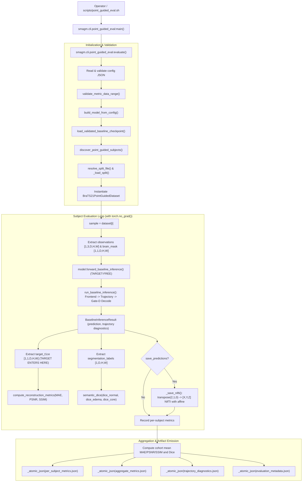

# AGY-E — Evaluation, Runtime Artifacts, and Operator Flow Audit Report

## 1. Audit Metadata and Target Context

- **Audit Target Commit (HEAD):** `0efeb94af72ffa067769e19afcd19ad358feefd2` (`main`)
- **Base / Upstream:** `origin/main` at `0efeb94af72ffa067769e19afcd19ad358feefd2`
- **Pre-existing Dirty Files Preserved:**
  - Modified: `.DS_Store`, `src/.DS_Store`, `tests/.DS_Store`
  - Untracked: `configs/.DS_Store`, `docs/.DS_Store`, `docs/architecture/point_guided_reward_cost_trajectory.html`, `scripts/.DS_Store`, `uv.lock`
- **Mutation Scope:** `reports/audit/workers/agy-e-evaluation.md` only. All production code, tests, configs, plans, and existing documentation remain strictly read-only.
- **Auditor Role:** AGY-E (Evaluation audit: checkpoint verification, held-out split isolation, target-free baseline inference, metric spaces, NIfTI output geometry, JSON artifacts, error handling, and operator flow).

---

## 2. Executive Summary

1. **End-to-End Evaluation Lifecycle:**
   The evaluation pipeline is fully wired and functional across `scripts/point_guided_eval.sh`, `src/smagm/cli/point_guided_eval.py`, `src/smagm/features/point_guided/baseline_inference.py`, `src/smagm/features/point_guided/baseline_metrics.py`, `src/smagm/features/point_guided/baseline_checkpoint.py`, and `src/smagm/data/brats21_point_guided.py`. The lifecycle proceeds from strict checkpoint loading and split file resolution to target-free baseline inference, post-inference metric evaluation, affine-preserved NIfTI prediction export, and atomic persistence of four standardized JSON summary artifacts.

2. **Strict Checkpoint Verification:**
   Checkpoints loaded for evaluation are verified against schema `point-guided-gate-f-baseline-v1` via `load_validated_baseline_checkpoint()`. The loader mandates exact dictionary keys (`metadata`, `state_dict`), computes a canonical JSON hash of model configuration and trajectory configuration, validates exact decoder and Gate-E architectural constants, and executes `model.load_state_dict(state_dict, strict=True)`. Any configuration mismatch, corrupted weight, or incomplete state dictionary is rejected fail-closed with clear errors.

3. **Held-Out Cohort & Split Isolation:**
   Evaluation strictly defaults to the `test` split (`--split test`). The split is resolved either from explicit `--split-file` or automatically from the training run directory `<run_dir>/split.json` associated with the checkpoint (`checkpoint.parent.parent / "split.json"`). Evaluation never generates or regenerates a split dynamically. The loader validates that the split file completely partitions every discovered subject in the dataset exactly once, contains no overlapping or unknown subjects, and verifies the 64-character SHA-256 `split_hash`.

4. **Target-Free Baseline Inference (Gate G Determinism):**
   `PointGuidedMRIModel.forward_baseline_inference()` enforces `self.eval()` and `with torch.no_grad():`, safely restoring the model's prior training state in a `finally` block. It passes only observation volumes ($T_1, T_2, \text{FLAIR}$), brain mask, spacing, and affine to the frontend. Neither $T_{1\text{ce}}$ nor segmentation labels are accepted by the inference API. Route selection uses `ExactNoRevisitPolicy` and deterministic greedy `argmax` solver. Implicit decoding occurs exactly once per subject from the final dynamic state $Z_K$ in memory-bounded spatial chunks.

5. **Post-Inference Metrics & Intensity Normalization:**
   Targets enter strictly after inference has completed. Reconstruction metrics ($\text{MAE}$, $\text{PSNR}$, 3-D $\text{SSIM}$) and coarse semantic Dice ($\text{Dice}_{\text{normal}}$, $\text{Dice}_{\text{edema}}$, $\text{Dice}_{\text{core}}$) are computed over valid masked voxels. The evaluation runner enforces intensity space validation via `validate_metric_data_range()`, ensuring `data_range=1.0` matches `masked_robust_01_[0,1]` and rejecting uncalibrated metric ranges on `masked_zscore`.

6. **NIfTI Output Geometry Roundtrip:**
   When `--save-predictions` is enabled, prediction tensors $[D, H, W]$ are explicitly transposed back to NIfTI voxel coordinates $[X, Y, Z]$ via `transpose(2, 1, 0)` and saved alongside the subject's canonical homogeneous $4 \times 4$ affine matrix, ensuring exact spatial orientation and voxel alignment without distortion.

7. **Audit Findings Summary:**
   - **`[AGY-E-FIND-001]` (Severity: P3 / Minor):** `evaluation_metadata.json` hardcodes `"git_head": None` rather than resolving the active git commit hash.
   - **`[AGY-E-FIND-002]` (Severity: P3 / Hygiene):** Orphaned duplicate metrics helper `src/smagm/features/point_guided/point_guided_metrics.py` exists alongside authoritative `baseline_metrics.py`.
   - **`[AGY-E-FIND-003]` (Severity: INFO / Operational):** Evaluation executes single-pass subject iteration without partial-run resume.
   - **`[AGY-E-FIND-004]` (Severity: INFO / Invariant):** Semantic Dice returns 1.0 when ground-truth class is absent (empty set convention).

---

## 3. End-to-End Evaluation Architecture & Flow Analysis

### 3.1 Operator Invocations & Execution Boundary

The evaluation operator boundary consists of the shell entrypoint `scripts/point_guided_eval.sh` and the Python CLI module `src/smagm/cli/point_guided_eval.py`:

```bash
# Production server invocation via shell wrapper:
CUDA_VISIBLE_DEVICES=0 bash scripts/point_guided_eval.sh \
  /path/to/point_guided_runs/run-01/checkpoints/best_model.pt \
  [/path/to/eval_output_dir]

# Direct Python CLI invocation:
PYTHONPATH=src python -m smagm.cli.point_guided_eval \
  /path/to/point_guided_runs/run-01/checkpoints/best_model.pt \
  --config configs/evaluation/point_guided_brats21_eval.json \
  --data-root "$BRATS21_ROOT" \
  --output-dir "/path/to/eval_output_dir" \
  --split-file "/path/to/point_guided_runs/run-01/split.json" \
  --split test \
  --device cuda \
  --medicalnet-checkpoint "$MEDICALNET_CKPT" \
  --medicalnet-sha256 "$MEDICALNET_SHA256" \
  --save-predictions
```



---

### 3.2 Checkpoint Loading and Verification Contract

Checkpoint restoration is governed by `src/smagm/features/point_guided/baseline_inference.py:load_validated_baseline_checkpoint()`.

1. **File Existence & Torch Loader:**
   - Verifies target file exists (`path.is_file()`).
   - Uses `torch.load(path, map_location="cpu", weights_only=True)` to prevent arbitrary code execution vulnerabilities during checkpoint deserialization.
2. **Payload Structure Validation:**
   - Validates that the top-level dictionary contains exactly two keys: `{"metadata", "state_dict"}`.
3. **Exact Architecture & Configuration Metadata Match:**
   - Compares `payload["metadata"]` against `baseline_checkpoint_metadata(model)`:
     ```python
     {
         "schema": "point-guided-gate-f-baseline-v1",
         "model_config": { ... },       # Canonical JSON serialization of PointGuidedConfig
         "trajectory_config": { ... },  # Canonical JSON serialization of TrajectoryConfig
         "decoder_architecture": "96->64->32->1",
         "gate_e_architecture": "target-after-inference objective"
     }
     ```
   - Any mismatch in hyperparameters (e.g. number of points, support radius, trajectory cost weights, hidden channel widths) raises a `ValueError("baseline checkpoint metadata does not match...")`.
4. **Strict State Dict Restoration:**
   - Calls `model.load_state_dict(state_dict, strict=True)`.
   - Rejects any missing keys, unexpected keys, or tensor shape mismatches.

---

### 3.3 Split Resolution, Integrity, and Provenance

Evaluation strictly decouples data partitioning from evaluation execution:

1. **Split File Discovery (`resolve_split_file`):**
   - If `--split-file` is not explicitly provided on the CLI, the evaluator infers the path as `checkpoint.parent.parent / "split.json"`.
   - If neither the explicit path nor the inferred run split file exists, evaluation terminates fail-closed with `FileNotFoundError`. It never creates a new split on the fly.
2. **Cohort Partition Integrity Check (`_load_split`):**
   - Discovers all subject directories in `data_root` via `discover_point_guided_subjects()`.
   - Validates that `split.json` partitions every discovered subject exactly once:
     $$\text{disjoint}(\text{train}, \text{val}, \text{test}, \text{excluded}) \quad \text{and} \quad \text{train} \cup \text{val} \cup \text{test} \cup \text{excluded} = \text{DiscoveredSubjects}$$
   - Validates presence of a 64-character hexadecimal SHA-256 `split_hash`.
3. **Held-Out Split Selection:**
   - The CLI argument `--split` defaults to `test` (`choices=("train", "val", "test")`).
   - Supports optional evaluation cohort truncation via `--max-subjects <N>` for smoke/debug profiling.

---

### 3.4 Data Discovery and Observation Normalization

1. **Subject Discovery (`src/smagm/data/brats21_point_guided.py`):**
   - Validates subject folder naming pattern `BraTS2021_\d{5}`.
   - Verifies existence of required input observation files: `_t1.nii.gz`, `_t2.nii.gz`, `_flair.nii.gz`.
   - Verifies target file `_t1ce.nii.gz` exists (required for evaluation ground-truth comparison).
   - Identifies optional segmentation file `_seg.nii.gz`.
2. **Observation-Derived Brain Mask:**
   - Brain mask is derived strictly from raw input observations ($T_1 \cup T_2 \cup \text{FLAIR} > \text{threshold}$) before any intensity normalization.
   - Neither $T_{1\text{ce}}$ nor segmentation masks can influence the brain mask topology.
3. **Intensity Normalization:**
   - Main policy is `masked_robust_01`: computes 1st and 99th percentiles of intensities within the input brain mask, clips intensities to $[P_1, P_{99}]$, and linearly maps to $[0.0, 1.0]$.
   - Target $T_{1\text{ce}}$ is normalized independently within the input brain mask to $[0.0, 1.0]$ using its own target percentiles.
   - Metric range validation (`validate_metric_data_range`) ensures `supervision.ssim_data_range == 1.0` matches the $[0, 1]$ intensity space.

---

### 3.5 Target-Free Gate-G Baseline Inference Execution

`PointGuidedMRIModel.forward_baseline_inference()` executes the completed Gate G deterministic operational policy:

```text
Input Observations [1, 3, D, H, W] + Input Brain Mask [1, 1, D, H, W]
  │
  ▼
[1] Shared MedicalNet ResNet10 Frontend (Phases 1–7)
    ├── Coarse Semantics S_coarse [1, 3, D, H, W] (normal, edema, core)
    ├── Deterministic Quasi-Uniform Initial Points (2048 points)
    ├── Observation-Only Bounded Refinement (< 2 mm displacement)
    ├── Sparse Semantic-Aware PoU on 4-mm Spheres
    ├── Static Base Planes (Bxy, Bxz, Byz)
    ├── Fixed 2-Level SWT-Haar Spectral Anchor (Axy, Axz, Ayz)
    └── Bilinear Query -> Descriptor q (24-d) -> Reliability alpha -> f_spec (168-d)
  │
  ▼
[2] Gate-G Deterministic Adaptive Trajectory (C1–C7 + G1–G3)
    ├── Initial Dynamic State Z_0 = B
    ├── State Query -> RewardNet (126 -> 64 -> 1)
    ├── Travel, Overlap, Step Cost Calculation
    ├── Route Utility U = R - lambda_travel*C_travel - lambda_overlap*C_overlap - lambda_step
    ├── ExactNoRevisitPolicy: Available mask updated after each selection (no point visited twice)
    ├── Deterministic Greedy Selection (argmax over available utility)
    ├── Shared UpdateNet (270 -> 96) -> Physical 4-mm Writeback
    └── Stopping: k_max (64), nonpositive_utility, or candidates_exhausted
  │
  ▼
[3] Gate-D Implicit Tri-Plane Decoder (D1)
    └── Evaluates Final Dynamic State Z_K in Spatial Chunks (chunk_size=8192) -> Prediction [1, 1, D, H, W]
```

**Key Verification Invariants:**
- **No Target Ingress:** `forward_baseline_inference()` does not accept `target_t1ce` or `segmentation`.
- **Eval Mode Enforcement:** Enforces `self.eval()` and `torch.no_grad()`. The previous training state is recorded and restored in a `finally` block (`self.train(was_training)`).
- **Single Decoder Pass:** The implicit decoder is called exactly once per subject, after the final dynamic tri-plane state $Z_K$ is produced.
- **Candidate Diagnostics:** Diagnostics differentiate dense candidate evaluations ($K \times N$) from eligible candidate evaluations (accounting for unvisited points).

---

### 3.6 Post-Inference Metrics Computation

Reconstruction and semantic metrics are calculated only after inference completes (`src/smagm/features/point_guided/baseline_metrics.py`):

1. **Reconstruction Metrics (`compute_reconstruction_metrics`):**
   - Evaluated strictly over the input-derived `brain_mask`:
     $$\text{MAE} = \frac{1}{N_{\text{vox}}} \sum_{v \in \Omega} |\hat{Y}_v - Y_v|$$
     $$\text{MSE} = \frac{1}{N_{\text{vox}}} \sum_{v \in \Omega} (\hat{Y}_v - Y_v)^2$$
     $$\text{PSNR} = 10 \cdot \log_{10}\left(\frac{\text{data\_range}^2}{\max(\text{MSE}, 10^{-12})}\right)$$
     $$\text{SSIM} = 1.0 - \mathcal{L}_{\text{SSIM}}(\hat{Y}, Y, \text{mask})$$
   - $\text{PSNR}$ denominator is clamped to $10^{-12}$ so exact reconstructions return a finite scalar rather than `inf`.
   - $\text{SSIM}$ uses an unpadded 3-D windowed implementation; if no valid window exists (e.g. tiny debug volume), it falls back deterministically to global population covariance SSIM.
2. **Coarse Semantic Dice (`semantic_dice`):**
   - Ground truth segmentation is mapped to coarse semantic classes: $0 = \text{normal brain}$, $1 = \text{edema}$, $2 = \text{tumor core candidate}$.
   - Evaluated over voxels inside the brain mask ($\text{ignore\_index} = 255$ outside):
     $$\text{Dice}_c = \frac{2 |\hat{S}_c \cap S_c|}{|\hat{S}_c| + |S_c|}$$
   - If both prediction and target for a class are empty, Dice evaluates to $1.0$.

---

### 3.7 NIfTI Generation and Affine Preservation

When `--save-predictions` is passed:
1. **Axis Order Reversal:**
   - The model operates in tensor memory order $[D, H, W] = [Z, Y, X]$.
   - Source NIfTI images are stored in voxel index order $[X, Y, Z]$.
   - `_save_nifti()` transposes tensor slices:
     ```python
     array_xyz = prediction.detach().cpu().numpy().transpose(2, 1, 0)
     ```
2. **Affine Preservation:**
   - The subject's original validated $4 \times 4$ homogeneous affine matrix (`sample.voxel_to_ras_mm`) is passed directly to `nib.Nifti1Image(array_xyz, affine)`.
   - File output path: `<output_dir>/predictions/<subject_id>_t1ce_pred.nii.gz`.
   - Output volumes match the coordinate space, voxel spacing, and anatomical orientation of the source MRI.

---

### 3.8 Output Artifact Persistence & Schemas

Evaluation emits four atomic JSON artifacts into `<output_dir>`:

```text
<output_dir>/
  ├── per_subject_metrics.json      # Complete per-subject metrics, semantic dice, and trajectory traces
  ├── aggregate_metrics.json        # Cohort summary: mean MAE/PSNR/SSIM, mean Dice, stop histogram
  ├── trajectory_diagnostics.json   # Cohort trajectory diagnostic records
  ├── evaluation_metadata.json      # Provenance: checkpoint, split, hashes, normalization space
  └── predictions/                  # Optional saved NIfTI predictions
        ├── BraTS2021_XXXXX_t1ce_pred.nii.gz
        └── ...
```

All JSON files are written atomically (`.json.tmp` written and renamed) to prevent corrupt files upon interruption.

---

## 4. Scientific & Operational Invariants Verification

| Invariant / Contract | Requirement | Implementation Status | Evidence / Reference |
|---|---|---|---|
| **Checkpoint Integrity** | Schema `point-guided-gate-f-baseline-v1`, exact metadata match, strict weights load. | **VERIFIED** | `baseline_inference.py:285-305` |
| **Split Isolation** | Exact split reuse, default `test`, partition verification, 64-char hash. | **VERIFIED** | `point_guided_eval.py:35-76` |
| **Target Isolation** | $T_{1\text{ce}}$ and segmentation excluded from all inference APIs and route decisions. | **VERIFIED** | `model.py:290-337`, `point_guided_eval.py:152-167` |
| **Deterministic Route** | `ExactNoRevisitPolicy` + greedy `argmax` solver (zero temperature). | **VERIFIED** | `baseline_inference.py:220-232`, `availability.py:10-38` |
| **Eval / No-Grad Mode** | `eval()` and `torch.no_grad()` enforced; previous mode restored on exit. | **VERIFIED** | `model.py:311-337`, `baseline_inference.py:213-216` |
| **Single Decoder Call** | Exactly one Gate-D implicit decode from $Z_K$ per subject. | **VERIFIED** | `baseline_inference.py:234-239` |
| **Intensity Calibration** | Normalization space declared; `masked_robust_01` verified against `data_range=1.0`. | **VERIFIED** | `training/point_guided.py:931-965`, `baseline_metrics.py:80-96` |
| **Affine Roundtrip** | Tensor $[D, H, W] \to [X, Y, Z]$ array transpose; original $4\times 4$ affine preserved. | **VERIFIED** | `point_guided_eval.py:79-87` |
| **Fail-Closed Missing Data** | Missing $T_{1\text{ce}}$, malformed split, or corrupt NIfTI raises immediately. | **VERIFIED** | `point_guided_eval.py:147-149`, `brats21_point_guided.py:1297-1308` |
| **Non-Claim Invariant** | `clinical_quality_claim: false` explicitly recorded in aggregate output. | **VERIFIED** | `point_guided_eval.py:223` |

---

## 5. Artifact Schema & Field Provenance Traceability Matrix

### 5.1 `per_subject_metrics.json`

| Field Path | Type | Source Computation / Origin | Description |
|---|---|---|---|
| `[].subject_id` | `str` | `sample.subject_id` | Unique BraTS2021 subject identifier (`BraTS2021_XXXXX`). |
| `[].split` | `str` | CLI argument `split_name` | Evaluated split partition name (`test`, `val`, `train`). |
| `[].metrics.MAE` | `float` | `compute_reconstruction_metrics().mae` | Mean absolute error over valid brain mask voxels. |
| `[].metrics.PSNR` | `float` | `compute_reconstruction_metrics().psnr` | Peak signal-to-noise ratio in dB (clamped denominator). |
| `[].metrics.SSIM` | `float` | `compute_reconstruction_metrics().ssim` | 3-D structural similarity index over masked volume. |
| `[].metrics.intensity_space` | `str` | `normalization_space_from_config()` | Declared intensity normalization space (`masked_robust_01_[0,1]`). |
| `[].semantic.dice_normal` | `float` | `semantic_dice().dice_normal` | Coarse normal brain class Dice coefficient (or `null`). |
| `[].semantic.dice_edema` | `float` | `semantic_dice().dice_edema` | Coarse peritumoral edema class Dice coefficient (or `null`). |
| `[].semantic.dice_core` | `float` | `semantic_dice().dice_core` | Coarse tumor core candidate class Dice coefficient (or `null`). |
| `[].semantic.voxel_count` | `int` | `semantic_dice().voxel_count` | Count of non-ignored voxels in coarse semantic evaluation. |
| `[].trajectory.K_used` | `int` | `result.k_used[0]` | Actual number of trajectory steps executed ($0 \le K \le K_{\max}$). |
| `[].trajectory.path_length_mm` | `float` | `result.path_length_mm[0]` | Total physical Euclidean path length traversed in mm. |
| `[].trajectory.mean_predicted_reward` | `float` | `result.reward_mean[0]` | Mean predicted RewardNet score across selected steps. |
| `[].trajectory.max_predicted_reward` | `float` | `result.reward_max[0]` | Maximum predicted RewardNet score across selected steps. |
| `[].trajectory.mean_utility` | `float` | `result.utility_mean[0]` | Mean route utility after travel/overlap/step costs. |
| `[].trajectory.max_utility` | `float` | `result.utility_max[0]` | Maximum route utility after costs. |
| `[].trajectory.mean_update_magnitude` | `float` | `result.update_magnitude_mean[0]` | Mean $L_2$ norm of UpdateNet tri-plane update tensor. |
| `[].trajectory.max_update_magnitude` | `float` | `result.update_magnitude_max[0]` | Maximum $L_2$ norm of UpdateNet tri-plane update tensor. |
| `[].trajectory.stop_reason` | `str` | `result.stop_reasons[0]` | Reason trajectory stopped (`k_max`, `nonpositive_utility`, `candidates_exhausted`). |
| `[].trajectory.candidate_evaluations` | `int` | `result.candidate_evaluations[0]` | Total dense RewardNet candidate evaluations ($K \times N$). |
| `[].trajectory.eligible_candidate_evaluations` | `int` | `result.eligible_candidate_evaluations[0]` | Pre-mask eligible candidate evaluations excluding visited points. |

---

### 5.2 `aggregate_metrics.json`

| Field Path | Type | Source Computation / Origin | Description |
|---|---|---|---|
| `split` | `str` | CLI argument `split_name` | Evaluated split partition (`test`, `val`, `train`). |
| `split_hash` | `str` | `split.json` payload | 64-char SHA-256 hash of dataset split partition. |
| `subject_count` | `int` | `len(per_subject)` | Total number of subjects evaluated in this run. |
| `metrics.MAE` | `float` | Mean of subject MAEs | Arithmetic mean of MAE across evaluated cohort. |
| `metrics.PSNR` | `float` | Mean of subject PSNRs | Arithmetic mean of PSNR across evaluated cohort. |
| `metrics.SSIM` | `float` | Mean of subject SSIMs | Arithmetic mean of SSIM across evaluated cohort. |
| `semantic.dice_normal` | `float` | Mean of subject `dice_normal` | Mean Dice for normal brain across segmented subjects. |
| `semantic.dice_edema` | `float` | Mean of subject `dice_edema` | Mean Dice for edema across segmented subjects. |
| `semantic.dice_core` | `float` | Mean of subject `dice_core` | Mean Dice for tumor core across segmented subjects. |
| `stop_reason_histogram` | `dict[str, int]` | `Counter(result.stop_reasons)` | Distribution of stopping reasons across cohort. |
| `normalization_space` | `str` | `normalization_space_from_config()` | Machine-readable intensity space label. |
| `clinical_quality_claim` | `bool` | Constant `False` | Scientific disclaimer: no clinical efficacy claim. |

---

### 5.3 `evaluation_metadata.json`

| Field Path | Type | Source Computation / Origin | Description |
|---|---|---|---|
| `checkpoint` | `str` | `str(checkpoint.resolve())` | Absolute path to evaluated checkpoint file. |
| `git_head` | `str \| null` | Hardcoded `None` *(see finding AGY-E-001)* | Git HEAD commit hash at evaluation time. |
| `split_file` | `str` | `str(resolved_split_file)` | Absolute path to training split file used. |
| `split_hash` | `str` | `split.json` | 64-char SHA-256 digest of split partition. |
| `split` | `str` | CLI argument `split_name` | Evaluated partition (`test`). |
| `training_run_dir` | `str` | `checkpoint.parent.parent` | Inferred training run directory root. |
| `normalization_space` | `str` | `normalization_space_from_config()` | Declared metric intensity space. |
| `target_used_after_inference_only` | `bool` | Constant `True` | Invariant assertion: $T_{1\text{ce}}$ evaluated post-hoc. |
| `segmentation_used_after_inference_only` | `bool` | Constant `True` | Invariant assertion: seg evaluated post-hoc. |

---

## 6. Detailed Findings

### [AGY-E-FIND-001] (Severity: P3 / Minor Bug) `evaluation_metadata.json` has hardcoded `git_head: null`

- **Component:** `src/smagm/cli/point_guided_eval.py:230`
- **Description:**
  `evaluation_metadata.json` sets `"git_head": None` as a literal constant rather than dynamically querying the repository's git HEAD commit hash.
- **Code Evidence:**
  `src/smagm/cli/point_guided_eval.py` line 230:
  ```python
  _atomic_json(output_dir / "evaluation_metadata.json", {
      "checkpoint": str(checkpoint.resolve()),
      "git_head": None,
      "split_file": str(resolved_split_file),
      ...
  })
  ```
  In contrast, `src/smagm/training/point_guided.py:224` implements a robust `_git_head()` helper that executes `git rev-parse HEAD`, and `scripts/point_guided_eval.sh:24` prints `git HEAD: $(git rev-parse HEAD)` to stdout. The persisted JSON artifact loses this provenance link.
- **Impact:**
  Evaluation runs generate an artifact where `git_head` is always `null`, requiring operators to check console logs rather than relying on the self-describing metadata JSON.
- **Recommendation:**
  Import `_git_head` from `smagm.training.point_guided` (or implement a common utility) and assign `"git_head": _git_head()` in `evaluation_metadata.json`.

---

### [AGY-E-FIND-002] (Severity: P3 / Code Hygiene) Orphaned duplicate metric helper `point_guided_metrics.py`

- **Component:** `src/smagm/features/point_guided/point_guided_metrics.py`
- **Description:**
  `point_guided_metrics.py` defines `PointGuidedMetrics` and `compute_point_guided_metrics` (implementing a 1-D/global SSIM and unmasked NMSE). It is completely unreferenced by production evaluation (`point_guided_eval.py`) and training (`training/point_guided.py`), both of which import from `baseline_metrics.py` (`compute_reconstruction_metrics` and `semantic_dice`). It is only imported by `tests/features/point_guided/test_point_guided_metrics.py` and omitted from `CODEGRAPH.json`.
- **Code Evidence:**
  - `src/smagm/features/point_guided/point_guided_metrics.py` (136 lines)
  - `src/smagm/cli/point_guided_eval.py:18` imports `compute_reconstruction_metrics` and `semantic_dice` from `baseline_metrics.py`.
  - `src/smagm/training/point_guided.py:40` imports from `baseline_metrics.py`.
- **Impact:**
  Coexistence of two metric calculation modules with differing SSIM definitions (3-D windowed in `baseline_metrics.py` vs 1-D global in `point_guided_metrics.py`) creates technical debt and ambiguity.
- **Recommendation:**
  Deprecate and remove `point_guided_metrics.py` and its test, consolidating all metric contracts into `baseline_metrics.py`.

---

### [AGY-E-FIND-003] (Severity: INFO / Operational Invariant) Single-pass evaluation without subject-level partial resume

- **Component:** `src/smagm/cli/point_guided_eval.py:145-206`
- **Description:**
  Evaluation iterates sequentially over the selected split subjects in a single pass. If the evaluation process is interrupted (e.g. server preemption, timeout), there is no `--resume` argument to skip already-computed subjects. The aggregate JSON files are written only once at the conclusion of the loop.
- **Code Evidence:**
  `per_subject: list[dict[str, Any]] = []` accumulates in memory throughout the dataset iteration; `_atomic_json(...)` is called at lines 225–238 after the loop completes.
- **Impact:**
  While individual NIfTI prediction files written prior to interruption remain intact in `<output_dir>/predictions/`, no JSON metric summaries are generated if the process terminates before evaluating the final subject.
- **Recommendation:**
  For large test cohorts, consider writing incremental per-subject records to a `per_subject_metrics.jsonl` file to allow seamless inspection and recovery of partial runs.

---

### [AGY-E-FIND-004] (Severity: INFO / Design Invariant) Default Dice 1.0 on empty ground-truth semantic target classes

- **Component:** `src/smagm/features/point_guided/baseline_metrics.py:167`
- **Description:**
  In `semantic_dice()`, if both predicted voxels and target voxels for a semantic class (e.g. edema or tumor core) are empty, the Dice score evaluates to `1.0` (`1.0 if denominator == 0 else 2.0 * intersection / denominator`). In `point_guided_eval.py:217-220`, cohort aggregate Dice only averages subjects that have segmentation data present.
- **Code Evidence:**
  `src/smagm/features/point_guided/baseline_metrics.py:167`.
- **Impact:**
  This is the standard convention in medical imaging segmentation benchmarks (empty-set agreement = 1.0), preventing undefined division by zero when evaluating subjects without tumor pathology.
- **Recommendation:**
  Retain this standard behavior and keep it documented.

---

## 7. Verification Summary

- **HEAD Verification:** Confirmed `0efeb94af72ffa067769e19afcd19ad358feefd2` before and after audit.
- **Dirty State Verification:** `git status --short` confirmed only the pre-existing dirty files (`.DS_Store`, `uv.lock`, etc.) plus this assigned report.
- **Compilation Check:** `python3.10 -m compileall -q src tests configs scripts` passed with 0 errors.
- **Whitespace Check:** `git diff --check` passed with 0 errors.
- **Unit Test Execution:**
  - `tests/features/point_guided/test_baseline_inference.py` (6 tests passed)
  - `tests/features/point_guided/test_point_guided_server_pipeline.py` (14 tests passed)
  - `tests/features/point_guided/test_point_guided_metrics.py` (3 tests passed)
  - `tests/data/test_brats21_point_guided.py` (23 tests passed)
  - Total: **46 passed tests, 0 failures**.
- **Codegraph Scope:** Verified with `python scripts/codegraph.py --task baseline_inference` and `--task server_pipeline`.
